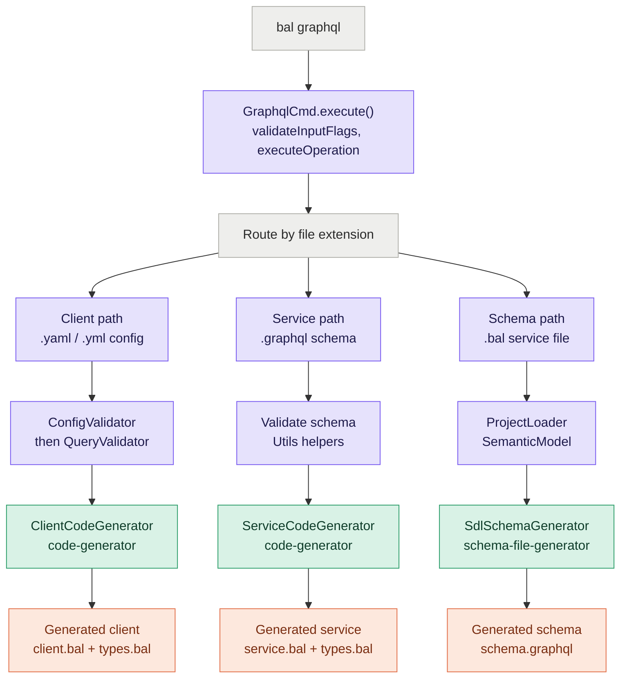
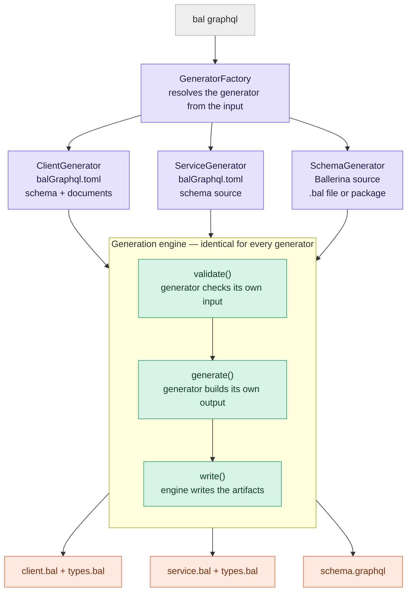
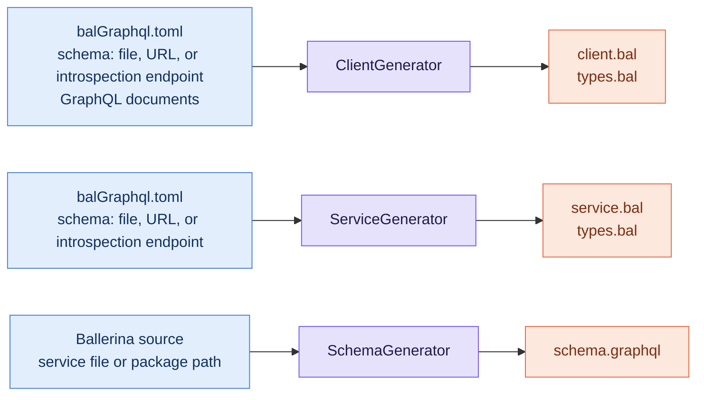

# 1493 : Revamping Ballerina GraphQL CLI Tool

- Authors 
    - Nidula Ekanayake
- Reviewed by
    - Thisaru Guruge
    - Danesh Kuruppu
- Created date
    - 01/08/2026
- Issue
    - [#1493](https://github.com/ballerina-platform/ballerina-spec/issues/1493)
- State: Submitted

## 1. Summary

The Ballerina GraphQL CLI tool is currently in an [experimental](https://ballerina.io/learn/graphql-tool/#client-generation-experimental) state with limited modularity and incomplete support for key GraphQL capabilities. This proposal outlines a comprehensive revamp of the GraphQL tool to promote client generation to General Availability (GA), introduce a package-aware modular architecture for CLIENT, SERVICE, and SCHEMA generation with a fail-fast approach, and add missing features such as Subscriptions and DataLoader support.

## 2. Motivation

The Ballerina GraphQL tool is currently built around a single command entrypoint with mode and behavior flags, and the ballerina [GraphQL documentation](https://ballerina.io/learn/graphql-tool/) still treats client generation as \[experimental\].

This limits production adoption, makes the architecture harder to evolve, and creates friction for teams that want a stable GraphQL workflow inside Ballerina packages. It also leaves the tool behind similar GraphQL libraries in terms of stability, modularity, feature coverage, and overall developer experience.

WSO2 Integrator's Language Server consumes the output of service generation to render diagrams, but because the generated service doesn't compile, the Language Server cannot build a diagram from it directly. It currently injects error("not implemented") resolver bodies on its own side, purely to make the code compile before rendering. That's a workaround for a problem that belongs upstream \- generating compilable code in the tool itself would let the Language Server drop that step entirely.

### 2.1 Current Problems

#### 2.1.1 Experimental Status Blocks Production Adoption

* Client generation fails for some basic use cases, which makes the current experience unreliable for common workflows
* Production users hesitant to adopt unstable APIs
* No clear path to GA promotion
* Missing comprehensive test coverage for edge cases

#### 2.1.2 Missing GraphQL Features

* Package awareness not implemented (affects multi-project scenarios)
* Incomplete ID type support
* No DataLoader pattern support for N+1 query optimization
* No properly defined error paths \- failures surface as generic, unhelpful messages

#### 2.1.3 Related GitHub issues

* [\#8229](https://github.com/ballerina-platform/ballerina-library/issues/8229) \- NullPointerException in Ballerina GraphQL client code generation during formatting
* [\#6545](https://github.com/ballerina-platform/ballerina-library/issues/6545) \- Proposal: Expose a Database as a GraphQL API
* [\#6316](https://github.com/ballerina-platform/ballerina-library/issues/6316) \- No command completion for the graphql command
* [\#6020](https://github.com/ballerina-platform/ballerina-library/issues/6020) \- Bad sad error in graphql tool
* [\#5813](https://github.com/ballerina-platform/ballerina-library/issues/5813) \- Remove Warnings Returned when GraphQL Client Generation
* [\#6382](https://github.com/ballerina-platform/ballerina-library/issues/6382) \- Prompt for Override Existing File Should Occur Before Generating Schema
* [\#6383](https://github.com/ballerina-platform/ballerina-library/issues/6383) \- Add Client Generation Support for Schema With Interfaces
* [\#6384](https://github.com/ballerina-platform/ballerina-library/issues/6384) \- Improve the Documentation
* [\#6432](https://github.com/ballerina-platform/ballerina-library/issues/6432) \- Provide a Way to Define the Name of the Generated File
* [\#6433](https://github.com/ballerina-platform/ballerina-library/issues/6433) \- Improve Logs in GraphQL Service Generation and Client Generation
* [\#6434](https://github.com/ballerina-platform/ballerina-library/issues/6434) \- Update FunctionBodyGenerator for NodeFactory.createOnFailClauseNode change
* [\#6435](https://github.com/ballerina-platform/ballerina-library/issues/6435) \- NPE when Trying to Generate a Client
* [\#6436](https://github.com/ballerina-platform/ballerina-library/issues/6436) \- Add Missing Code Coverage Details of Schema File Generator
* [\#6437](https://github.com/ballerina-platform/ballerina-library/issues/6437) \- Code Coverage Reduces for Gradle File Updates
* [\#6439](https://github.com/ballerina-platform/ballerina-library/issues/6439) \- Add an auto-generated header for Ballerina files generated using the client generation
* [\#6440](https://github.com/ballerina-platform/ballerina-library/issues/6440) \- \[Service Generation\] Refresh Code on Schema Change
* [\#6441](https://github.com/ballerina-platform/ballerina-library/issues/6441) \- Improve the Schema Generation with Ordering the Types
* [\#3746](https://github.com/ballerina-platform/ballerina-library/issues/3746) \- Move Duplicated Functions in GraphQL Tool into commons Package
* [\#6445](https://github.com/ballerina-platform/ballerina-library/issues/6445) \- '\*' symbols are not supported when configuring schema and query file paths in Graphql config (graphql.config.yaml) file
* [\#6446](https://github.com/ballerina-platform/ballerina-library/issues/6446) \- Unable to generate GraphQLl client for mutations with scalar return type
* [\#6449](https://github.com/ballerina-platform/ballerina-library/issues/6449) \- \[Improvement\] Implement a compile time validator for the GraphQL client generation tool
* [\#6450](https://github.com/ballerina-platform/ballerina-library/issues/6450) \- Template tag graphql-client for the bal new command to generate prototypes necessary for the GraphQL client generation tool
* [\#6451](https://github.com/ballerina-platform/ballerina-library/issues/6451) \- \[Improvement\] User experience of the GraphQL client generation tool

The motivation of this proposal is to move the tool toward a package-aware, modular design that separates client, schema, and service generation cleanly, and addresses missing GraphQL capabilities such as subscription and data loading support \- bringing the tool on par with comparable libraries and aligning it better with Ballerina package structure and user expectations.

The main benefit is a more stable and reusable GraphQL toolchain that is easier to maintain, easier to test, and easier to expose through low-code or button-click workflows. It is being driven by the current GraphQL tooling roadmap and related Ballerina library issues, and it aligns the tool more closely with the expectations of modern GraphQL development.

## 3. Goals

* Move the tool from an experimental posture to a stable, generally available (GA) Version (1.0.0)
* Make the Ballerina GraphQL tool package-aware so generation fits Ballerina project and module structure.
* Simplify the command interface by consolidating three command forms into two, making the mandatory input a positional argument, and deriving mode from config contents rather than file extension.
* Add first-class handling for GraphQL ID, subscriptions, and data loading.
* Preserve backward compatibility where practical while allowing a clear migration path away from the old command design.

## 4. Non-Goals

* Federation support including Apollo Federation subgraph scaffolding and federation directives (future)
* Parser enhancements beyond the current scope (future)

## 5. Design

### 5.1 Current Architecture

The current GraphQL CLI tool is built around a single entry point (GraphqlCmd.java) with three generation modes

1. SERVICE Generation
2. SCHEMA Generation
3. CLIENT Generation \[Experimental\]

Each mode is handled by its own generator, but the overall structure is monolithic with no clear separation of concerns.



<p align="center"><em>Figure 1: Current Architecture</em></p>

Everything goes through one shared entrypoint that routes to three different paths \- but each path works completely differently underneath. Different validation, different logic, nothing shared between them. That's a large part of why things break: a fix in one mode tells you nothing about the others, and changing shared code risks breaking something unrelated.

#### 5.1.1 Overview

Input may be:

* schema.graphql \- a GraphQL SDL file, routed to service generation
* graphql.config.yaml \- a client config file, routed to client generation
* service.bal \- a Ballerina service file, routed to schema generation

The command entry point routes execution to one of the generators

The current flow generates:

* client files such as client.bal, types.bal, utils.bal, and config\_types.bal
* service files such as service.bal and types.bal
* schema output such as schema.graphql

#### 5.1.2 Limitations

* Flag logic is scattered across multiple files
* No package awareness
* No clear separation between generation modes
* Client generation remains experimental
* Configuration relies on graphql.config.yaml, which is tied to the earlier VS Code GraphQL plugin ecosystem
* Missing ID type support
* No subscription support
* No DataLoader support

### 5.2 Proposed Architecture

The proposed architecture aims to evolve the current system into a more modular, package-aware, and Ballerina-native design.



<p align="center"><em>Figure 2: Proposed Architecture</em></p>

Every generator follows the same contract \- validate, generate, write. A generator factory picks the right generator based on the input, and from there the process is identical no matter which one runs. What differs is that each generator only validates its own input: the client generator checks for a schema and documents, the service generator checks for a schema, the schema generator checks for valid Ballerina code. None of them needs to know anything about the others, which is what makes fail-fast work properly \- each generator rejects bad input immediately, by its own rules, before any generation work starts.



<p align="center"><em>Figure 3: Generator input and output boundaries</em></p>

**The long-term architecture will:**

* Each mode gets cleanly separated \- no more shared, tangled logic.
* Generated code becomes package-aware.
* Support missing ID type handling consistently across schema and service generation
* Redesign client generation around Ballerina-native configuration using TOML instead of YAML.

The architecture should be designed so that each generation mode becomes a first-class concern with its own internal model, parser, validator, and generator pipeline.

### Key Change Areas

### 5.2.1 Service Generation - Package Awareness

**Current State:**

* **Generates service.bal and types.bal without package awareness**

```
$ cat schema.graphql
type Query {
    book(id: Int!, title: String): Book
    books: [Book!]
}

type Book {
    id: Int!
    title: String!
}

$ bal graphql -i schema.graphql -m service -o ./output_path
$ ls output_path
service.bal  types.bal
```

* **Generated type/service name is taken directly from the input filename with no sanitization**

```
$ ls
schema.graphql

$ bal graphql -i schema.graphql -m service -o ./output_path
$ cat output_path/service.bal | grep "service"
service schema on new graphql:Listener(port) {
```

(input file was schema.graphql → generated service is literally named schema)

**Proposed changes:**

* Add package awareness to generated service code
* Add sensible, sanitized naming instead of echoing the raw input filename
* Migrate generated service code to the new modular architecture
* Generate compilable code instead of empty resolver bodies that fail to compile.

Given this schema:

```
type Query {
    greeting(name: String!): String!
}
```

What's currently generated (does not compile):

```
service on new graphql:Listener(9090) {
     resource function get greeting(string name) returns string {
     }
}
```

This fails to compile \- the function declares returns string but the body is empty, with no return statement, so it doesn't satisfy Ballerina's return requirement.

What should be generated instead (compiles):

```
service on new graphql:Listener(9090) {
    resource function get greeting(string name) returns string|error {
        return error("Not implemented");
    }
}
```

This compiles immediately. The developer then fills in their own logic, and can return whatever value or error they like \- error("Not implemented") is just the generated placeholder.

**Expected Outcome:**

* More maintainable generated services
* Better alignment between service definitions and schema semantics
* Easier future extension

### 5.2.2 Schema Generation

**Current State:**

* **Enum member order is not preserved in the generated schema**

```
$ cat main.bal
public enum Episode {
    NEWHOPE,
    EMPIRE,
    JEDI
}

$ bal graphql -i main.bal -o ./schema_output
$ cat schema_output/*.graphql
enum Episode {
  JEDI
  EMPIRE
  NEWHOPE
}
```

Declared order NEWHOPE, EMPIRE, JEDI comes out reversed as JEDI, EMPIRE, NEWHOPE \- (which matches the GitHub issue [\#6441](https://github.com/ballerina-platform/ballerina-library/issues/6441).)

* **No proper defined error paths**

  Fails with a generic, unhelpful message when the input isn't a valid, independently compilable Ballerina service

```
$ cat service.bal
import ballerina/graphql;

service /test on new graphql:Listener(9090) {
    resource function get hello() returns Unknown {
    }
}
$ bal graphql -i service.bal -o ./schema_output
ERROR [:(-1:-1,-1:-1)] Given Ballerina file contains compilation error(s).
```

(which matches the GitHub issue [\#6020](https://github.com/ballerina-platform/ballerina-library/issues/6020))

**Proposed changes:**

* Define and apply a consistent type ordering convention in the generated schema \- Query, Mutation, and Subscription grouped together at the top (in that order), followed by the remaining types
* Fix enum member ordering to preserve declaration order from the source service
* Improve error handling to surface actionable diagnostics instead of a generic compilation-error message
* Validate that the input compiles before attempting schema extraction, and fail fast with a clear error if not. A standalone `.bal` file is loaded as a single-file project; a file inside a package, or a package directory, is loaded as that package through the Ballerina project API.
* Migrate schema generation to the new modular architecture.

**Expected Outcome:**

* Generated schema accurately reflects the declared service structure, including type ordering
* Clear, actionable error messages instead of generic compilation failures
* Consistent behavior aligned with the modular architecture

### 5.2.3 Client Generation - Full Redesign

**Current state:**

* **Client generation fails with a NullPointerException during code formatting**

```
$ bal graphql -i graphql.config.yaml

SEVERE: Error while formatting [kind: CLASS_DEFINITION] [line: 1] [column:26]: java.lang.NullPointerException: Cannot invoke "io.ballerina.compiler.syntax.tree.SyntaxKind.ordinal()" because the return value of "io.ballerina.compiler.syntax.tree.Node.kind()" is null

Reproduced identically with both bal graphql -i graphql.config.yaml and bal graphql -i graphql.config.yaml -o ./output_path
```

(which matches the GitHub issue [\#8229](https://github.com/ballerina-platform/ballerina-library/issues/8229))

* **The failure is silent and non-blocking, so generation writes broken, unformatted output instead of failing**

```
$ cat client.bal

publicisolatedclientclassGraphqlClient{finalgraphql:ClientgraphqlClient;publicisolatedfunctioninit(stringserviceUrl,ConnectionConfigconfig={})...
```

All whitespace between keywords is stripped in the outer class/function declaration, making the file invalid, non-compilable Ballerina.

* **An unrelated SnakeYAML deserialization warning is printed on every run**

```
$ bal graphql -i graphql.config.yaml

WARNING: Failed to find field for io.ballerina.graphql.generator.client.pojo.Endpoints.default
```

(Which matches the GitHub issue [\#5813](https://github.com/ballerina-platform/ballerina-library/issues/5813))

* **Configuration relies on graphql.config.yaml tied to the old VS Code plugin ecosystem**

```
$ cat graphql.config.yaml
schema: schema.graphql
documents:
  - queries/country-queries.graphql
```

  No Ballerina.toml-native equivalent exists \- the config format is not aligned with the rest of the Ballerina toolchain.

* **Client generation is marked \[Experimental\] throughout the codebase and documentation**

```
$ cat ballerina-graphql.help
Generate Ballerina Graphql clients using a GraphQL config file (`graphql.config.yaml`)
[Experimental].
    $ bal graphql -i graphql.config.yaml
```

**Proposed changes:**

* Redesign the full client generation architecture around the new modular pipeline
* Fix the NullPointerException in the formatting step (issue [\#8229](https://github.com/ballerina-platform/ballerina-library/issues/8229)) so generated code is always valid, correctly formatted Ballerina
* Ensure generation fails loudly and clearly when formatting fails, instead of silently writing broken output
* Remove the unrelated SnakeYAML warning (issue [\#5813](https://github.com/ballerina-platform/ballerina-library/issues/5813))
* Migrate client configuration from graphql.config.yaml to balGraphQL.toml
* Add support for currently unhandled schema constructs (interfaces, unions, custom scalars)
* Add subscription support
* Add DataLoader support
* Promote client generation from Experimental to General Availability once the above are addressed

**Expected Outcome:**

* Client generation reliably produces valid, correctly formatted, compilable Ballerina code
* Failures are surfaced clearly instead of degrading silently into broken output
* Configuration is native to the Ballerina ecosystem (TOML-based)
* Client generation reaches GA quality with broader GraphQL feature coverage

### 5.2.4 Input Resolution for Service-to-Schema Generation

**Current State:**

Input resolution only supports a direct file path. Pointing \-i at a package directory is explicitly rejected today, even when that directory is a valid Ballerina package containing a GraphQL service

```
$ ls my-package
Ballerina.toml  main.bal

$ bal graphql -i ./my-package -o ./schema_output
ERROR [:(0:0,0:0)] File "./my-package" is invalid. Supported input files are,
A GraphQL configuration file with .yaml/.yml extension,
a Ballerina service file with .bal extension or
a GraphQL schema file with .graphql extension.
```

**Proposed changes:**

* Support two input forms for schema generation: a direct file path (standalone or inside a package), and a package directory path
* Resolve each form to the right kind of project before validating: a standalone .bal file is loaded as a single-file project, and a package directory (or a file inside one) is loaded as a package via the Ballerina project API (see 5.2.2)
* For a directory input, validate it is a valid Ballerina package (via the Ballerina project API) and fail fast with a clear error if not
* For a valid package input, locate the GraphQL service(s) within it using a GraphQL compiler plugin API, rather than requiring the user to point at the exact file

**Expected Outcome:**

* Schema generation works correctly whether given a file path or a package path
* Package inputs are validated up front, with a clear error if the directory isn't a valid Ballerina package
* Users no longer need to know the exact file a service lives in when generating from a package

### 5.2.5 Deterministic Output Naming for Duplicate Base Paths

**Current State:**

When multiple services in the same input share the same base path (e.g., both at /gql on different ports), output file naming is based on declaration order, not on anything intrinsic to each service \- making it unstable across edits to the source file.

```
$ cat service.bal
service /gql on new graphql:Listener(9090) {
    resource function get bookTitle() returns string { ... }
}

service /gql on new graphql:Listener(9091) {
    resource function get authorName() returns string { ... }
}

$ bal graphql -i service.bal -o ./all_schemas
SDL Schema(s) generated successfully and copied to :
-- schema_gql.graphql
-- schema_gql_1.graphql
```

The second file is named schema\_gql\_1.graphql purely because it's the second /gql service encountered while scanning the file top to bottom \- not because of anything unique about that service itself. If a service is reordered, or a new one is inserted earlier in the file, a previously-generated file can end up mapped to a different service than before, even though nothing about that specific service changed. Port is not considered anywhere in this logic.

This also affects the \-s flag \- since matching is done against the base path alone, \-s /gql in this scenario matches both services instead of narrowing to one.

**Proposed changes:**

* Derive output file names from basePath \+ port instead of a positional duplicate counter

```
import ballerina/graphql;
import ballerina/http;

listener graphql:Listener gql = new (9090);
listener http:Listener rest = new (9093);
configurable int port1 = 9092;

service /graphql on new graphql:Listener(9090) { }     // graphql_9090.graphql
service /graphql on new graphql:Listener(port1) { }    // graphql_port1.graphql
service /graphql on new graphql:Listener(rest) { }     // graphql_rest.graphql
service /graphql on gql { }                            // graphql_gql.graphql
service /api on gql { }                                // api_gql.graphql
```

**The naming rule:**

* If the port is written as a literal (e.g. new graphql:Listener(9090)) \- use the literal value directly, since it's knowable at compile time
* If the port is a non-literal expression (e.g. port1, rest) \- use that identifier's name as written, since the actual runtime value can never be known during generation, but the name is always present and deterministic
* If the service is attached to an already-declared listener rather than constructing one inline (on gql) \- there is no port expression present at all at the service declaration, so the listener variable's name (gql) is used instead

Ballerina has two phases \- compile time and run time. Schema generation is a compile-time, static-analysis process; it never runs the service, which is why this always falls back to names and literals rather than resolved runtime values.

**Expected Outcome:**

* Output file names for duplicate-base-path services are stable and deterministic, independent of declaration order or unrelated edits to the source file
* The \-s flag can reliably disambiguate between services sharing the same base path
* Naming behavior is derivable entirely from static analysis, with no dependency on runtime configuration values.

### 5.2.6 Shape of the balGraphQL.toml

Schema can come from one of three sources: a local schema file, a hosted schema file URL, or a live introspection endpoint. The latter two involve reaching out to something external over the network, not just reading local content.

A hosted schema URL or introspection endpoint may require specific HTTP headers to be sent with the request. balGraphQL.toml exposes a generic headers table where the user can set any header name and value their endpoint requires.

Requests to url and endpoint require HTTPS - a plain http:// value is rejected with a validation error. Since headers can carry credentials (an Authorization token, for example), allowing cleartext transport would expose them in transit. Headers are not forwarded across a redirect that changes the origin (host, scheme, or port), preventing a compromised or malicious endpoint from redirecting the request elsewhere and capturing configured credentials.

`bal build` only accepts `source = "file"` for a `[[tool.graphql]]` entry (see 5.2.8). Generation at build time never performs a network request. Fetching a remote schema remains a deliberate, one-time `bal graphql` action, whose result the developer commits alongside `balGraphQL.toml`.

**Fields required in balGraphQL.toml:**

| Field | Description | Mandatory/Optional |
| ----- | ----- | ----- |
| source | Selects which of the three input types is being used \- one of file, url, or introspection | Mandatory |
| path | Path to a local GraphQL schema file (.graphql). Required when source \= "file" | Mandatory |
| url | URL of the hosted schema file. Required when source \= "url" | Mandatory |
| endpoint | URL of the live GraphQL API to introspect. Required when source \= "introspection" | Mandatory |
| headers | A table of header name/value pairs to send with the request. Only relevant when source is url or introspection | Optional |

**Documents \- needed only for Client generation**

| Field | Description | Mandatory/Optional |
| ----- | ----- | ----- |
| documents | A list of paths to GraphQL query/mutation documents to generate client operations from | Mandatory for client generation, not used for service generation |

**ID type mapping \- needed only for Service generation**

| Field | Description | Mandatory/Optional |
| ----- | ----- | ----- |
| id-types | A table of GraphQL Field Notations mapped to the Ballerina type that field's ID scalar should generate as (e.g. Profile.id \= "int"). Applies to object fields, query fields, and arguments. Defaults to string when not listed | Optional |

**DataLoader \- needed only for Service generation**

| Field | Description | Mandatory/Optional |
| ----- | ----- | ----- |
| dataloaders | A table of GraphQL Field notations mapped to the name of the loader that field should be wired to (e.g. Query.profile \= "profileLoader") | Optional |

**DataLoader wiring contract**

For each field mapped in dataloaders, the tool generates the resolver and its wiring to a loader declared in the developer's package, using the loader/batch-function pattern from the ballerina/graphql DataLoader API. The generated resolver retrieves the batched value from the named loader; implementing the loader's batch function - including key-to-value mapping, missing-key handling, and error handling - is the developer's responsibility.

**Example (Client Generation)**

```toml
documents = [
    "./queries/getUser.graphql",
    "./mutations/createUser.graphql"
]

[schema]
source = "url"
url = "https://api.example.com/schema.graphql"

[schema.headers]
Authorization = "Bearer <token>"
```

**Example (Service Generation)**

```toml
[schema]
source = "file"
path = "./schema.graphql"

[id-types]
Profile.id = "int"
Query.profile.id = "int"
Query.getFloatId = "float"

[dataloaders]
Query.profile = "profileLoader"
```

**Which fields you actually need:**

* Generating a Client: you need \[schema\] and documents. The id-types and dataloaders sections aren't used \- they only affect server-side generation.
* Generating a Service: you need \[schema\], and can optionally include id-types (to override the default string mapping for specific ID fields) and dataloaders (to wire batching into generated resolvers). documents isn't used, since a service doesn't execute queries against itself.

**Expected Outcome:**

* A single config format covers schema sourcing, client document input, ID type overrides, and DataLoader wiring
* ID overrides apply consistently to fields, arguments, and return types \- @graphql:ID is always generated alongside the configured type, whether that's the default string or an override
* Only the fields relevant to what's being generated are required \- the same file format works for both directions without forcing irrelevant fields

### 5.2.7 CLI Interface

**Current State:**

The CLI has three separate command forms, each driven by a different input file type:

```
bal graphql [-i | --input] <ballerina-graphql-service-file-path>
            [-o | --output] <output-location>
            [-s | --service] <service-base-path>

bal graphql [-i | --input] <graphql-schema-file-path>
            [-o | --output] <output-location>
            [-m | --mode] <operation-mode>
            [-r | --use-records-for-objects]

bal graphql [-i | --input] <graphql-configuration-file-path>
            [-o | --output] <output-location>
```

Mode is inferred from the input file's extension \- .yaml/.yml routes to client generation, .graphql to service generation, and .bal to schema generation.

**Proposed changes:**

Collapse to two command forms. Client and service generation share the same balGraphQL.toml input, so they merge into a single form. Schema generation stays separate, since it takes Ballerina source rather than a config file:

```
bal graphql <balGraphQL.toml-path>
            [-o | --output] <output-location>
            [-m | --mode] <client|service>
            [--module] <module-name>
            [-r | --use-records-for-objects]

bal graphql <ballerina-service-file-or-package-path>
            [-o | --output] <output-location>
            [-s | --service] <service-base-path>
```

| Flag | Change |
| :---- | :---- |
| \<input\> | Now a positional argument instead of the \-i flag, since it's always mandatory. For client/service generation it takes balGraphQL.toml; for schema generation it takes a Ballerina service file or package directory path (see 5.2.4) |
| \-m | Narrowed to client\|service. Only needed when the TOML is ambiguous \- schema is no longer a mode value, since that path is determined by the input being Ballerina source |
| \--module | New flag (no short form). Specifies which module within the package the generated files are written into. If omitted, files are generated into the package's default module. If the named module doesn't exist yet, it is created |
| \-s | Unchanged \- scoped to schema generation |
| \-r | Unchanged \- scoped to service generation |

**Expected Outcome:**

* Fewer command forms to learn \- client and service generation share one consistent entry shape
* Mode is derived from config contents rather than file extension, with \-m available as an explicit override
* Schema generation input covers both a single file and a whole package
* Generated code can target either the package's default module or a named sub-module, with the module created automatically if it doesn't already exist

### 5.2.8 Build Tool Integration

**Current State:**

Generation is only available as a standalone command. The user must run bal graphql separately, then run bal build \- there's no way to make generation part of the normal build cycle.

**Proposed changes:**

Add support for declaring the tool in Ballerina.toml, so generation runs automatically as part of bal build:

```
[[tool.graphql]]
id = "books"
input = "balGraphQL.toml"
mode = "client"
targetModule = "books"
```

This follows the same build-tool pattern already used by bal openapi and bal persist, so it's consistent with how other Ballerina tools integrate into the build.

The \[\[tool.graphql\]\] entry mirrors the CLI \- every option available as a flag has an equivalent field here:

| Field | CLI equivalent | Description |
| :---- | :---- | :---- |
| id | \- | Identifier for this tool entry |
| input | positional argument | The input driving generation. Either a balGraphQL.toml config path (for client/service generation), or a Ballerina service file or package directory path (for schema generation) |
| mode | \-m | client or service. Only needed when the config could mean either |
| targetModule | \--module | The module within the package that generated files are written into |
| serviceBasePath | \-s | Schema generation only. Selects one service by base path |
| useRecordsForObjects | \-r | Service generation only. Generate record types instead of service classes where possible |

Multiple \[\[tool.graphql\]\] entries can be declared, each generating into its own target module.

**Expected Outcome:**

* Generation runs as part of bal build, with no separate command needed
* Consistent with how other Ballerina tools (bal openapi, bal persist) integrate into the build
* The standalone bal graphql command remains available for one-off generation

## 6. Alternatives

### 6.1 Package Awareness

**Considered:** Automatically generating Ballerina.toml for the user when the output location isn't already a valid Ballerina project.

**Rejected because:** It would silently assume org name, package name, and versioning on the user's behalf, and could mask genuine misuse of the tool. Creating a new Ballerina project is also the responsibility of the bal new command, not bal graphql.

**Proposed instead:** Validate the output location is a valid Ballerina project (via an internal Ballerina project API), and fail fast with a clear error if not.

**Impact of not doing this:** The tool keeps generating loose, stale files with no package identity regardless of where it's run \- there's no validation ensuring the output lands inside a proper Ballerina project. The burden falls entirely on the user to manually verify the output directory is already a valid package before running the command, with no safeguard against generating unusable, floating files by mistake.

### 6.2 Compilable Generated Code

**Considered:** Decoupling the GraphQL service's design (contract) from its implementation, so generated skeletons don't need a resolver body at all (see [ballerina-library\#4620](https://github.com/ballerina-platform/ballerina-library/issues/4620)).

**Rejected because:** This capability doesn't currently exist at the package level \- it depends on changes to the ballerina/graphql package itself, outside this tool's control, so this option isn't being considered further.

**Considered (rejected):** using panic instead of a returned error

```
resource function get greeting(string name) returns string {
    panic error("Not implemented");
}
```

This also compiles \- Ballerina's compiler recognizes panic as an unconditional exit, satisfying the return-value check without an explicit return statement.

Rejected because, for two reasons:

* Panic is an anti-pattern
* Panic will shut down the service; not something you want at development time

**Proposed instead:** (return error("not implemented")

```
resource function get greeting(string name) returns string|error {
    return error("not implemented");
}
```

Does not panic \- the service will keep running even if someone calls the unimplemented resource.

**Impact of not doing this:** Every generated service continues failing to build out of the box, since resolver methods with non-nilable return types have empty bodies with no return statement. The user must manually add return statements to every resolver before the code runs at all, with no guidance from the tool about what's needed.

### 6.3 DataLoader Wiring

**Considered:** A custom SDL directive (@dataload(loaderName: ..., batchKey: ...)).

**Rejected because:** Testing confirmed custom directives are currently silently ignored \- no directive-reading logic exists anywhere in the pipeline, so this would require both a new Ballerina-side annotation and new read-path logic built from scratch. It would also embed a server-only concern into a schema that may also drive client generation, where DataLoader has no meaning.

**Proposed instead:** A separate TOML configuration file mapping fields to loader definitions.

**Impact of not doing this:** Developers hit N+1 query performance problems in generated resolvers with no first-class tool support to address them. Each user has to hand-roll their own batching/caching logic outside the generated code, inconsistently across projects, with no standard pattern the tool understands or can regenerate correctly if the schema changes.

### 6.4 Client Configuration Format

**Considered:** Keeping graphql.config.yaml for backward compatibility.

**Rejected because:** It originates from the VS Code GraphQL plugin ecosystem, not Ballerina itself, and is inconsistent with Ballerina.toml being the standard configuration format across the rest of the toolchain.

**Proposed instead:** Migrate to TOML, with a transition period supporting both formats, a deprecation notice, and a conversion tool.

**Impact of not doing this:** Client generation configuration stays tied to a format with no relationship to the rest of the Ballerina toolchain. Users already familiar with Ballerina.toml-based configuration everywhere else in Ballerina have to learn and maintain a second, inconsistent config format just for this one tool, with no path toward unifying it.

### 6.5 Client Generation Full Redesign

**Considered:** Patching the existing client generator incrementally.

**Rejected because:** The issues found aren't isolated symptoms of an otherwise sound architecture \- the formatting bug lives in a ballerina-lang dependency, mutations with scalar returns are categorically rejected, interfaces/unions/custom scalars are unsupported, and the config format is a legacy carryover. Together, these point to the current architecture itself not being sound, rather than a handful of independent bugs a patch could meaningfully resolve.

**Proposed instead:** A full redesign around a new, sound, modular pipeline \- rebuilding client generation on solid architectural footing instead of continuing to patch an architecture that isn't fit for purpose.

**Impact of not doing this:** Patching around the existing implementation leaves the root causes untouched \- the formatting bug lives inside a ballerina-lang dependency, not this repo's code, so surface-level patches to this tool alone can't fix it. Client generation would remain stuck in its current experimental, unreliable state indefinitely, continuing to reject common cases like mutations with scalar returns no matter how many individual symptoms get patched.

### 6.6 Schema Type Ordering Convention

**Considered:** Leaving the current arbitrary/insertion-order output as-is, versus alternative conventions (e.g. alphabetical ordering) for arranging types in the generated schema.

**Rejected because:** An undefined or arbitrary order makes generated schemas harder to read and review as they grow, and doesn't match how comparable GraphQL codegen tools typically structure output \- putting the operation root types front and center.

**Proposed instead:** A finalized ordering convention \- Query, Mutation, and Subscription grouped together at the top (in that order), followed by the remaining types.

**Impact of not doing this:** Generated schemas would keep coming out in an inconsistent, effectively arbitrary type order (matches issue [\#6441](https://github.com/ballerina-platform/ballerina-library/issues/6441)), making them harder to read, review, and diff as they grow, with no clear standard for contributors to generate against.

## 7. Dependencies

This proposal depends on a related, still-open BEP in ballerina-platform/ballerina-spec that directly affects the GraphQL client-side validation this tool's client generation relies on:

| BEP | Issue | PR | Scope | Breaking? | Open decision? |
| ----- | ----- | ----- | ----- | ----- | ----- |
| Client-side schema-aware validation | [ballerina-spec\#1476](https://github.com/ballerina-platform/ballerina-spec/issues/1476) | [ballerina-spec\#1483](https://github.com/ballerina-platform/ballerina-spec/pull/1483) | The NONE/SYNTAX/SCHEMA validation tiers and the SDL parser they need | No, beyond a closed-record field addition | No |

This BEP does not have an open decision pending, so it's not expected to materially change the implementation of this proposal \- it's tracked here as a related dependency for visibility.

## 8. Future Work

* Federation support \- Apollo Federation subgraph scaffolding and federation directives (@key, @external, \_entities, \_service) are explicitly out of scope for this proposal (see Non-Goals), but represent a natural next step once service and client generation reach GA quality \- enabling Ballerina GraphQL services to participate in a distributed, composed graph.
* Parser enhancements \- this proposal keeps schema and document parsing within its current scope, delegating to existing external libraries (graphql-java) rather than building a unified, Ballerina-native parsing interface. A future effort could revisit this to support more advanced SDL features and give the tool more control over parsing behavior, rather than remaining dependent on the current external library's capabilities.
* Workspace-awareness \- mode derivation and input resolution in this proposal are scoped to a single package or standalone file, with mode inferred by inspecting a single balGraphQL.toml. Extending this to Ballerina workspaces, where multiple packages, each potentially with their own submodules, live together, would first require detecting whether the given input sits inside a workspace at all, then resolving which package(s) and module(s) within it to target \- a meaningfully larger scope than a single config file can reason about. A concrete use case would be a single GraphQL schema used to generate both the client and the service as two different Ballerina packages inside the same workspace. This is intentionally left out of this proposal and deferred to future work.
* Specific auth mechanism \- balGraphQL.toml currently exposes a generic headers table, letting users supply whatever headers their endpoint requires by hand. A future effort could add first-class support for specific, named authentication mechanisms (e.g. Basic Auth, OAuth2 client credentials) as structured config fields, rather than requiring the user to construct the correct headers manually.