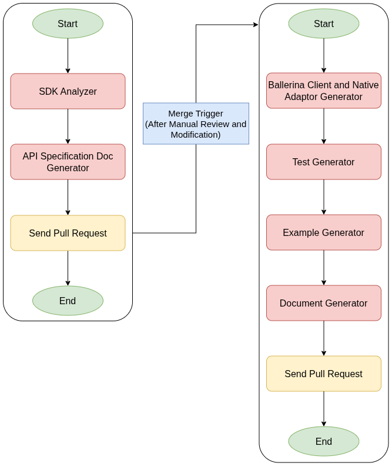

# AI-Powered Automation for Ballerina Connector Generation from SDKs

-   Authors: Kanistan Kanesalingam

-   Reviewed by: Danesh Kuruppu, Tharmigan Krishnananthalingam

-   Created date: 2026-01-23

-   Updated date: 2026-01-30

-   Issue: [1434](https://github.com/ballerina-platform/ballerina-spec/issues/1434)

-   State: InProgress

## Summary

This proposal outlines an AI-driven workflow to automate the generation
of Ballerina connectors from pre-existing Software Development Kits
(SDKs). The solution employs a multi-stage Large Language Model (LLM)
pipeline to analyze an SDK and synthesize the required Foreign Function
Interface (FFI) definitions, native interoperability logic,
comprehensive unit tests, documentation, and practical examples.

While the current implementation focuses on Java SDKs because
Ballerina's FFI presently supports invoking Java methods the overall
architecture is designed to be extensible, allowing future plugins to
support additional languages and runtime environments. This approach is
intended to produce production-ready connectors with minimal human
intervention.

## Motivation

The current process for developing Ballerina connectors from existing
SDKs is resource-intensive and susceptible to errors.Since Ballerina's
Foreign function Interface(FFI) Integration is only supported through
Java libraries, developers must manually build complex interoperability
layers for Java SDKs. This undertaking comprises the bidirectional
mapping of Java and Ballerina types, the management of memory
references, and the translation of Java exceptions into appropriate
Ballerina error constructs.

This manual approach presents several significant challenges:

1.  **Elevated Effort:** The development of a single robust connector
    typically necessitates 4-6 weeks of dedicated engineering time.

2.  **Inconsistency:** Variations in how different developers implement
    interoperability patterns result in a fragmented and non-uniform
    ecosystem.

3.  **Maintenance Burden:** Updates to the upstream SDK require manual,
    time-consuming code adjustments.

The present time offers a viable opportunity for this solution, owing to
the maturity of Large Language Model (LLM) technologies for code
generation and the escalating demand for connectors. By automating the
bridge logic, we can significantly accelerate the expansion of the
Ballerina ecosystem, thereby enabling internal developers and external
contributors to integrate robust SDKs both rapidly and reliably.

## Goals

-   To achieve complete automation in the generation of idiomatic
    Ballerina connectors from SDKs, encompassing source code, guides,
    API documentation, and examples.

-   To synthesize robust Foreign Function Interface (FFI) definitions
    and native language interoperability code without requiring manual
    development.

-   To automatically produce comprehensive unit tests (covering both
    positive and negative scenarios) and illustrative usage examples.

-   To guarantee that all generated code successfully compiles and
    executes through the implementation of an iterative
    self-correction mechanism.

## Non-Goals

-   This proposal is not intended to supersede the manual design of the
    high-level API surface for exceptionally complex, non-standard
    SDKs; however, it aims to deliver a starting point that is 90%
    complete.

-   The project\'s scope is strictly limited to generating Ballerina
    connectors from Java SDKs; support for other language SDKs is
    currently excluded. However, the architecture has been designed
    with pluggability to accommodate non-Java SDKs in the future, upon
    the availability of Ballerina language support for the
    corresponding Foreign Function Interface (FFI).

## Design

The solution\'s foundation is a pair of sequential GitHub Actions
workflows encompassing seven specialized AI modules. The system adheres
to a \"Generate and Validate\" architectural paradigm, wherein
AI-generated code undergoes immediate compilation, and any resulting
errors are subsequently channeled back into the model for rectification.

### System Components

1.  **SDK Analyzer:** This module performs a comprehensive analysis of
    the input SDK to extract foundational API structures, method
    ignatures, and type definitions, serving as the definitive source
    of truth for the integration.

2.  **Additional Information Provider (Optional):** Designed to augment
    the core analysis, this distinct module aggregates semantic
    context from supporting sources, specifically Code Examples and
    docs. It enriches the upstream data flow by supplying idiomatic
    usage patterns and descriptive metadata, thereby enhancing the
    fidelity of downstream specification derivation, example
    generation, and documentation synthesis.

3.  **Specification Generator:** Following the analysis, this module
    generates a formal API Specification Document for the Ballerina
    connector. This document serves as a blueprint, outlining the
    proposed client initialization logic and the signatures for the
    most frequently utilized client methods. Importantly, it excludes
    implementation-specific details, thereby facilitating a
    streamlined human review process.

4.  **Connector Generator (Client & Native Adaptor):** This module
    accepts the *approved* (and potentially revised) Specification
    Document to generate the actual connector implementation. This
    process is bifurcated into two distinct sub-tasks:

    a.  **Ballerina Client Generator:** Generates the Ballerina client,
        including Foreign Function Interface (FFI) definitions that
        align precisely with the established specification.

    b.  **Native Adaptor Generator:** Generates the corresponding
        language Native Adapter, incorporating the necessary type
        conversion and error handling logic.

5.  **Code Fixer:** A supporting utility module invoked during the
    generation phase. It is responsible for compiling the generated
    artifacts, analyzing ensuing compiler error messages, and
    iteratively applying corrections to resolve syntax or type
    mismatches until a successful build is achieved.

6.  **Test Generator:** This module analyzes the completed connector to
    automatically produce a comprehensive test suite. This suite
    encompasses tests for both successful method execution and various
    error handling scenarios.

7.  **Example Generator:** Synthesizes practical, compilable code
    snippets that clearly demonstrate real-world usage paradigms for
    the newly developed connector.

8.  **Document Generator:** Systematically scans the final codebase to
    generate user-centric Markdown documentation, effectively
    translating complex technical concepts into explanations centered
    on Ballerina principles.

### 

### Workflow Architecture

The process is executed in a structured Review-Then-Generate sequence,
comprising five distinct phases:

**Phase 1: Analysis and Specification**

-   The workflow is initiated upon the addition of a new SDK.

-   The Multi-Source SDK Analyzer conducts a thorough scan of the input.

-   The Specification Generator produces the formal Specification
    Document (API Blueprint).

-   **Output:** An initial Pull Request is raised, containing
    exclusively the generated Specification Document.

**Phase 2: Manual Review (Human-in-the-Loop)**

-   The developer is responsible for reviewing the content of the Pull
    Request.

-   The developer has the authority to modify API signatures, rename
    methods, or remove non-essential functionalities directly within
    the Specification Document.

-   Upon approval, the developer merges the Pull Request.

**Phase 3: Implementation Generation**

-   The merging of the specification Pull Request triggers the
    subsequent workflow.

-   The Connector Generator utilizes the *modified* and approved
    Specification Document as input.

-   It generates the complete Ballerina client and the corresponding
    Native Adaptor logic to precisely align with the approved
    specification.

-   The Code Fixer module is employed to ensure the generated code
    achieves successful compilation.

**Phase 4: Verification and Documentation**

-   The Test Generator module creates comprehensive unit tests.

-   The Example Generator module produces practical usage
    demonstrations.

-   The Document Generator module generates the final, official
    documentation.

**Phase 5: Final Delivery**

-   The system creates a new Pull Request to push these newly created
    artifacts, thereby marking it as complete and ready for the final
    merge operation.
    
### 

### Workflow Diagram
The following diagram illustrates the complete end-to-end workflow of the AI-Powered Automation for Ballerina Connector Generation from SDKs

*Figure 1: The Steps of the GitHub Workflow*

## Alternatives

1.  Existing bindgen Tool: The current Ballerina bindgen tool facilitates the automatic generation of bindings for Java classes.

- **Rationale for Rejection:** The bindgen tool generates a direct,
one-to-one mapping between Java classes and Ballerina constructs. This
approach yields code that is overly verbose and non-idiomatic,
essentially resulting in the direct implementation of Java logic
within the Ballerina environment. Consequently, significant manual
refactoring is required to achieve a user-friendly implementation.

2.  Manual Implementation: This involves continuing the established practice of manually authoring the Foreign Function Interface (FFI) code.

-   **Rationale for Rejection:** This method fails to address the
    inherent scalability challenge. The substantial time investment
    required per connector prevents the achievement of the projected
    ecosystem growth objectives.

## Testing

The feature, specifically the automation pipeline, will be rigorously
evaluated using a benchmark suite that includes popular open-source
libraries, with comparisons against existing handwritten Ballerina
connectors.

-   Success Criteria: The pipeline must produce a connector that
    successfully compiles and passes all generated unit tests.

-   Integration Testing: The generated tests will be executed against
    live APIs utilizing GitHub Secrets for the secure injection of
    requisite credentials.

## Risks and Assumptions

-   **Risk:** AI Hallucinations. The Large Language Model (LLM) may
    generate invocations of non-existent methods or use incorrect
    Ballerina data types.

    -   **Mitigation:** This risk is mitigated through a combination of
        the SDK Analyzer and the Code Fixer loop, the SDK Analyzer
        provides a structured view of the SDK, guiding the LLM toward
        only real and supported APIs, and the Code Fixer loop then
        uses the compiler as the final authority, and code is accepted
        only after successful compilation.

-   **Assumption:** The provided SDK adheres to standard conventions.
    Highly obfuscated code or the utilization of non-standard bytecode
    may lead to ambiguity for the Analyzer.

## Dependencies

-   GitHub Actions: The workflow is dependent on GitHub\'s Continuous
    Integration/Continuous Delivery (CI/CD) environment.

-   Large Language Model

-   Ballerina Compiler: This component is mandatory within the runtime
    environment to facilitate the validation loop of the Code Fixer.
