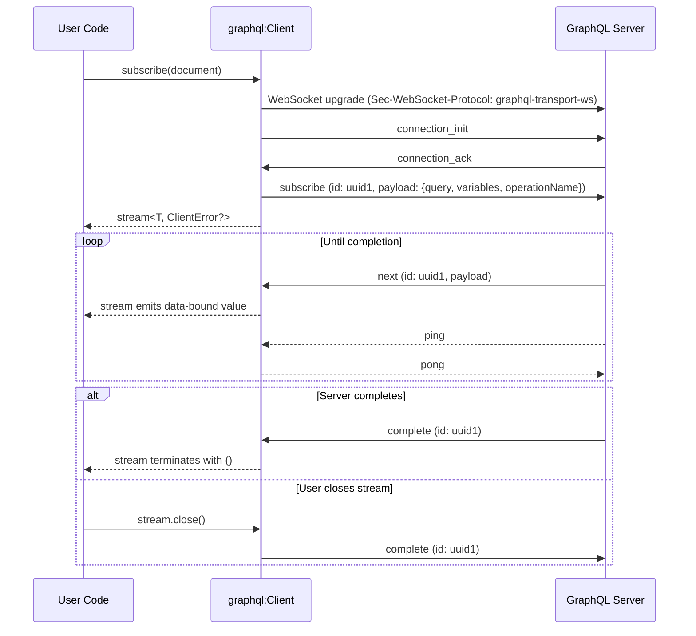

# GraphQL Client Subscription Support

- Authors
  - Thisaru Guruge
- Reviewed by
  - Danesh Kuruppu
- Created date
  - 2026-07-16
- Updated date
  - 2026-07-17
- Issue
  - [1460](https://github.com/ballerina-platform/ballerina-spec/issues/1460)
- State
  - Submitted

## Summary

The Ballerina GraphQL package provides a client (`graphql:Client`) to execute `query` and `mutation` operations against GraphQL services over HTTP. The third GraphQL operation type, `subscription`, is not supported by the client, even though the Ballerina GraphQL listener has supported serving subscriptions over WebSocket for a long time. This proposal adds subscription support to the `graphql:Client` using the [`graphql-transport-ws`](https://github.com/enisdenjo/graphql-ws/blob/master/PROTOCOL.md) WebSocket subprotocol, exposing subscription results as a Ballerina `stream`. As part of this, the client API is restructured around per-operation methods (`query()`, `mutate()`, and `subscribe()`), deprecating the generic `execute()` method and removing the already-deprecated `executeWithType()` method.

## Motivation

GraphQL subscriptions are long-lived operations that allow a server to push results to a client over time, most commonly over WebSocket. The Ballerina GraphQL listener implements subscriptions using the `graphql-transport-ws` subprotocol, but the `graphql:Client` cannot consume them.

Today, a Ballerina user who wants to consume a GraphQL subscription must:

1. Create a raw `websocket:Client` with the `graphql-transport-ws` subprotocol header.
2. Hand-write the subprotocol handshake (`connection_init`/`connection_ack`).
3. Hand-write the `subscribe` message with a unique operation ID.
4. Read and dispatch `next`, `error`, and `complete` messages manually.
5. Respond to `ping` messages with `pong` messages to keep the connection alive.
6. Handle data binding of the raw JSON payloads manually.

This is exactly the boilerplate the Ballerina GraphQL module's own integration tests are forced to write today. Every other major GraphQL client (Apollo Client, graphql-ws, gql for Python, etc.) supports subscriptions out of the box; the lack of it is a notable gap in the Ballerina GraphQL story, especially since Ballerina positions itself as an integration language and the server side already supports the feature.

An earlier proposal for this feature exists in [ballerina-library#3560](https://github.com/ballerina-platform/ballerina-library/issues/3560). It was deferred due to a `websocket` module limitation ([ballerina-library#3962](https://github.com/ballerina-platform/ballerina-library/issues/3962)), which has since been resolved. This BEP supersedes that proposal and updates the design to match the current `graphql:Client` API.

## Goals

- Support executing GraphQL `subscription` operations with the `graphql:Client`.
- Expose subscription results as a Ballerina `stream` with data binding, consistent with the idioms used by other Ballerina clients (e.g., `sql:Client`).
- Handle the `graphql-transport-ws` subprotocol (handshake, multiplexing, keep-alive, and reconnection) transparently, so the user never deals with protocol messages.
- Restructure the client API around per-operation methods (`query()`, `mutate()`, and `subscribe()`) so that the operation semantics and the return shape are explicit at the call site.

## Non-Goals

- Supporting subscription transports other than WebSocket (e.g., server-sent events via `graphql-sse`). The configuration design keeps room for this as future work.
- Adding subscription support to the GraphQL client generation tool (`bal graphql` client generation). This is a natural follow-up, but it is tracked separately.

## Design

### Overview

The `graphql:Client` gains a new remote method, `subscribe()`, which executes a subscription document and returns a `stream` of data-bound responses. Internally, the client lazily creates a single `websocket:Client` (per `graphql:Client` instance) on the first `subscribe()` call and multiplexes all subscription operations over it, as permitted by the `graphql-transport-ws` protocol.

Alongside this, two new remote methods, `query()` and `mutate()`, are introduced for the request-response operation kinds, the generic `execute()` method is deprecated, and the previously-deprecated `executeWithType()` method is removed.



### API Changes

#### Per-Operation Methods: `query()` and `mutate()`

Two new remote methods are introduced for the request-response operation kinds. Both share the shape of the current `execute()` method:

```ballerina
# Executes a GraphQL query operation and data binds the response.
#
# + document - The GraphQL document containing the query operation.
#              For example `query countryByCode($code: ID!) { country(code: $code) { name } }`
# + variables - The GraphQL variables. For example `{"code": "<variable_value>"}`
# + operationName - The GraphQL operation name. If the document has more than one operation,
#                   the operation name must be provided
# + headers - The headers to be sent with the request
# + targetType - The type the response is expected to be bound to
# + return - The data-bound response, or a `graphql:ClientError` if the execution fails
remote isolated function query(string document, map<anydata>? variables = (),
        string? operationName = (), map<string|string[]>? headers = (),
        typedesc<GenericResponseWithErrors|record {}|json> targetType = <>)
        returns targetType|ClientError;

# Executes a GraphQL mutation operation and data binds the response.
# (Parameters and return type are identical to `query()`.)
remote isolated function mutate(string document, map<anydata>? variables = (),
        string? operationName = (), map<string|string[]>? headers = (),
        typedesc<GenericResponseWithErrors|record {}|json> targetType = <>)
        returns targetType|ClientError;
```

Since all three operation kinds have dedicated methods, each method validates that the operation being executed matches the invoked method. This validation uses the existing GraphQL parser written in Ballerina, shipped with the `graphql` package as the `graphql.parser` submodule (the same parser used by the listener implementation). Executing a mismatched document (e.g., passing a mutation document to `query()`) returns a `graphql:InvalidDocumentError` without sending the request. Without this validation, `query()` and `mutate()` would be purely documentary, as both use an identical HTTP request on the wire.

The client currently performs no client-side parsing of the document; this proposal introduces it. The module documentation and samples must be updated to reflect the client-side validation behavior, including the errors it can produce.

#### The `subscribe()` Method

```ballerina
# Executes a GraphQL subscription document and returns a stream of data-bound responses.
#
# + document - The GraphQL document containing the subscription operation.
#              For example `subscription { totalDonations }`
# + variables - The GraphQL variables. For example `{"code": "<variable_value>"}`
# + operationName - The GraphQL operation name. If the document has more than one operation,
#                   the operation name must be provided
# + id - The unique ID for the subscription operation. If not provided, a UUID is generated.
#        The ID must be unique among the active subscriptions of this client
# + targetType - The type each subscription event is expected to be bound to
# + return - A stream of data-bound responses, or a `graphql:ClientError` if the subscription
#            could not be established
remote isolated function subscribe(string document, map<anydata>? variables = (),
        string? operationName = (), string? id = (),
        typedesc<GenericResponseWithErrors|record {}|json> targetType = <>)
        returns stream<targetType, ClientError?>|ClientError;
```

Design notes:

- A dedicated `subscribe()` method is introduced instead of overloading the existing `execute()` method. Queries and mutations are request-response operations that return a single value; subscriptions are long-lived operations that return a stream. Keeping them separate keeps both signatures simple and makes the operation semantics explicit at the call site. (See [Alternatives](#alternatives).)
- The return type follows the established Ballerina idiom of dependently-typed stream-returning client methods (e.g., `sql:Client->query()` returning `stream<rowType, sql:Error?>`).
- Each `next` event payload is data-bound to `targetType` using the same rules the `query()` method uses for a single response. A payload that fails to bind terminates the stream with a `graphql:PayloadBindingError`.
- The user can provide the operation ID via the `id` parameter (useful for tracing and debugging); otherwise, the client generates a UUID. The client validates the uniqueness of a user-provided ID against the active subscriptions locally and returns a `graphql:SubscriptionError` on a duplicate, since sending a duplicate ID would cause the server to close the entire connection (close code `4409`, per the protocol).
- There is no `headers` parameter: subscriptions do not have a per-operation HTTP request. Headers for the WebSocket upgrade request can be set via the `customHeaders` field of the `WebSocketClientConfiguration`, and connection-scoped parameters (such as authentication tokens) can be sent via the `connectionInitPayload` configuration (both described below).

#### Deprecating `execute()` and Removing `executeWithType()`

- The `execute()` method is deprecated in favor of the per-operation methods. It remains functional throughout a deprecation period and will be removed in a later major version.
- The `executeWithType()` method, which has already been deprecated in favor of `execute()`, is removed.

#### The `close()` Method

A new remote method is added to close the client:

```ballerina
# Terminates all active subscriptions, closes the underlying WebSocket connection (if any),
# and marks the client as closed.
#
# + return - A `graphql:ClientError` if the client could not be closed gracefully
remote isolated function close() returns ClientError?;
```

The `close()` method handles subscriptions as follows:

1. A `complete` message is sent for every active subscription, so the server can release the resources associated with each operation.
2. The WebSocket connection is closed with a normal closure.
3. Every active subscription stream is terminated with `()`; consumers blocked on `next()` receive the stream end.

Invoking `close()` also abandons any in-flight reconnection attempts; once closing has begun, no new WebSocket connection is established. After `close()` returns, the client is closed: any subsequent `query()`, `mutate()`, or `subscribe()` call returns a `graphql:ClientError`. A single `close()` method is provided (rather than a subscriptions-only closing method) since closing only the subscriptions while continuing to use the rest of the client is not a meaningful use case.

#### `ClientConfiguration` Changes

The existing `graphql:ClientConfiguration` is a flat record of HTTP client configurations. One optional field is added:

```ballerina
public type ClientConfiguration record {|
    // ... existing fields remain unchanged ...

    # Configurations related to GraphQL subscriptions over WebSocket. Nil value means the
    # default subscription behavior with default configurations
    WebSocketConfiguration? subscription = ();
|};

# Represents the WebSocket transport configurations for GraphQL subscriptions.
#
# + serviceUrl - The WebSocket URL of the subscription endpoint. If not provided, it is derived
#                from the client's service URL by mapping `http` to `ws` and `https` to `wss`
# + connectionInitPayload - The payload to be sent with the `connection_init` message,
#                           commonly used to pass authentication information
# + reconnect - The reconnection configurations. Nil value disables automatic reconnection
# + websocketConfig - The configurations of the underlying `websocket:Client`
public type WebSocketConfiguration record {|
    string? serviceUrl = ();
    map<json>? connectionInitPayload = ();
    ReconnectConfig? reconnect = ();
    WebSocketClientConfiguration websocketConfig = {};
|};

# Represents the configurations of the underlying WebSocket client used for subscriptions.
public type WebSocketClientConfiguration record {|
    // Every field of `websocket:ClientConfiguration` except `subProtocols`,
    // copied with identical names, types, and defaults
|};
```

Design notes:

- The field is named `subscription` (not `websocket`) since it configures the subscription capability of the client rather than a transport. No transport-abstraction type is introduced for it: the Ballerina `http:Client` supports SSE natively (responses data-bind to `stream<http:SseEvent, error?>`) with no SSE-specific client configurations, so a future `graphql-sse` transport can reuse the GraphQL client's existing HTTP configurations in `ClientConfiguration` as-is. If transport-specific settings turn out to be necessary, the field type can be widened to a union (e.g., `WebSocketConfiguration|SseConfiguration`) at that point.
- A nil `subscription` field does not disable subscriptions: `subscribe()` works with the default behavior (derived URL, no `connection_init` payload, no reconnection, default WebSocket configurations).
- The GraphQL module already depends on the `websocket` module for the listener-side subscription support, so using the WebSocket client underneath does not add a new dependency.
- The subprotocol is not user-configurable: `WebSocketClientConfiguration` mirrors `websocket:ClientConfiguration` without the `subProtocols` field, and the client always sets the subprotocol to `graphql-transport-ws` internally. A dedicated record (instead of exposing `websocket:ClientConfiguration` directly and overriding the field) prevents a user-provided value from being silently ignored.
- A separate `serviceUrl` override is provided because some GraphQL deployments host subscriptions on a different endpoint than queries and mutations.
- Custom headers for the WebSocket upgrade request (e.g., an `Authorization` header) are supported via the `customHeaders` field of the `WebSocketClientConfiguration`. For example:

```ballerina
graphql:Client donationsClient = check new ("http://localhost:9090/donations",
    subscription = {
        connectionInitPayload: {authToken: token},
        websocketConfig: {
            customHeaders: {"Authorization": string `Bearer ${token}`}
        }
    }
);
```

#### Automatic Reconnection

Subscription connections are long-lived and can be dropped by intermediaries. The client supports automatic reconnection, configured via the `reconnect` field:

```ballerina
# Represents the reconnection configurations for the subscription connection.
#
# + maxAttempts - The maximum number of reconnection attempts before giving up
# + interval - The initial interval (in seconds) between reconnection attempts
# + backOffFactor - The multiplier applied to the interval after each failed attempt
# + maxInterval - The maximum interval (in seconds) between reconnection attempts
public type ReconnectConfig record {|
    int maxAttempts = 5;
    decimal interval = 1;
    float backOffFactor = 2.0;
    decimal maxInterval = 30;
|};
```

The field types follow the existing retry configurations of the platform (`http:RetryConfig`, `websocket:WebSocketRetryConfig`), which use `decimal` for intervals and `float` for the backoff factor. The reconnection configuration is validated at client initialization: invalid values (e.g., a negative `interval`, a non-positive `backOffFactor`, or a `maxInterval` less than the `interval`) result in a `graphql:ClientError`.

When the WebSocket connection is dropped abnormally and reconnection is configured:

1. The client attempts to re-establish the connection following the configured retry strategy.
2. On a successful reconnection, the client redoes the `connection_init`/`connection_ack` handshake (re-sending the configured `connectionInitPayload`) and re-sends the `subscribe` message for every active subscription, reusing the original IDs and payloads.
3. The existing streams continue to emit events transparently; user code does not observe the reconnection.
4. If all attempts fail, every active stream is terminated with a `graphql:SubscriptionError`.

When reconnection is not configured (the default), a dropped connection immediately terminates all active streams with a `graphql:SubscriptionError`.

> **Note:** GraphQL subscriptions are not durable: events published by the server while the client is disconnected are lost. Reconnection restores the subscription, not the missed events.

#### Error Types

A new public error type is introduced to represent subscription-specific failures (handshake failures, protocol violations, connection drops, and server-sent `error` messages):

```ballerina
# Represents errors occurring while establishing or executing a GraphQL subscription
public type SubscriptionError distinct (ClientError & error<record {| ErrorDetail[]? errors; |}>);
```

When the server responds to a `subscribe` message with an `error` message (e.g., document validation failures), the GraphQL errors from the payload are made available via the `errors` field of the `SubscriptionError` detail.

> **Implementation note:** The module currently has an internal (non-public) `SubscriptionError` type used by the listener implementation. Since it is not public, it can be renamed without a breaking change.

### Runtime Behavior

#### Connection Lifecycle

1. The `graphql:Client` `init` method does not open a WebSocket connection. It only resolves and stores the WebSocket URL and configurations.
2. On the first `subscribe()` call, the client opens the WebSocket connection with the `graphql-transport-ws` subprotocol, sends `connection_init` (with the configured `connectionInitPayload`, if any), and waits for `connection_ack`. This connection establishment (the WebSocket upgrade and the `connection_init`/`connection_ack` handshake) is bounded by the client's `timeout` configuration: on expiry, the client closes the socket and cleans up the pending handshake state. Failure at any of these steps returns a `graphql:SubscriptionError` from `subscribe()`.
3. Subsequent `subscribe()` calls reuse the established connection.
4. If the WebSocket connection drops, the reconnection behavior described above applies.

#### Multiplexing

The `graphql-transport-ws` protocol supports executing multiple operations over a single connection, distinguished by a unique ID:

- The client uses the user-provided ID or generates a UUID for each `subscribe()` call and sends it as the `id` of the `subscribe` message.
- The client maintains a map from ID to the corresponding stream's producer.
- A background reader dispatches each incoming message by its `id`:
  - `next` - the payload is data-bound and emitted to the corresponding stream.
  - `error` - the corresponding stream is terminated with a `graphql:SubscriptionError` carrying the GraphQL errors, and the ID is removed from the map.
  - `complete` - the corresponding stream is terminated with `()`, and the ID is removed from the map.
- Messages received for an ID that is not in the map are ignored. Such messages can occur when the server sends events for an operation the user has already unsubscribed from, before the `complete` message reaches the server.
- `ping` messages are answered with `pong` messages automatically, independent of any operation.

#### Stream Semantics

- `stream.next()` blocks until the next event, an error, or completion.
- `stream.close()` removes the operation from the active-subscription map and then sends a `complete` message for the corresponding operation ID, so the server stops sending events for that operation, per the protocol. The removal happens locally before sending the message, since client-to-server `complete` messages are not acknowledged by the server; this guarantees that a user-closed operation is never resubscribed by the reconnection logic.
- Closing the last active stream does not close the WebSocket connection; the connection is reused for future subscriptions and is closed only by the client's `close()` method.

### Example

```ballerina
import ballerina/graphql;
import ballerina/io;

type DonationsResponse record {|
    record {| int totalDonations; |} data;
|};

public function main() returns error? {
    graphql:Client donationsClient = check new ("http://localhost:9090/donations");

    stream<DonationsResponse, graphql:ClientError?> donations =
        check donationsClient->subscribe(string `subscription { totalDonations }`);

    check from DonationsResponse response in donations
        do {
            io:println(response.data.totalDonations);
        };

    check donationsClient->close();
}
```

The query action consumes the stream until the server completes the subscription (or an error occurs). To stop consuming earlier, the user can call `donations.close()`, which unsubscribes from the operation.

## Alternatives

### Overloading the `execute()` Method

The earlier proposal ([ballerina-library#3560](https://github.com/ballerina-platform/ballerina-library/issues/3560)) evolved toward extending the `execute()` method's `targetType` to accept a `stream` type, using the binding type to detect subscription operations. This was rejected because:

- It conflates two fundamentally different operation semantics (single response vs. long-lived stream) behind one signature, making the return type of `execute()` significantly harder to reason about.
- Selecting the operation kind via the binding type is implicit and error-prone; binding a subscription document with a non-stream `targetType` (or vice versa) can only fail at runtime.
- Per-operation methods were suggested during the review of the earlier proposal, and mirror how other Ballerina clients expose streaming results.

### Keeping `execute()` as the Only API for Queries and Mutations

Adding only `subscribe()` while keeping `execute()` for queries and mutations was considered. This was rejected because it results in an inconsistent API surface: one generic method for two operation kinds and a dedicated method for the third. Per-operation methods make the client API self-documenting and allow operation-kind validation on the client side.

### An Intermediate `Subscriber` Object

The original form of the earlier proposal returned a `Subscriber` client object from `execute()`, from which the user obtained the stream and performed `unsubscribe()`. This was already rejected during the earlier review: Ballerina streams have a `close()` method, which makes the intermediate object redundant.

### A Separate Subscription Client

A standalone `graphql:SubscriptionClient` could isolate the WebSocket concerns from the HTTP client. This was rejected because a GraphQL endpoint is a single conceptual service; forcing users to build two clients for one endpoint adds friction without any expressiveness benefit.

### Doing Nothing

Users can continue using a raw `websocket:Client`. This leaves a standard GraphQL capability unsupported in the Ballerina library and forces every user to re-implement (and maintain) protocol boilerplate that is easy to get subtly wrong (e.g., forgetting to answer `ping` messages results in servers dropping the connection).

## Testing

- Unit tests for the protocol handling logic: handshake, multiplexing dispatch, ping/pong handling, reconnection, and error propagation.
- Unit tests for the operation-kind validation of `query()`, `mutate()`, and `subscribe()`.
- Integration tests running the client against the Ballerina GraphQL listener's subscription support, covering:
  - Single and multiple concurrent subscriptions over one connection
  - User-provided operation IDs, including duplicate ID validation
  - Data binding to `GenericResponseWithErrors` subtypes, open records, and `json`
  - Server-side validation errors surfacing as `graphql:SubscriptionError`
  - Stream closure sending `complete`, and the `close()` method behavior
  - Connection failure, abrupt server disconnect, and reconnection scenarios (with and without `reconnect` configured)
  - Authentication via `connectionInitPayload` and via WebSocket upgrade headers
- The existing subscription integration tests in the module (currently written against a raw `websocket:Client`) can be progressively migrated to the new API, which also serves as a real-world validation of the design.

## Risks and Assumptions

- **Breaking changes**: This proposal includes backward-incompatible changes:
  - Removing the deprecated `executeWithType()` method.
  - Adding a new field to the closed `ClientConfiguration` record, which breaks binary (BIR) compatibility for dependents compiled against the previous version.

  Therefore, these changes must be shipped in a release where breaking changes are permitted, with the major version bump.

- **Protocol assumption**: The server is assumed to speak `graphql-transport-ws`. Older servers using the legacy `graphql-ws` (subscriptions-transport-ws) subprotocol are not supported. This matches the Ballerina listener's behavior, which also supports only `graphql-transport-ws`.
- **Concurrency**: The multiplexing dispatcher and the subscriber map must be safe under concurrent `subscribe()`/`close()` calls; the design confines this state to the client instance and relies on Ballerina isolation to enforce safety.
- **Blocking reads**: The background reader must not block stream consumers indefinitely on connection loss. The previously reported `websocket` module issue where `readMessage()` blocked after `close()` ([ballerina-library#3962](https://github.com/ballerina-platform/ballerina-library/issues/3962)) has been resolved, so this is no longer a blocker.
- **Non-durable subscriptions**: Automatic reconnection restores active subscriptions but cannot recover events published while disconnected.

## Dependencies

- The `ballerina/websocket` module (already a dependency of the GraphQL module) for the underlying WebSocket client.

## Future Work

- Subscription support in the GraphQL client generation tool, generating typed `subscribe` methods per operation.
- Support for the `graphql-sse` (server-sent events) transport. Since the Ballerina `http:Client` supports SSE natively with no transport-specific configurations, this can reuse the GraphQL client's existing HTTP configurations.
- Removal of the deprecated `execute()` method after the deprecation period.

## References

- [GraphQL Specification - Subscriptions](https://spec.graphql.org/October2021/#sec-Subscription)
- [graphql-transport-ws Protocol Specification](https://github.com/enisdenjo/graphql-ws/blob/master/PROTOCOL.md)
- [Earlier Proposal: GraphQL Client Subscription Support (ballerina-library#3560)](https://github.com/ballerina-platform/ballerina-library/issues/3560)
- [Ballerina GraphQL Module Specification](https://github.com/ballerina-platform/module-ballerina-graphql/blob/master/docs/spec/spec.md)

[]: # (end)
[]: # Please add any comments to issue [#1460](https://github.com/ballerina-platform/ballerina-spec/issues/1460)
