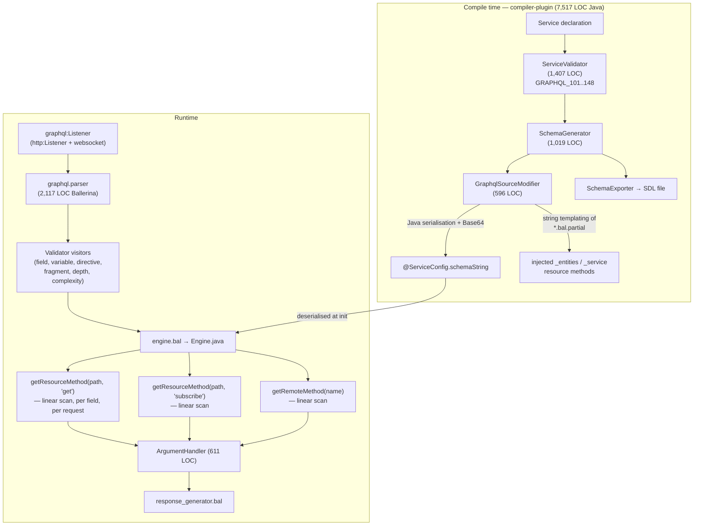

# Compile-Time-Resolved Runtime Dispatch for the GraphQL Engine

- Authors
  - Thisaru Guruge
- Reviewed by
  - Danesh Kuruppu
- Created date
  - 2026-08-14
- Updated date
  - 2026-08-17
- Issue
  - [1472](https://github.com/ballerina-platform/ballerina-spec/issues/1472)
- State
  - Submitted

## Summary

The Ballerina GraphQL runtime answers every field resolution by linearly scanning the service's full set of resource and remote methods. That holds for a `Query` or nested-object field, a `Mutation` field, and a `Subscription` field alike. The scan is re-run for every field on every request, and a second equivalent scan finds the same field's `@graphql:ResourceConfig`. The mapping from field to method is fixed for the lifetime of the service, so none of that work needs repeating per request. This proposal records it once, by extending an analysis pass that already runs per service at listener-attach time and already walks the same methods. Every per-request dispatch lookup then becomes a single map lookup keyed by schema coordinate. The same structure holds a federation entity type map, which lets the engine resolve `_entities` and `_service` natively instead of having them injected as Ballerina source at compile time. That is the one piece of Federation v2 direction this proposal commits to; the rest of federation parity is left to the Apollo Federation v2 Parity BEP.

## Motivation

The runtime maintains two parallel dispatch paths: `getResourceMethod(...)` keyed by accessor and `getRemoteMethod(...)` keyed by name. Each is a linear scan over every resource or remote method on the service. Neither result is cached per listener, so the scan is redone on every request, for every field, and again for the `@graphql:ResourceConfig` lookup that accompanies it. The infrastructure to fix this already exists: the package runs a once-per-service analysis pass that walks the same methods and stores a coordinate-keyed map on the service object. That map does not carry the method reference itself, which is the one piece of information that would let the engine stop re-scanning.

The same structure solves a second problem. Today the federation `_entities` and `_service` resolvers are not engine code at all: they are Ballerina source, synthesised at compile time from template files by placeholder substitution and parsed back into the service. The templating step can fail independently of anything the user wrote. Once a compile-time-resolved dispatch table exists for ordinary fields, the entity resolvers no longer need a source-injection mechanism of their own. An entity type map in the same structure is enough, and the compile-time failure modes disappear with the templating that produced them. Neither change alters behaviour: they change how fast dispatch finds the answer, and where the entity resolvers live, never what a given document resolves to.

## Goals

- Replace the runtime's per-request, per-field linear scan over every resource and remote method with a dispatch structure resolved once per service, reusing the attach-time analysis pass the package already runs.
- Set the direction for Federation v2 parity, namely engine-native `_entities`/`_service` resolution, and hand the rest of the directive/validation/composition work to the Apollo Federation v2 Parity BEP rather than designing it here.

## Non-Goals

- **Federation v2 parity, designed in full.** Only engine-native `_entities`/`_service` resolution is committed here. The directive set, `FieldSet` validation, reference-resolver narrowing, static composition, and cross-module entities are out of scope, and are designed in the [Apollo Federation v2 Parity BEP](1477_graphql_federation_v2_parity.md) ([#1477](https://github.com/ballerina-platform/ballerina-spec/issues/1477)), which builds on what [Section 2](#2-engine-native-entity-and-service-resolution) specifies here. That BEP states that its own design is carried forward from unreviewed draft work and must be re-verified before implementation; nothing in it is committed by this proposal.
- **The resolver model.** This proposal changes how a field is dispatched, not how a field is declared. Two things are designed in the [GraphQL Unified Resolver Model BEP](1473_graphql_unified_resolver_model.md) ([#1473](https://github.com/ballerina-platform/ballerina-spec/issues/1473)) rather than here: the accessor set a service may use, and the compile-time rules that become natural to enforce while the coordinate map is being built (a cross-family duplicate-field check, and the `graphql:Upload` permitted-accessor rule re-expressed against operation type). Both are motivated by a second accessor spelling.
- **General performance tuning.** The dispatch structure specified here is the one performance change; this proposal sets no other performance goals.

## Current State Analysis

This section records the present-day behaviour that [Design](#design) changes. Every claim is sourced from the package at `ballerina/graphql` v1.18.0 (distribution `2201.13.3`) and, where noted, the [Ballerina GraphQL Specification](https://github.com/ballerina-platform/module-ballerina-graphql/blob/master/docs/spec/spec.md).

> **Note on `GRAPHQL_nnn` codes.** Every diagnostic code cited in this document under its _current_ number (`GRAPHQL_137` and so on) comes from the GraphQL **compiler plugin**, an implementation detail of this package rather than a Ballerina language error code. The [GraphQL Diagnostic Code Convention BEP](1471_graphql_diagnostic_code_convention.md) ([#1471](https://github.com/ballerina-platform/ballerina-spec/issues/1471)) replaces every one of these numbers. This section keeps the current numbers because they are what ships today, and cross-references the new numbers where useful.

### Architecture

The three-way dispatch at the bottom of the runtime path (`RD1`/`RD2`/`RD3` in the diagram above) follows from the current resolver model. The engine selects between them based on the document's operation type; the attach-time service analysis walks resource and remote methods as two separate loops. Each of `RD1`/`RD2`/`RD3` is, today, a linear scan over every resource or remote method on the service, run again for every field of every request. [Section 1](#1-compile-time-resolved-runtime-dispatch) has the fix.

### Runtime dispatch performance

Every field resolution is answered today by a linear scan over the service's full set of resource or remote methods, matched by accessor and path. That holds for a `Query`/nested-object field, a `Mutation` field, and a `Subscription` field alike. Each scan is **re-run for every field, on every request**: the answer is fixed for the lifetime of the service, but nothing records it, so the runtime has no per-service method table to consult. A separate scan looks up the `@graphql:ResourceConfig` annotation for the same field, so a single field resolution can trigger a linear scan more than once. None of this is cached per listener; it is redone on every request.

The package already has the infrastructure to fix this, without adding a new one. One analysis pass runs per service, at listener-attach time, walking every resource and remote method once and storing the result in a map keyed by schema coordinate (e.g. `"Query.greeting"`) as native data on the service object. Today that map's entries carry only a complexity value, not a reference to the method itself. See [Section 1](#1-compile-time-resolved-runtime-dispatch).

### Federation / subgraph

The subgraph module contains declarations only, no logic. Supported Federation directives are **exactly two**: `@key` (on object and interface types, taking a `fields` selection and a `resolvable` flag) and `@link` (schema-level). The `@link` directive it emits already points at `https://specs.apollo.dev/federation/v2.0`, so the package is not stuck on the Federation v1 specification; what it lacks is coverage of the rest of the v2 directive set. The `_entities`/`_service` resolvers are injected as Ballerina source at compile time, generated from template files with placeholder substitution and parsed back in. Failure surfaces as `GRAPHQL_137`/`GRAPHQL_138`. Full design work addressing these limitations is deferred to the Apollo Federation v2 Parity BEP rather than designed here. See [Section 2](#2-engine-native-entity-and-service-resolution).

## Design

Two design items. The first replaces the runtime's per-request dispatch scans with a structure resolved once per service. The second builds federation entity and service resolution on that same structure, and is the only piece of Federation v2 work this proposal commits to.

### 1. Compile-time-resolved runtime dispatch

**The problem** ([Current State Analysis](#runtime-dispatch-performance)): the runtime resolves every `Query`/nested-object field, every `Mutation` field, and every `Subscription` field by linearly scanning the service's full set of resource and remote methods, on every field resolution, on every request. The mapping from schema coordinate to resolving method is fixed for the lifetime of the service, yet it is recomputed for every field of every request.

**The fix reuses an existing once-per-service analysis pass rather than adding a new one.** That pass is `ServiceAnalyzer`, runtime code invoked from `EngineUtils` when the service is attached to the listener. It walks every resource and remote method of the runtime `ServiceType` once, derives a schema coordinate for each, and stores the result as native data on the service object. Today each entry is a `Resource` record carrying only a complexity value; this proposal extends the entry to also carry the method that resolves the coordinate and that method's `@graphql:ResourceConfig`.

Both are already in hand at that point: the pass holds the live `ResourceMethodType`/`RemoteMethodType` objects it is iterating, and already reads `@graphql:ResourceConfig` off each of them to compute complexity. **No method identity needs to be serialised into, or recovered from, the compile-time `schemaString`.** The compiler plugin's contribution to the runtime remains what it is today, the encoded schema; what this proposal changes is how much of the service's own structure the attach-time pass records while it is already walking it. Every per-request dispatch lookup in the runtime then becomes a single map lookup keyed by schema coordinate instead of a linear scan: a query/nested-object field, a mutation field, a subscription field, and the field's `@graphql:ResourceConfig` alike, whichever accessor spelling produced that coordinate at compile time.

**Why this stands alone.** The fix improves today's already-shipped `get`/`remote`/`subscribe` dispatch, whether or not a second accessor spelling is ever added. It is also a prerequisite of two separate pieces of work: the [GraphQL Unified Resolver Model BEP](1473_graphql_unified_resolver_model.md) ([#1473](https://github.com/ballerina-platform/ballerina-spec/issues/1473)), which is simpler to specify and to implement against this structure than against the three scans it replaces, and the engine-native entity resolution in [Section 2](#2-engine-native-entity-and-service-resolution) of this proposal. The fix also makes the number of accessor spellings a field can have irrelevant to dispatch cost, which is what allows a service to accept two spellings at once without a per-request penalty. The [GraphQL Unified Resolver Model BEP](1473_graphql_unified_resolver_model.md) ([#1473](https://github.com/ballerina-platform/ballerina-spec/issues/1473)) relies on that property; it is noted here because it follows from this design.

### 2. Engine-native entity and service resolution

Full design work for Federation v2 parity is deferred to the Apollo Federation v2 Parity BEP and is not designed here: the directive set, `FieldSet` validation, reference-resolver narrowing, static composition, and cross-module entities. None of it is committed by this proposal, and none of it should be read as if it were. See [Non-Goals](#non-goals).

**The one piece of direction this proposal does commit to**, because it builds on the structure [Section 1](#1-compile-time-resolved-runtime-dispatch) introduces and should not wait on the rest of federation's design: `_entities` and `_service` are resolved **natively by the engine**, not injected as compiled Ballerina source. Today those resolvers are synthesised at compile time by generating Ballerina source from template files with placeholder substitution and parsing the result back in. That templating step can fail (`GRAPHQL_1205`/`GRAPHQL_1206`) independently of anything the user wrote. Once the engine holds a compile-time-resolved dispatch table for ordinary fields anyway, the same structure can hold an entity type map (`__typename` → type symbol + optional `resolveReference`), and no Ballerina source needs synthesising: `_service { sdl }` is answered by the engine from the encoded schema, and `_entities(representations:)` dispatches on `__typename` through the map.

Two points of precision, because this replaces a shipped implementation rather than adding a new one:

- **`resolveReference` is optional in the map.** An entity declared `@key(..., resolvable: false)` has no reference resolver, as does a type carrying no `@subgraph:Entity` annotation. Today's injected resolver answers both cases with an error per representation rather than failing the request. The map entry must therefore make `resolveReference` optional and preserve that behaviour.
- **`_service { sdl }` returns the same artifact it returns today**, which the injected template obtains by calling `graphql:getSdlString(config.schemaString)`, not by re-running `SchemaExporter`. Directive retention, definition ordering and formatting follow from reusing that conversion, and are settled by parity rather than re-specified here.

The contract for all of this is **behavioural parity with the currently injected resolvers**, whose semantics are already pinned by the existing subgraph test suite: unknown `__typename`, a type with no `@subgraph:Entity`, a missing reference resolver, a resolver returning `error` or `()`, a wrong return type, and result ordering following representation order. Parity is what the [Testing](#testing) obligation below requires, message text included. The federation directive semantics that sit above this, including anything `resolvable: false` implies for composition, belong to the [Apollo Federation v2 Parity BEP](1477_graphql_federation_v2_parity.md) ([#1477](https://github.com/ballerina-platform/ballerina-spec/issues/1477)). `GRAPHQL_1205`/`GRAPHQL_1206` are removed once this ships, since the failure modes they report cannot occur once there is no source injection to fail.

## Alternatives

### A second, dispatch-specific cache alongside the existing analysis pass

The obvious way to stop the per-request scans is to add a cache in front of them. It is rejected in favour of extending the map the once-per-service analysis pass already builds. That pass runs once per service, walks the methods a dispatch cache would have to walk, and keys its result by schema coordinate. It is missing one field, not a mechanism, so the fix reuses existing code rather than introducing a second structure alongside it.

### Keeping compile-time source injection for `_entities`/`_service`

Leaving federation's entity and service resolvers as generated Ballerina source works today and is the status quo. It is rejected because the mechanism carries a compile-time failure mode of its own (`GRAPHQL_1205`/`GRAPHQL_1206`) that has nothing to do with what the user wrote, and because [Section 1](#1-compile-time-resolved-runtime-dispatch)'s structure removes the need for the mechanism rather than hardening it.

## Testing

Fixture-level test obligations are left to implementation. The categories of coverage:

- **Dispatch table.** The dispatch table must resolve every field to the correct method, including nested-object and federation entity fields, with a regression test proving dispatch no longer scans the full method list per request.
- **Performance.** Because performance is this proposal's justification, the improvement is measured rather than asserted. A benchmark compares before and after across a range of service sizes (method count) and query shapes (field count, nesting depth), and separately records the one-off attach-time cost of building the table. The acceptance criterion is that per-request resolution time stops growing with the service's method count, and that attach-time cost stays proportional to the service size and is paid once.
- **Federation.** The one committed item, engine-native `_entities`/`_service`, needs parity tests against today's source-injected behaviour, including every error path and its exact message text. Everything else is deferred to the Apollo Federation v2 Parity BEP.

## Risks and Assumptions

### Risks

- **Federation directive semantics are Apollo-defined and versioned**, and this proposal does not design the federation directive set at all. Tracked risk for the Apollo Federation v2 Parity BEP, not this one.

### Assumptions

- **No performance regression is expected.** The dispatch-table change specified here should be an improvement over today. This is not yet measured; [Testing](#testing) makes measuring it an obligation of the implementation rather than leaving the claim as an assumption.

## Dependencies

- **[GraphQL Diagnostic Code Convention BEP](1471_graphql_diagnostic_code_convention.md) ([#1471](https://github.com/ballerina-platform/ballerina-spec/issues/1471)).** Supplies the numbering this proposal cites: `GRAPHQL_1205`/`GRAPHQL_1206` are the renumbered forms of today's `GRAPHQL_137`/`GRAPHQL_138`, which [Section 2](#2-engine-native-entity-and-service-resolution) removes on delivery.
- **The [GraphQL Unified Resolver Model BEP](1473_graphql_unified_resolver_model.md) ([#1473](https://github.com/ballerina-platform/ballerina-spec/issues/1473)) depends on this proposal**, not the other way round. Nothing designed here waits on the resolver-model decision, and nothing here changes if that decision changes.
- **[Apollo Federation v2 Parity BEP](1477_graphql_federation_v2_parity.md) ([#1477](https://github.com/ballerina-platform/ballerina-spec/issues/1477))**, a forward dependency this proposal creates rather than one it depends on. It builds on the entity type map specified in [Section 2](#2-engine-native-entity-and-service-resolution).
- **`rover`** in CI, for the federation composition check. Tracked by the [Apollo Federation v2 Parity BEP](1477_graphql_federation_v2_parity.md) ([#1477](https://github.com/ballerina-platform/ballerina-spec/issues/1477)), not this one.
- **Apollo Federation v2 specification**, tracked by the [Apollo Federation v2 Parity BEP](1477_graphql_federation_v2_parity.md) ([#1477](https://github.com/ballerina-platform/ballerina-spec/issues/1477)).

## Future Work

- **Federation v2 parity**: the rest of the v2 directive set, `FieldSet` validation, reference-resolver narrowing, static composition, and cross-module entities. This is designed in the [Apollo Federation v2 Parity BEP](1477_graphql_federation_v2_parity.md) ([#1477](https://github.com/ballerina-platform/ballerina-spec/issues/1477)), which builds on the entity type map specified here.

## References

- [Apollo Federation subgraph specification](https://www.apollographql.com/docs/graphos/schema-design/federated-schemas/reference/subgraph-spec)
- [Apollo Federation directives reference](https://www.apollographql.com/docs/graphos/schema-design/federated-schemas/reference/directives)
- [Apollo Federation changelog / versions](https://www.apollographql.com/docs/graphos/schema-design/federated-schemas/reference/versions)
- [Apollo library of technical specifications](https://specs.apollo.dev/)
- [GraphQL specification, October 2021 edition](https://spec.graphql.org/October2021/)
- [Ballerina GraphQL module specification](https://github.com/ballerina-platform/module-ballerina-graphql/blob/master/docs/spec/spec.md)
- [BEP process](../AAA-bep-resources/0000_bep_process.md)
- [Apollo Federation v2 Parity BEP](1477_graphql_federation_v2_parity.md) ([#1477](https://github.com/ballerina-platform/ballerina-spec/issues/1477)) — the rest of the federation design, built on the entity type map specified here

[]: # (end)
[]: # Please add any comments to issue [#1472](https://github.com/ballerina-platform/ballerina-spec/issues/1472)
