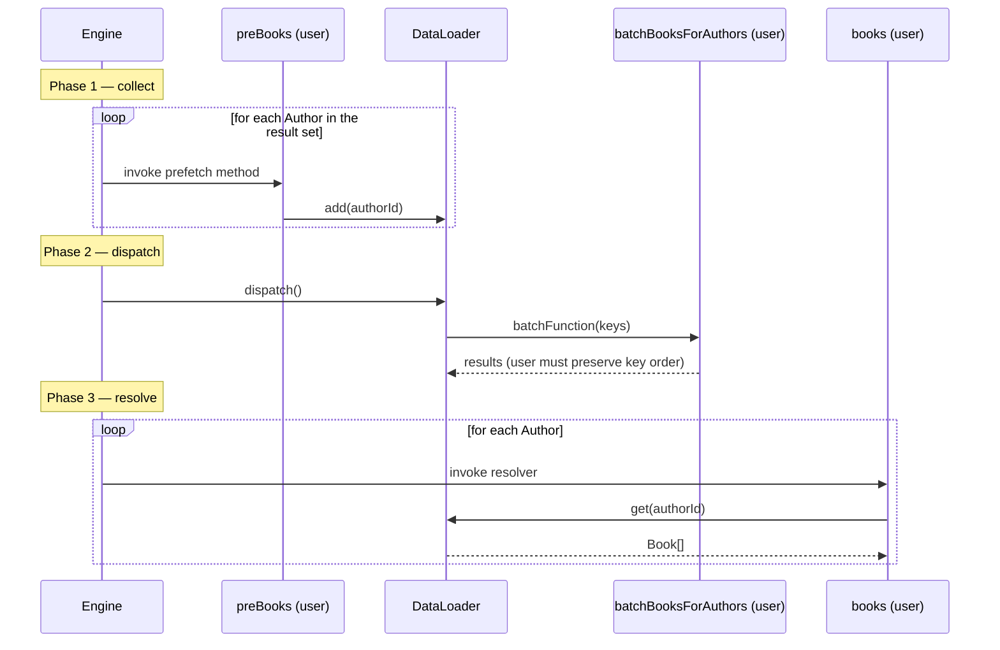

# GraphQL Data Loader Streamlining

- Authors
  - Thisaru Guruge
- Reviewed by
  - Danesh Kuruppu
- Created date
  - 2026-08-14
- Updated date
  - 2026-08-17
- Issue
  - [1474](https://github.com/ballerina-platform/ballerina-spec/issues/1474)
- State
  - Submitted

## Summary

Batching a field with the Ballerina GraphQL package's data loader costs the user six declarations. Most carry no information the compiler could not derive or check: a `contextInit` closure for loader registration, one `registerDataLoader` call per loader, a string key repeated at every use site with no compile-time check, a prefetch method whose only job is to call `add`, the resolver, and a batch function with a manual cast and manual key-to-result ordering. This proposal removes the boilerplate that carries no information and makes what remains compile-time checked. `@graphql:ServiceConfig` gains a declarative `dataLoaders` field. The prefetch method contract is corrected where the specification's examples contradict it. Single-call `load()`/`loadMany()` drop the mandatory prefetch method for the common case on today's runtime, reusing the engine's existing placeholder/generation loop. `DataLoader` gains the convenience operations every comparable implementation provides and this one lacks. `Context.getDataLoader` stops panicking on an unknown key. Two `Context` ergonomics fixes tracked under [ballerina-library#4108](https://github.com/ballerina-platform/ballerina-library/issues/4108) are folded in as the identical class of fix. One decision is left open for reviewers: whether `Context.registerDataLoader` is removed now or deprecated and removed later.

## Motivation

The data loader is the package's answer to the N+1 problem, and it works. But the amount a user has to write to get it, and the amount of that writing the compiler cannot check, is out of proportion to what the mechanism does. Per batched field the user writes six things, enumerated in [Current State Analysis](#current-state-analysis). Among them, the loader name is a bare string repeated at every use site with no compile-time check, and the batch function's key-to-result ordering is a correctness obligation the type system cannot express. `Context.getDataLoader` panics rather than returning an error, so a typo in that string is an unrecoverable runtime crash instead of a compile error or a caught one. There is no `loadMany`, `prime`, or `clear(key)` — operations every comparable data loader implementation provides.

The mandatory prefetch method is the largest piece of that boilerplate and the one with the least information in it: its whole body is a call to `add()`. It exists because Ballerina resolvers are synchronous. An earlier reading of the problem concluded that removing it required a Ballerina runtime capability that does not exist and is not expected soon. That reading is wrong. For the prefetch-method case, the engine already runs the dispatch-and-retry loop a single-call `load()` needs, so the prefetch method can be made optional for the common case without waiting on anything outside this proposal's control.

Two of the mechanism's rough edges are documented defects rather than design gaps, and must be fixed alongside any redesign. The specification's own examples show the prefetch method declared with the wrong method kind. A pre-existing proposal document in the module repository describes a data loader API that was never shipped. Both are recorded in [Current State Analysis](#current-state-analysis).

## Goals

- Reduce data loader boilerplate: declarative loader registration, compile-time-checked loader references, and removal of the mandatory prefetch method for the common case.
- Give `DataLoader` the operations every comparable implementation provides and this one lacks, and replace `Context.getDataLoader`'s panic with a checked error.
- Remove the same class of manual-cast boilerplate from `Context.get()` and `Context.resolve()`. This is not data loader work, but it is the identical fix; [Section 5](#5-dependently-typed-contextgetwithtype-and-contextresolvewithtype) records why it is folded in here.

## Non-Goals

- **Removing the prefetch method mechanism.** [Section 3](#3-single-call-load-and-loadmany) makes it unnecessary for the common case; it does not retire it. The manual `add()`/`dispatch()`/`get()` primitives plus a prefetch method remain available, unchanged, wherever a resolver cannot tolerate the re-invocation `load()`/`loadMany()` require.
- **A type-parameterised `DataLoader<K, V>`.** The dependently-typed function form is kept instead — see the note on generics in [Section 4](#4-convenience-additions).
- **Deciding the resolver model.** That decision belongs to the [GraphQL Unified Resolver Model BEP](1473_graphql_unified_resolver_model.md) ([#1473](https://github.com/ballerina-platform/ballerina-spec/issues/1473)). This proposal's design does not depend on it; see [Design](#design) for the one diagnostic-level respect in which the outcome touches it.

## Current State Analysis

This section records the present-day behaviour that [Design](#design) changes. Every claim is sourced from the package at `ballerina/graphql` v1.18.0 (distribution `2201.13.3`) and, where noted, the [Ballerina GraphQL Specification](https://github.com/ballerina-platform/module-ballerina-graphql/blob/master/docs/spec/spec.md).

### Data loader

The `graphql.dataloader` module is small:

```ballerina
public type BatchLoadFunction isolated function (readonly & anydata[] keys) returns anydata[]|error;

public type DataLoader isolated object {
    public isolated function add(anydata key);
    public isolated function get(anydata key, typedesc<anydata> 'type = <>) returns 'type|error;
    public isolated function dispatch();
    public isolated function clearAll();
};
```

Per batched field, the user writes six things: a `contextInit` closure; one `registerDataLoader` call per loader; a string key repeated at every use site with no compile-time check; a prefetch method whose only job is to call `add`; the real resolver that calls `get`; and a batch function containing a manual `<readonly & int[]>` cast and manual key-to-result ordering. `Context.getDataLoader` **panics** if the key is absent. There is no `loadMany`, `prime`, or `clear(key)`.

This two-phase split looks like a consequence of a Ballerina runtime limitation. A single-call loader API (`loader.load(key)` that suspends and resumes once a batch is ready) appears to need the engine to know when every resolver at the current selection-set level has requested a value and is now idle. That is what a JavaScript engine gets for free by observing an empty call stack at the end of an event-loop tick, and the Ballerina runtime exposes no analogous signal for strands. A single-call API does not need that signal. [Section 3](#3-single-call-load-and-loadmany) gets `load()` on today's runtime by reusing the engine's existing retry-until-resolved dispatch loop, at the cost of a resolver using it being invoked more than once.



Two defects must be fixed alongside any redesign:

1. **The specification's own examples contradict the implementation on the prefetch method's kind.** This is a documentation deviation, not a functional defect. The shipped mechanism works as designed: a prefetch method must be a plain method, not a resource method. Three _other_ examples in the same document show `resource function get preBooks(...)` instead, which silently compiles into an unwanted `preBooks` field on `Query` rather than a working prefetch hook. See [Section 2](#2-fix-the-prefetch-method-contract).
2. **A pre-existing proposal document in the module repository describes a data-loader API that was never shipped**: an annotation-based configuration, a `load()` method (shipped instead as `add()`), and a `map<dataloader:DataLoader>`-shaped resolver parameter. This proposal does **not** touch that document. The `docs/proposals/` directory is a historical record of what was accepted and shipped at the time, kept unmodified afterward. The inaccuracy is a pre-existing fact about the record, not something this proposal corrects.

## Design

The goal is to remove boilerplate that carries no information and make what remains compile-time checked, without waiting on runtime capability outside this proposal's control. Five changes follow, in increasing order of design risk. This BEP does not depend on the decision in the [GraphQL Unified Resolver Model BEP](1473_graphql_unified_resolver_model.md) ([#1473](https://github.com/ballerina-platform/ballerina-spec/issues/1473)). [Section 1](#1-declarative-loader-registration)'s registration-mechanism choice is in turn independent of both that decision and the rest of this BEP.

**One coupling, at the diagnostic level only.** Two diagnostics in this BEP touch the resolver model. `GRAPHQL_1307` (`INVALID_DATA_LOADER_LOAD_IN_MUTATION`, [Section 3](#3-single-call-load-and-loadmany)) rejects `load()`/`loadMany()` called from a resolver mapped to `Mutation`. `GRAPHQL_1305`'s message ([Section 2](#2-fix-the-prefetch-method-contract)) names the valid resolver forms. Both rules are expressed against the GraphQL **operation type**, not the Ballerina **method kind**, so no part of this design depends on how the resolver model resolves. Two things do follow from it: which Ballerina declarations `GRAPHQL_1307` matches (a `mutate` resource method alone, or that plus a `remote` method for as long as `remote` is accepted as a mutation form), and the wording of `GRAPHQL_1305`'s message. Neither is resolved here — see the [GraphQL Unified Resolver Model BEP](1473_graphql_unified_resolver_model.md) ([#1473](https://github.com/ballerina-platform/ballerina-spec/issues/1473)).

### 1. Declarative loader registration

`@graphql:ServiceConfig` gains a `dataLoaders` field mapping a loader name to its batch function:

```ballerina
public type GraphqlServiceConfig record {|
    // ... existing fields unchanged ...

    # Data loaders available to the resolvers of this service, keyed by loader name.
    # The engine creates one `dataloader:DefaultDataLoader` per entry per request.
    readonly & map<dataloader:BatchLoadFunction|ContextualBatchLoadFunction> dataLoaders = {};
|};
```

Before — the user writes a `contextInit` closure whose only purpose is loader registration:

```ballerina
@graphql:ServiceConfig {
    contextInit: isolated function (http:RequestContext requestContext, http:Request request)
            returns graphql:Context {
        graphql:Context context = new;
        context.registerDataLoader("bookLoader", new dataloader:DefaultDataLoader(batchBooksForAuthors));
        context.registerDataLoader("authorLoader", new dataloader:DefaultDataLoader(batchAuthorsForBooks));
        return context;
    }
}
service on new graphql:Listener(9090) { ... }
```

After:

```ballerina
@graphql:ServiceConfig {
    dataLoaders: {
        bookLoader: batchBooksForAuthors,
        authorLoader: batchAuthorsForBooks
    }
}
service on new graphql:Listener(9090) { ... }
```

**The gap that appears to require keeping both mechanisms.** There is an argument for keeping `contextInit`/`Context.registerDataLoader` alongside `dataLoaders`: a loader whose _construction_ depends on request state — a multi-tenant service selecting a data source from a request header — cannot reach that state from a compile-time-constant annotation value. The module layout says otherwise. The blocker was never that `dataLoaders` has to be a compile-time constant; it does, and still must be, to be embeddable in an annotation. It is that `dataloader:BatchLoadFunction` is declared inside the `graphql.dataloader` submodule, which cannot import its own parent module `graphql` without a cyclic dependency. A batch function typed against it has never been able to reference `graphql:Context`, however it gets registered. A new sibling type, declared in the `graphql` module rather than the submodule, closes the gap:

```ballerina
# A batch function that additionally receives the current request's `Context`, for behaviour that
# depends on request-scoped state — a tenant identifier, a resource an interceptor already opened, and
# so on. Declared in `graphql`, not `graphql.dataloader`, specifically so it can reference `Context`.
public type ContextualBatchLoadFunction isolated function (Context context, readonly & anydata[] keys) returns anydata[]|error;
```

`dataLoaders`'s value type becomes `map<dataloader:BatchLoadFunction|ContextualBatchLoadFunction>`. Both branches are new, since `dataLoaders` has never shipped, so neither has a compatibility obligation to the other. The engine builds this request's `DefaultDataLoader` instances once per entry per request, as today, and at that point it already holds the request's `Context`. For a `ContextualBatchLoadFunction` entry it closes over that `Context` into a plain `dataloader:BatchLoadFunction` closure before handing it to `dataloader:DefaultDataLoader`'s constructor. The submodule's own types never change, and the adaptation happens once, in the one place that holds both pieces. A multi-tenant loader is declarative too, now:

```ballerina
@graphql:ServiceConfig {
    dataLoaders: {
        bookLoader: isolated function(graphql:Context context, readonly & anydata[] keys) returns anydata[]|error {
            string tenantId = check context.getWithType("tenantId");
            return batchBooksForTenant(tenantId, keys);
        }
    }
}
service on new graphql:Listener(9090) { ... }
```

**With the gap closed, `dataLoaders` covers every case identified so far, which makes `Context.registerDataLoader` redundant.** Whether removing it now is worth the breakage is a separate question. This proposal presents both answers rather than picking one, as [Section 4](#4-convenience-additions) below does for its breaking change and the [GraphQL Unified Resolver Model BEP](1473_graphql_unified_resolver_model.md) ([#1473](https://github.com/ballerina-platform/ballerina-spec/issues/1473)) does for the two resolver-model approaches:

|                                                          | Remove `registerDataLoader` now                                                                                                                                 | Deprecate, remove later                                                                                                                                                                                       |
| -------------------------------------------------------- | ----------------------------------------------------------------------------------------------------------------------------------------------------------------- | ----------------------------------------------------------------------------------------------------------------------------------------------------------------------------------------------------------------------- |
| **Mechanism count once shipped**                          | One, immediately: `dataLoaders` only.                                                                                                                       | Two, for one release: `dataLoaders` (recommended, and now sufficient for every case identified above) alongside `contextInit`/`registerDataLoader` (`@deprecated`, still functional, no longer needed for anything `dataLoaders` can express). |
| **Migration cost**                                        | Every existing `registerDataLoader` call site fails to compile. The fix is one line per call site: move the batch function into `dataLoaders`, promoting it to a `ContextualBatchLoadFunction` if it needs request state. | None forced. The `@deprecated` annotation surfaces a compiler warning at existing call sites, not a build failure. This package already uses it for `executeWithType()`.                       |
| **`GRAPHQL_1306` (`UNDECLARED_DATA_LOADER`)**              | A literal key not in `dataLoaders` is always an error; no carve-out needed.                                                                                | A literal key not in `dataLoaders` and not registered by a `contextInit` in the same module is an error, matching today's rule; a non-constant name remains a warning.                                                    |
| **Resolution of the concern that motivated this section** | Resolved immediately: one way to register a loader.                                                                                                | Resolved in intent, not yet in fact: the redundant path is labelled and sunset-tracked rather than gone. This is the trade-off the [GraphQL Unified Resolver Model BEP](1473_graphql_unified_resolver_model.md) ([#1473](https://github.com/ballerina-platform/ballerina-spec/issues/1473)) already documents for `get`/`remote`. |
| **Precedent elsewhere in this proposal**                   | Matches [Section 4](#4-convenience-additions)'s `getDataLoader` change: small, compiler-caught migration cost, taken now.                                        | Matches the dual-syntax deprecation window in the [GraphQL Unified Resolver Model BEP](1473_graphql_unified_resolver_model.md) ([#1473](https://github.com/ballerina-platform/ballerina-spec/issues/1473)): nothing forced, a deprecation warning the only signal.                                                                          |

Reviewers should treat this as a decision separable from the resolver model's and from [Section 4](#4-convenience-additions)'s, as Section 4 asks for its own change. **This is the only open decision in this BEP**; every other change here is decided, and this one blocks nothing outside Section 1.

**Breaking change.** Adding the `dataLoaders` field to a closed record breaks BIR compatibility under either path above. See [Risks](#risks) for the accounting.

### 2. Fix the prefetch method contract

The prefetch method is a plain method, not a resource method. This is correct today and unaffected by either resolver-model approach. The defect is in the specification's examples: several show a resource method instead, which silently compiles into an unwanted `Query` field rather than a working prefetch hook. Those examples must be corrected. See [Testing](#testing) for the required negative-fixture coverage.

The default prefetch method name derivation (`"pre"` + PascalCase(field)) is retained, and `@graphql:ResourceConfig { prefetchMethodName }` continues to override it. `GRAPHQL_1305`'s message names every resolver form valid under whichever resolver model ships. That is the one place in this BEP where the resolver-model decision changes text rather than behaviour, per [Design](#design)'s coupling note. [Section 3](#3-single-call-load-and-loadmany) below does not change this mechanism, which remains available wherever a resolver cannot tolerate the re-invocation `load()`/`loadMany()` require.

### 3. Single-call `load()` and `loadMany()`

The two-phase `add`/`dispatch`/`get` split, and therefore the mandatory prefetch method, exists because Ballerina resolvers are synchronous: a resolver cannot yield where it needs a batched value and resume after the batch has been dispatched. A single-call `load()` looks at first like it needs new Ballerina runtime capability: the engine observing that every in-flight resolver at a level is blocked on a given loader, the strand-level equivalent of a JavaScript engine's empty call stack at the end of an event-loop tick. That capability does not exist today and is not expected soon, so this section does not design around it. It designs around the engine's own dispatch loop instead, confirmed against the shipped implementation (`ballerina/context.bal`, `ballerina/engine.bal`, and `ballerina/value_tree_builder.bal` in `module-ballerina-graphql`). A field with a prefetch method is already resolved in two passes joined by the loop this section needs. The first pass walks every sibling instance in the result set, invoking a method whose only job is to call `add()`, and defers the field behind a placeholder. `Context.resolvePlaceholders()` then dispatches every loader with pending keys and re-invokes the deferred field a second time, for real. The surrounding loop repeats that cycle — dispatch, then re-invoke every still-unresolved placeholder — for as many generations as the query needs. That is what makes nested batched fields work today, such as an `Author.books` loader feeding a `Book.reviews` loader one level down, with no special-casing. Single-call `load()` reuses this loop rather than requiring a new one. It removes the need for a _separate_ prefetch method by letting the resolver serve as its own, at the cost of being invoked more than once.

The target user code is one method instead of two:

```ballerina
distinct service class Author {
    private final int authorId;

    resource function query books(graphql:Context ctx) returns Book[]|error {
        dataloader:DataLoader bookLoader = check ctx.getDataLoader("bookLoader");
        return check bookLoader.load(self.authorId);
    }
}
```

`load(key)` returns the cached value if `dispatch()` has already produced it, which is `get()`'s behaviour. Otherwise it registers the key, which is `add()`'s behaviour including the existing dedup against an already-pending or cached key, and raises `dataloader:PendingResolutionError`. That error is an internal, unexported signal, never constructed or caught by user code. For the prefetch-method case, the engine already distinguishes a field that is done from a field that is a placeholder waiting on a dispatch. This extends that to `PendingResolutionError` from _any_ field resolution, prefetch method or not, with the same response: create a placeholder for the field, as it does for a prefetch method today, and let the existing generation loop retry it after the next dispatch. There is no new loop and no new placeholder type. The number of resolutions per field in the single-hop case does not change either: today's `preBooks()`-then-`books()` pair is two invocations across two methods, and a `load()`-based `books()` is two invocations of one method. The runtime cost is unchanged; only the code the user maintains is smaller.

`loadMany(keys)` extends the same idea. It registers every key in `keys`, like a loop of `add()` calls, and raises the same pending signal if _any_ of them is still outstanding. It returns the full `V[]` array in input order, matching `getMany`'s ordering guarantee, only once every key it was given has a result.

**What this buys that a manual prefetch method doesn't: chained loader calls compose for free.** Take a resolver that calls a second loader with the result of the first: `Book book = check bookLoader.load(id); return check reviewLoader.load(book.reviewId);`. It pends on `bookLoader` when first invoked. It is retried once `bookLoader` dispatches, at which point `bookLoader.load(id)` returns from cache and the resolver calls `reviewLoader.load(...)`, which pends in turn. It is retried a third time once `reviewLoader` dispatches. Each retry is cheap, because every earlier step is cached. This needs no engine capability beyond the generation loop already running, and a single engine-driven dispatch point — the futures-based alternative in [Alternatives](#alternatives) — would not get it for free.

**What this costs, and why it is scoped to query-side resolvers.** A resolver using `load()`/`loadMany()` may be invoked more than once for the same field instance in one request, once per loader it waits on, discarding every result except the last. It must therefore be free of user-visible side effects up to and including the `load()`/`loadMany()` call. React's Suspense-driven data fetching places the same constraint on a component that reads a not-yet-resolved resource, for the same reason: the framework may invoke the same unit of work more than once before committing to a result. GraphQL `query` fields, and nested object fields reached from them, are already expected to be side-effect-free reads, so the constraint costs nothing there. `mutate` fields are the opposite case by design — serial, exactly-once — and are not where the N+1 problem arises, since a mutation operation is far less likely to contain the kind of sibling list `dataLoaders` batches over. A new diagnostic, `GRAPHQL_1307` (`INVALID_DATA_LOADER_LOAD_IN_MUTATION`), rejects `load()`/`loadMany()` from a resolver mapped to `Mutation` at compile time, rather than leaving it a runtime hazard. The manual `add()`/`dispatch()`/`get()` primitives plus a prefetch method, unchanged by this section, remain available there and anywhere else a resolver cannot tolerate re-invocation.

### 4. Convenience additions

Independently of [Section 3](#3-single-call-load-and-loadmany) above, the `DataLoader` object type gains the operations every comparable implementation provides and this one lacks, alongside `load`/`loadMany` themselves:

```ballerina
public type DataLoader isolated object {
    public isolated function add(anydata key);
    public isolated function addMany(anydata[] keys);                                   // new
    public isolated function get(anydata key, typedesc<anydata> valueType = <>) returns valueType|error;
    public isolated function getMany(anydata[] keys, typedesc<anydata> valueType = <>) returns valueType[]|error;  // new
    public isolated function load(anydata key, typedesc<anydata> valueType = <>) returns valueType|error;              // new — Section 3
    public isolated function loadMany(anydata[] keys, typedesc<anydata> valueType = <>) returns valueType[]|error;      // new — Section 3
    public isolated function prime(anydata key, anydata value);                         // new
    public isolated function clear(anydata key);                                        // new
    public isolated function dispatch();
    public isolated function clearAll();
};
```

`Context.getDataLoader` changes from panicking on an unknown key to returning `dataloader:DataLoader|Error`.

**This is a breaking change:**

|                          | For shipping it as breaking, now                                                                                                                                                                                                                            | Against — soften it                                                                                                                                                                                                                                                                                                     |
| ------------------------ | ----------------------------------------------------------------------------------------------------------------------------------------------------------------------------------------------------------------------------------------------------------- | ----------------------------------------------------------------------------------------------------------------------------------------------------------------------------------------------------------------------------------------------------------------------------------------------------------------------- |
| **Pro**                  | Today, `dataloader:DataLoader loader = ctx.getDataLoader("key");` compiles because the return type carries no error union, so the panic is invisible to the type checker. Changing the signature to `DataLoader \| Error` makes that call site fail to compile, which is the point: a silent runtime crash becomes a compile-time obligation. A recoverable error beats an unrecoverable panic, and the scope is one method's return type. | A dual-syntax treatment, like the deprecation window in the [GraphQL Unified Resolver Model BEP](1473_graphql_unified_resolver_model.md) ([#1473](https://github.com/ballerina-platform/ballerina-spec/issues/1473)), could soften panic-to-checked-error: add a new, differently-named method returning the checked form (e.g. `getDataLoaderChecked`) alongside the existing panicking `getDataLoader`, deferring the old one's change to whichever future release also removes `get`/`remote`. |
| **Cost of doing it now** | One call-site edit per existing usage (`check` added), caught by the compiler everywhere it applies, unlike a runtime-only behaviour change that could hide until triggered.                                                       | A second, differently-named method for the same concept adds naming debt (`getDataLoader` vs. `getDataLoaderChecked`) that has to be explained and eventually resolved anyway.                                                                                                                                          |

This proposal ships it as breaking, now: the migration cost is small and caught by the compiler, and a checked error is a better contract than a panic regardless of how the resolver model resolves. Reviewers who weigh this differently should treat it as a decision separable from the resolver model's.

> **Note on generics.** Rather than a type-parameterised `DataLoader<K, V>`, `get`/`getMany`/`load`/`loadMany` are kept as dependently-typed functions: the `typedesc<anydata> valueType` argument is dispatched through a native call that returns the value already bound to `valueType`, not `anydata`.

### 5. Dependently-typed `Context.getWithType()` and `Context.resolveWithType()`

Two more `Context` methods carry the same manual-cast boilerplate, tracked separately in [ballerina-library#4108](https://github.com/ballerina-platform/ballerina-library/issues/4108), filed against this package and still open. **This is not specific to data loaders; it is folded in here because it is the identical class of fix.** `Context.get(key)` returns `value:Cloneable|isolated object {}|Error` today, forcing `check context.get("token").ensureType()` at every call site. `Context.resolve('field)`, used from inside an `Interceptor` to resolve a field's value before post-processing it, returns bare `anydata`. Both gain a dependently-typed sibling, non-breaking since the existing methods are untouched, named after the ecosystem precedent [`http:RequestContext.getWithType()`](https://central.ballerina.io/ballerina/http/2.12.3#RequestContext-getWithType):

```ballerina
public isolated class Context {
    // ... get(), resolve(), and everything else, unchanged ...

    # NEW — dependently-typed. Returns the value already bound to `targetType`, or an `Error` if the key
    # is absent or the stored value doesn't match `targetType`.
    public isolated function getWithType(string 'key, typedesc<anydata> targetType = <>) returns targetType|Error;

    # NEW — dependently-typed. Returns the resolved field value already bound to `targetType`.
    public isolated function resolveWithType(Field 'field, typedesc<anydata> targetType = <>) returns targetType|Error;
}
```

```ballerina
// Before
string token = check context.get("token").ensureType();

// After
string token = check context.getWithType("token");
```

```ballerina
// Before
readonly service class FooInterceptor {
    *graphql:Interceptor;
    isolated remote function execute(graphql:Context context, graphql:Field 'field) returns anydata|error {
        anydata data = context.resolve('field);
        if data is int {
            return data + 5;
        }
        return data;
    }
}

// After
readonly service class FooInterceptor {
    *graphql:Interceptor;
    isolated remote function execute(graphql:Context context, graphql:Field 'field) returns anydata|error {
        int data = check context.resolveWithType('field);
        return data + 5;
    }
}
```

### API Reference

#### `graphql:GraphqlServiceConfig`

```ballerina
public type GraphqlServiceConfig record {|
    int maxQueryDepth?;
    ListenerAuthConfig[] auth?;
    ContextInit contextInit = initDefaultContext;
    CorsConfig cors?;
    Graphiql graphiql = {};
    readonly string schemaString = "";                      // compiler-managed
    readonly (readonly & Interceptor)|(readonly & Interceptor)[] interceptors = [];
    boolean introspection = true;
    boolean validation = true;
    ServerCacheConfig cacheConfig?;
    readonly ServerCacheConfig? fieldCacheConfig = ();       // compiler-managed
    QueryComplexityConfig queryComplexityConfig?;
    DocumentCacheConfig documentCacheConfig?;

    # NEW — data loaders available to this service's resolvers, keyed by loader name
    readonly & map<dataloader:BatchLoadFunction|ContextualBatchLoadFunction> dataLoaders = {};
|};

# NEW — a batch function that also receives the current request's Context; see Section 1.
public type ContextualBatchLoadFunction isolated function (Context context, readonly & anydata[] keys) returns anydata[]|error;
```

#### `graphql:GraphqlResourceConfig`

Unchanged in shape. `prefetchMethodName` remains valid on every resolver form that maps to `Query` or `Mutation` (which form that is depends on the [GraphQL Unified Resolver Model BEP](1473_graphql_unified_resolver_model.md) ([#1473](https://github.com/ballerina-platform/ballerina-spec/issues/1473))) and invalid on `subscribe` resource methods.

```ballerina
public type GraphqlResourceConfig record {|
    readonly (readonly & Interceptor)|(readonly & Interceptor)[] interceptors = [];
    string prefetchMethodName?;
    ServerCacheConfig cacheConfig?;
    int complexity?;
|};
```

#### `graphql:Context` — changed

```ballerina
public isolated class Context {
    public isolated function init();
    public isolated function set(string 'key, value:Cloneable|isolated object {} value);
    public isolated function get(string 'key) returns value:Cloneable|isolated object {}|Error;

    # NEW — dependently-typed sibling of get(); see Section 5 and ballerina-library#4108.
    public isolated function getWithType(string 'key, typedesc<anydata> targetType = <>) returns targetType|Error;

    public isolated function remove(string 'key) returns value:Cloneable|isolated object {}|Error;

    # UNDER THE "remove now" PATH (Section 1): deleted.
    # UNDER THE "deprecate, remove later" PATH: kept, marked @deprecated.
    public isolated function registerDataLoader(string key, dataloader:DataLoader dataloader);

    # CHANGED — returns an error instead of panicking when the loader is not registered
    public isolated function getDataLoader(string key) returns dataloader:DataLoader|Error;

    public isolated function invalidate(string path) returns error?;
    public isolated function invalidateAll() returns error?;
    public isolated function resolve(Field 'field) returns anydata;

    # NEW — dependently-typed sibling of resolve(); see Section 5 and ballerina-library#4108.
    public isolated function resolveWithType(Field 'field, typedesc<anydata> targetType = <>) returns targetType|Error;
}
```

#### `graphql.dataloader` — changed

```ballerina
public type BatchLoadFunction isolated function (readonly & anydata[] keys) returns anydata[]|error;

public type DataLoader isolated object {
    public isolated function add(anydata key);
    public isolated function addMany(anydata[] keys);                                                     // NEW
    public isolated function get(anydata key, typedesc<anydata> 'type = <>) returns 'type|error;
    public isolated function getMany(anydata[] keys, typedesc<anydata> 'type = <>) returns 'type[]|error;  // NEW
    public isolated function load(anydata key, typedesc<anydata> 'type = <>) returns 'type|error;              // NEW — Section 3
    public isolated function loadMany(anydata[] keys, typedesc<anydata> 'type = <>) returns 'type[]|error;      // NEW — Section 3
    public isolated function prime(anydata key, anydata value);                                           // NEW
    public isolated function clear(anydata key);                                                          // NEW
    public isolated function dispatch();
    public isolated function clearAll();
};
```

`ContextualBatchLoadFunction` ([Section 1](#1-declarative-loader-registration)) is declared in `graphql`, not `graphql.dataloader` — see Section 1 for why the submodule boundary rules that out.

### Migration Guide

1. **`Context.getDataLoader` call sites.** Add `check` — see [Section 4](#4-convenience-additions).
2. **`Context.registerDataLoader` call sites, only if [Section 1](#1-declarative-loader-registration) resolves to the "remove now" path.** Move the batch function into `dataLoaders`; if it depended on request state, retype it as a `ContextualBatchLoadFunction` taking `Context` as its first parameter. Under the "deprecate, remove later" path, nothing is forced — existing call sites keep compiling with a warning.

Two further additions are optional, non-breaking, and independent of everything above. `Context.getWithType()`/`resolveWithType()` ([Section 5](#5-dependently-typed-contextgetwithtype-and-contextresolvewithtype)) are new methods alongside the existing `get()`/`resolve()`, adopted at whatever pace a codebase likes. `load()`/`loadMany()` ([Section 3](#3-single-call-load-and-loadmany)) replace a prefetch method plus `add()`/`get()` only where a resolver's author chooses to rewrite it that way; the manual form keeps working unchanged.

## Alternatives

### A `future<T>`-returning single-call loader

graphql-java's `DataLoader` achieves single-call batching by having a `DataFetcher` return a `CompletableFuture` immediately, without blocking. The engine's execution strategy invokes every sibling `DataFetcher` at a level, each returning near-instantly since none of them block, then dispatches every loader with pending keys, then resolves the collected futures. The same shape is expressible in Ballerina in principle, with a resolver returning `future<T>` instead of `T` and `load()` producing that future via `start`. It does not fit Ballerina's stock `future<T>` cleanly. A `future<T>` only exists as the result of a `start` expression, and Ballerina has no manually-completable promise a background strand can signal into once a batch resolves, short of a busy-poll loop. A wait/notify primitive inside `dataloader:DataLoader` would be new machinery this proposal would have to invent and maintain, where the retry-based design in [Section 3](#3-single-call-load-and-loadmany) needs none.

**Considered and set aside.**

### Softening `Context.getDataLoader`'s panic-to-checked-error change

Adding a new, differently-named checked method (e.g. `getDataLoaderChecked`) alongside the existing panicking `getDataLoader`, rather than changing the existing signature.

**Rejected**, on the reasoning in [Section 4](#4-convenience-additions)'s pros/cons table: the migration cost is one `check` per call site and is caught by the compiler everywhere it applies, while a second name for the same concept is naming debt that has to be resolved anyway.

### Keeping `contextInit`/`Context.registerDataLoader` as a permanent second mechanism

**No longer an alternative — this is one half of the open decision in [Section 1](#1-declarative-loader-registration)**, presented there in full as "deprecate, remove later". The argument for keeping it *permanently* was that a loader whose construction depends on request state cannot be expressed declaratively. `ContextualBatchLoadFunction` answers that, which reduces the question to timing rather than capability.

## Testing

This proposal needs the following categories of coverage; fixture-level test obligations are a matter for implementation, not this document.

- **Prefetch method contract.** [Section 2](#2-fix-the-prefetch-method-contract) needs a negative test, proving that a `preBooks` method declared as a resource method becomes a real `Query` field and is *not* invoked as a prefetch hook.
- **Data loader.** Declarative registration needs coverage for both paths in [Section 1](#1-declarative-loader-registration)'s comparison table: on the "remove now" path, that `registerDataLoader` call sites fail to compile; on the "deprecate" path, the `contextInit`-wins collision case plus the call site still compiling with a warning. The new convenience operations and `getDataLoader`'s panic-to-error change need coverage too. `load()`/`loadMany()` ([Section 3](#3-single-call-load-and-loadmany)) need four things: a single-hop case against a regression baseline captured from today's prefetch-method form, confirming identical results and dispatch counts; a chained case (`bookLoader` then `reviewLoader` in one resolver), proving the multi-generation retry composes; `GRAPHQL_1307` positive and negative fixtures for `load()`/`loadMany()` used from a `Mutation`-mapped resolver; and interaction tests with field-level caching and interceptors, confirming a `PendingResolutionError` is never itself cached or surfaced as a field error. `getWithType()`/`resolveWithType()` ([Section 5](#5-dependently-typed-contextgetwithtype-and-contextresolvewithtype)) need coverage matching `http:RequestContext.getWithType()`'s own test shape: correct type binding, and an `Error`/`error` result on a missing key or a type mismatch.

## Risks and Assumptions

### Risks

- **[Section 1](#1-declarative-loader-registration)'s registration-mechanism choice is an open decision.** Both the breaking and the non-breaking path are designed in full so this does not block the rest of the proposal, but it needs an answer before implementation starts on that piece. It is the only open decision in this BEP, and it is independent of the resolver-model decision, which is open in its own [sibling BEP](1473_graphql_unified_resolver_model.md) ([#1473](https://github.com/ballerina-platform/ballerina-spec/issues/1473)).
- **`load()`/`loadMany()`'s interaction with field-level caching and interceptors needs implementation-time verification, not a feasibility spike.** [Section 3](#3-single-call-load-and-loadmany)'s mechanism reuses the engine's existing placeholder/generation loop rather than requiring new capability, so this is a verification task rather than an open feasibility question. What needs confirming: a `PendingResolutionError` raised from inside an interceptor chain, or from a field with caching enabled, is neither cached nor surfaced as a user-visible field error, as is already the case for today's prefetch-method placeholders.
- **Closed-record field additions have a BIR-compatibility cost independent of source compatibility.** `GraphqlServiceConfig` is a closed record (`record {| ... |}`), so adding `dataLoaders` to it ([Section 1](#1-declarative-loader-registration)) breaks binary (BIR) compatibility for dependents compiled against the previous version, as [BEP 1460](https://github.com/ballerina-platform/ballerina-spec/issues/1460) already flags for its own additions to `ClientConfiguration`. This cost is distinct from source-level breaking changes. It applies under both of Section 1's paths and is not affected by how the resolver model resolves.

### Assumptions

- **The `dataLoaders` map annotation shape compiles as written.** Confirmed with a `bal build` against distribution `2201.13.3`, including a runtime read-back of the stored functions, for the single-type-value shape (`map<dataloader:BatchLoadFunction>`). The union-typed shape (`map<dataloader:BatchLoadFunction|ContextualBatchLoadFunction>`) this proposal introduces **has not yet been separately confirmed** to compile as an annotation value, and needs the same check repeated against it.
- **A submodule cannot import its own parent module.** Confirmed against `module-ballerina-graphql`: `graphql.dataloader` imports nothing from `graphql`, and `graphql`'s `context.bal` is the one that imports `graphql.dataloader`. This is why `dataloader:BatchLoadFunction` has never been able to reference `graphql:Context`, and the basis for placing `ContextualBatchLoadFunction` in `graphql` instead ([Section 1](#1-declarative-loader-registration)).

## Dependencies

- **[GraphQL Diagnostic Code Convention BEP](1471_graphql_diagnostic_code_convention.md) ([#1471](https://github.com/ballerina-platform/ballerina-spec/issues/1471)).** Every diagnostic code this proposal cites — `GRAPHQL_1301`–`GRAPHQL_1305` (renumbered from today's `GRAPHQL_141`–`GRAPHQL_145`), the new `GRAPHQL_1306` and `GRAPHQL_1307`, and `GRAPHQL_2301` (renumbered from `GRAPHQL_202`) — is allocated by that BEP's area-3 (data loader / prefetch) mapping table. The numbers must match it.
- **[GraphQL Unified Resolver Model BEP](1473_graphql_unified_resolver_model.md) ([#1473](https://github.com/ballerina-platform/ballerina-spec/issues/1473)) — a diagnostic-level dependency only, not a design one.** This proposal's design is independent of which resolver-model approach ships. What follows from that decision is the set of Ballerina declarations `GRAPHQL_1307` matches, and the wording of `GRAPHQL_1305`'s message — see the coupling note in [Design](#design).

## Future Work

- **Removal of `Context.registerDataLoader`**, if and only if [Section 1](#1-declarative-loader-registration) resolves to the "deprecate, remove later" path. A target release for the removal should then be tracked, not left implicit. Under the "remove now" path there is nothing left to do.

## References

- [ballerina-library#4108](https://github.com/ballerina-platform/ballerina-library/issues/4108) — making `Context.resolve()` and `Context.get()` dependently-typed, filed against this package and still open; see [Section 5](#5-dependently-typed-contextgetwithtype-and-contextresolvewithtype)
- [`http:RequestContext.getWithType()`](https://central.ballerina.io/ballerina/http/2.12.3#RequestContext-getWithType) — the existing ecosystem precedent [Section 5](#5-dependently-typed-contextgetwithtype-and-contextresolvewithtype)'s naming matches
- [Ballerina GraphQL module specification](https://github.com/ballerina-platform/module-ballerina-graphql/blob/master/docs/spec/spec.md) — the document whose prefetch-method examples [Section 2](#2-fix-the-prefetch-method-contract) corrects
- [Ballerina GraphQL accepted proposals](https://github.com/ballerina-platform/module-ballerina-graphql/tree/master/docs/proposals) — including the pre-existing document describing a data loader API that was never shipped; kept unmodified as a historical record
- [BEP 1460 — GraphQL Client Subscription Support](https://github.com/ballerina-platform/ballerina-spec/issues/1460) — the precedent for the closed-record BIR-compatibility note in [Risks](#risks)
- [BEP process](../AAA-bep-resources/0000_bep_process.md)

[]: # (end)
[]: # Please add any comments to issue [#1474](https://github.com/ballerina-platform/ballerina-spec/issues/1474)
