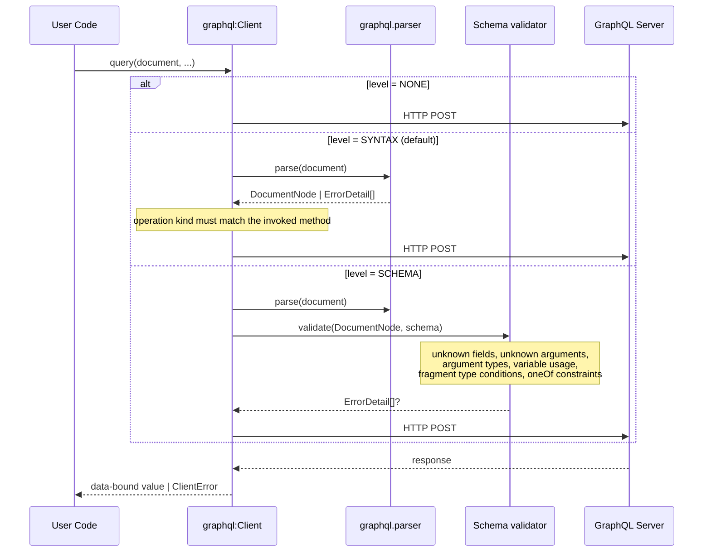

# Client-Side Schema-Aware Document Validation for the GraphQL Client

- Authors
  - Thisaru Guruge
- Reviewed by
  - Danesh Kuruppu
- Created date
  - 2026-08-14
- Updated date
  - 2026-08-17
- Issue
  - [1476](https://github.com/ballerina-platform/ballerina-spec/issues/1476)
- State
  - Submitted

## Summary

[BEP 1460 — GraphQL Client Subscription Support](https://github.com/ballerina-platform/ballerina-spec/issues/1460) restructures the `graphql:Client` around per-operation methods: `query()`, `mutate()`, and `subscribe()`. It always performs syntax-level validation plus an operation-kind match, using the packaged `graphql.parser`, before a request leaves the process. This proposal adds a second, opt-in tier on top of that: validation of the document against the target service's schema, supplied to the client in SDL form. A `SCHEMA`-level rejection is produced without a network call, in the same `ErrorDetail[]` shape the server would have returned, by the same validator visitors the listener already runs. The tier is opt-in because it requires a component the package does not have today: an SDL parser. `SYNTAX` remains the default, so a user who configures nothing gets the behaviour BEP 1460 specifies, and `NONE` remains available as an escape hatch.

## Motivation

A `graphql:Client` surfaced as a connector in a low-code or design-time tool presents a single, semantically opaque action, because `execute()` is the only operation it exposes. [BEP 1460](https://github.com/ballerina-platform/ballerina-spec/issues/1460) resolves that by introducing `query()`, `mutate()`, and `subscribe()`. This proposal builds on it by making the client's optional schema the single artifact from which both runtime validation and design-time assistance can be derived. Nothing is parsed or checked against a schema client-side today; the document is sent as-is. A document the target service will reject therefore costs a network round trip to find that out, and a tool consuming the client has no artifact from which to describe the operations it can perform. One configured SDL string answers both.

## Goals

- Add an opt-in schema-aware client-side validation tier on top of the syntax-level validation introduced by BEP 1460.
- Keep the behaviour BEP 1460 specifies as what a user gets without configuration, so this proposal is additive to 1460's client API rather than a modification of it.
- Reuse the listener's existing validator visitors against a schema built from the configured SDL, so that a client-side rejection matches what the server would have returned rather than approximating it.

## Non-Goals

- **A full SSE subscription transport design.** BEP 1460 scopes the client to WebSocket only. This proposal does not restate or replace that scope. It does flag that the client's HTTP/1.1 pin exists solely to support the WebSocket upgrade, now that `ballerina/http` supports server-sent events, including over HTTP/2. See [Future Work](#future-work).
- **Restating BEP 1460's client design.** The per-operation methods, the subscription transport, the `execute()` deprecation, and the `executeWithType()`/`ServerError` removal are 1460's, on 1460's own timeline. This proposal depends on them and does not respecify them.
- **Schema-first service generation in the `bal graphql` tool.** The SDL parser this proposal delivers is a prerequisite for it, but the generation design is a separate effort.

## Current State Analysis

This section records the behaviour that [Design](#design) changes, sourced from the package at `ballerina/graphql` v1.18.0 (distribution `2201.13.3`). The shipped client exposes one general-purpose operation:

```ballerina
remote isolated function execute(string document, map<anydata>? variables = (),
        string? operationName = (), map<string|string[]>? headers = (),
        typedesc<GenericResponseWithErrors|record{}|json> targetType = <>)
        returns targetType|ClientError = @java:Method { ... } external;

@deprecated
remote isolated function executeWithType(...) returns targetType|ClientError = ... external;
```

No parsing or validation happens client-side; the document is sent as-is. `init` pins the underlying client to HTTP/1.1. The pin exists because subscriptions (added by BEP 1460) go over a WebSocket upgrade, and Ballerina's WebSocket support requires HTTP/1.1. The shipped client has no subscription support and no file-upload support. The package also contains an SDL _generator_ — `SchemaExporter`, generation only — and **no SDL parser**. `graphql.parser` parses the _document_, not the SDL.

BEP 1460 is proposed in [ballerina-spec#1460](https://github.com/ballerina-platform/ballerina-spec/issues/1460) and was read in full for this proposal. It adds `query()`, `mutate()`, and `subscribe()`. It deprecates `execute()` **without removing it**: "It remains functional throughout a deprecation period and will be removed in a later major version" (1460's API Changes section). It removes the already-deprecated `executeWithType()` and the `graphql:ServerError` type, which 1460 confirms is used only by `executeWithType()` and constructed nowhere else. This proposal relies on 1460 directly and does not restate its design. Every breaking change in the client's API surface belongs to 1460, not to this proposal.

## Design

This proposal builds directly on BEP 1460. 1460 introduces `query()`, `mutate()`, and `subscribe()` and always performs syntax-level validation plus an operation-kind match, using the packaged `graphql.parser`. Executing a mismatched document returns `graphql:InvalidDocumentError` without a network call. This proposal adds a second, opt-in tier: validation of the document against the target schema.

```ballerina
public type ClientConfiguration record {|
    // ... existing fields unchanged ...

    # Client-side document validation configurations
    DocumentValidation documentValidation = {};
|};

# Represents the client-side document validation configurations.
#
# + level - The validation performed before a request is sent
# + schema - The target service's schema in SDL form, required when `level` is `SCHEMA`
public type DocumentValidation record {|
    ValidationLevel level = SYNTAX;
    string? schema = ();
|};

# The level of client-side validation performed before a request is sent.
public enum ValidationLevel {
    # No client-side validation; the document is sent as-is
    NONE,
    # The document is parsed and the operation kind is matched against the invoked method
    SYNTAX,
    # In addition to `SYNTAX`, the document is validated against the configured schema
    SCHEMA
}
```



Design notes:

- `SYNTAX` is the default, so the behaviour BEP 1460 specifies is what a user gets without configuration. `NONE` exists as an escape hatch for a client talking to a service that uses schema extensions the packaged validator does not model.
- `SCHEMA` reuses the listener's existing field, variable, directive, and fragment validator visitors — including the `@oneOf` check from the [September 2025 Specification Alignment BEP](1475_graphql_september_2025_spec_alignment.md) ([#1475](https://github.com/ballerina-platform/ballerina-spec/issues/1475)) — against a `__Schema` value built from the configured SDL. The validation logic is shared, not duplicated: a literal `@oneOf` argument that supplies zero fields, more than one field, or an explicit `null` is rejected here too, without a network call, by the same rule the listener applies.
- Validation failures return `graphql:InvalidDocumentError` carrying the `ErrorDetail[]`, in the same shape the server would have returned.

> **Implementation dependency.** The package contains an SDL _generator_ but **no SDL parser**. `SCHEMA`-level validation needs one, and it must carry the `@oneOf` directive on an input object type definition through into the `__Schema` value it builds, because the generator now emits it (the [September 2025 Specification Alignment BEP](1475_graphql_september_2025_spec_alignment.md) ([#1475](https://github.com/ballerina-platform/ballerina-spec/issues/1475))) — as it must for every other directive it round-trips. `graphql.parser`, which parses the *document* rather than the SDL, needs no change: `@oneOf` adds a validation rule over argument-value syntax the parser already handles (object literals), not new document syntax. The SDL parser is the largest new component in this proposal, which is why the tier is opt-in. It is also independently valuable: it is the prerequisite for schema-first service generation in the `bal graphql` tool and for federation composition checks.

The `schema` field is a plain string, so it can come from a compile-time constant, an SDL file read at initialisation, or generated code.

**Breaking changes:** adding `documentValidation` to `ClientConfiguration` shares the closed-record BIR-compatibility property BEP 1460 already flags for its own addition to the same record (the `subscription` field) — see [Risks](#risks). This proposal introduces no other breaking change. Every breaking change in the client's API surface (`executeWithType()`/`ServerError` removal) is BEP 1460's, on 1460's own timeline, independent of this proposal.

### API Reference

`graphql:Client` configuration — changed:

```ballerina
public type ClientConfiguration record {|
    // ... existing HTTP fields unchanged ...

    # From BEP 1460 — subscription (WebSocket) configurations
    WebSocketConfiguration? subscription = ();

    # NEW — client-side document validation configurations
    DocumentValidation documentValidation = {};
|};

public type DocumentValidation record {|            // NEW
    ValidationLevel level = SYNTAX;
    string? schema = ();
|};

public enum ValidationLevel { NONE, SYNTAX, SCHEMA }  // NEW
```

Client remote methods (`query`, `mutate`, `subscribe`, `close`; `execute` deprecated, `executeWithType` removed) are specified by [BEP 1460](https://github.com/ballerina-platform/ballerina-spec/issues/1460) and are not restated here.

### Migration

Client migration is specified by [BEP 1460](https://github.com/ballerina-platform/ballerina-spec/issues/1460) (`execute()` deprecated in favour of `query()`/`mutate()`/`subscribe()`, kept working; `executeWithType()` and `ServerError` removed). The only addition here is optional:

```ballerina
graphql:Client productsClient = check new ("http://localhost:9090/products",
    documentValidation = { level: graphql:SCHEMA, schema: PRODUCTS_SDL }
);
```

## Testing

The required categories of coverage:

- Each validation level (`NONE`/`SYNTAX`/`SCHEMA`) must behave as specified, with `SCHEMA` failing **without a network call** and producing the same `ErrorDetail[]` shape the listener would for the same document and schema — including a malformed literal `@oneOf` argument.
- The new SDL parser needs a round-trip suite against everything the existing generator can emit, `@oneOf` included.

## Risks and Assumptions

### Risks

- **The SDL parser is a new component with no existing counterpart in the package.** It is the schedule risk in this proposal, mitigated by `SCHEMA` being opt-in. If the parser slips, `SYNTAX` remains the default and nothing else in the release is blocked.
- **Closed-record field additions have a BIR-compatibility cost independent of source compatibility.** `ClientConfiguration` is a closed record (`record {| ... |}`). BEP 1460 already flags this for its own addition to the same record ("breaks binary (BIR) compatibility for dependents compiled against the previous version"), and the `documentValidation` addition shares that property. It is a narrower cost, distinct from source-level breaking changes.

### Assumptions

- **BEP 1460 is accepted and lands in the same or an earlier release.** 1460 has been read in full. If 1460 is substantially revised after this point, this proposal must be revisited.
- **The `@oneOf` rule the `SCHEMA` tier reuses is available.** The [September 2025 Specification Alignment BEP](1475_graphql_september_2025_spec_alignment.md) ([#1475](https://github.com/ballerina-platform/ballerina-spec/issues/1475)) designs and delivers it, not this proposal; the `SCHEMA` tier reuses the listener-side check rather than restating the rule.

## Dependencies

- **[BEP 1460 — GraphQL Client Subscription Support](https://github.com/ballerina-platform/ballerina-spec/issues/1460).** Read in full. Supplies the `query()`/`mutate()`/`subscribe()` client methods and the `SYNTAX` validation tier this proposal's `SCHEMA` tier builds on. It also deprecates `execute()` and removes `executeWithType()`/`ServerError` on its own timeline. This is a hard dependency: without 1460 there is no tier to layer on.
- **The [September 2025 Specification Alignment BEP](1475_graphql_september_2025_spec_alignment.md) ([#1475](https://github.com/ballerina-platform/ballerina-spec/issues/1475)).** The `SCHEMA` tier reuses that proposal's `@oneOf` check, and the new SDL parser must carry the `@oneOf` directive on an input object type definition through into the `__Schema` value it builds, because that proposal's generator changes now emit it. This is a soft dependency in one direction only: this proposal can be implemented against a package where `@oneOf` has not landed, but the `SCHEMA` tier is then incomplete against schemas that use it.
- **An SDL parser** in the `graphql` package, for `SCHEMA`-level client validation. An internal deliverable of this proposal, not an external dependency.

## Future Work

- **Subscriptions over SSE.** `ballerina/http` now supports server-sent events as a first-class response type, which changes the calculus from when BEP 1460 scoped subscriptions to WebSocket only. It is flagged here because it touches 1460's scope, not this proposal's.
- **HTTP/2 for the client outside of subscriptions.** The HTTP/1.1 pin exists solely to support the WebSocket upgrade; nothing else in the client requires it.
- **Client-side file upload**, which the listener supports but the client does not.

## References

- [BEP 1460 — GraphQL Client Subscription Support](https://github.com/ballerina-platform/ballerina-spec/issues/1460), proposed in [ballerina-spec#1461](https://github.com/ballerina-platform/ballerina-spec/pull/1461)
- [BEP process](../AAA-bep-resources/0000_bep_process.md)
- [Ballerina GraphQL module specification](https://github.com/ballerina-platform/module-ballerina-graphql/blob/master/docs/spec/spec.md)
- [GraphQL specification, September 2025 edition](https://spec.graphql.org/September2025/) — the edition that ratifies `@oneOf`
- [`graphql-sse` protocol](https://github.com/enisdenjo/graphql-sse/blob/master/PROTOCOL.md)

[]: # (end)
[]: # Please add any comments to issue [#1476](https://github.com/ballerina-platform/ballerina-spec/issues/1476)
