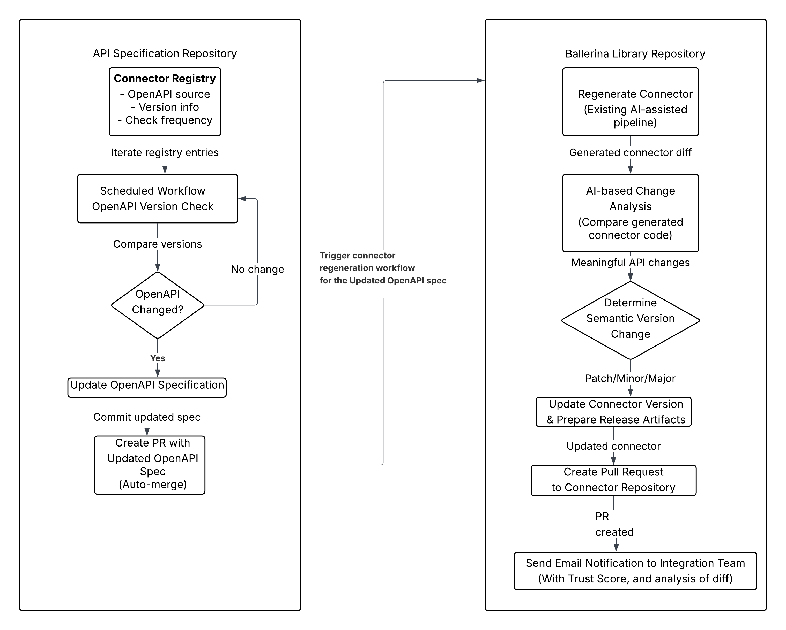

# AI-driven Dependabot for OpenAPI Connectors  

- **Authors**
  - Tharani Jayaratne
- **Reviewed by**
  - Thisaru Guruge
  - Sumudu Nissanka
- **Created date**
  - 2025-12-09
- **Issue**
  - [1416](https://github.com/ballerina-platform/ballerina-spec/issues/1416)
- **State**
  - InProgress

## Summary
The Ballerina ecosystem currently supports over 500 connectors, out of which more than 300 are automatically generated from OpenAPI specifications. These connectors must be frequently updated to remain compatible with upstream service provider APIs. Manual detection and maintenance of such updates is not scalable.

This project introduces an AI-driven Dependabot-like system that automatically identifies OpenAPI updates, determines the required connector modifications, and triggers or assists regeneration. The solution will reduce manual overhead, improve connector quality, and ensure timely updates.

## Goals
- Automate detection of upstream OpenAPI definition changes.
- Recommend or regenerate connector updates using AI-based reasoning.
- Provide automated pull requests that comply with repository standards.
- Develop a persistent GitOps workflow integration model.
- Minimize developer intervention while maintaining reliability and traceability.

## Non Goals
- S/4HANA like highly differentiated connector structures will be excluded from the automation.
- Platforms like Dayforce that provide client-wise or gated OpenAPI specs will not be handled by the automated system.

## Motivation
Maintaining an expanding set of OpenAPI-based connectors requires:

- Continuous monitoring of API spec changes.
- Regeneration and validation of connectors.
- Manual knowledge-intensive review.

Traditional approaches like Dependabot do not apply well because:

- OpenAPI specifications are not published artifacts like Maven dependencies.
- Change detection must account for schema semantics, not just version tags.

An AI-driven solution enables:

- Semantic comparison of OpenAPI versions.
- Automated reasoning for connector regeneration.
- Summarization and impact reporting for developer review.

## Description
### Proposed Solution

The proposed solution introduces an automated, AI-assisted workflow that continuously monitors, analyzes, and updates Ballerina connectors based on changes in external OpenAPI specifications. This approach is inspired by Dependabot but adapted to the unique challenges of OpenAPI-driven connector maintenance. The following are the main tasks that will be implemented: Ballerina will be used as the programming language for implementation. The complete process will be working with 2 repositories named the [Ballerina Library Repository](https://github.com/ballerina-platform/ballerina-library) and the [API Specifications Repository](https://github.com/wso2/api-specs). Up to the part where OpenAPI change detection, pull request creation and sending will be done inside the [API Specifications Repository](https://github.com/wso2/api-specs) , and the remaining connector generation, comparing changes and pull request sending for the relevant connector repository part will be done inside the [Ballerina Library Repository](https://github.com/ballerina-platform/ballerina-library).

#### 1. Registry Definition and Initialization

A central registry will be created to store metadata for every generated connector. Each registry entry will describe the connector's OpenAPI source, access method, spec format, version tracking method, and generation details. Whenever a new connector is added or a new OpenAPI source is identified, the registry will be updated automatically. Certain fields, such as the connector module version, will be maintained by existing Ballerina build and release workflows.

#### 2. Periodic Discovery and Version Checking

A scheduled workflow will iterate through all registry entries daily/weekly/monthly/quarterly, as specified in frequency field of the registry and check whether the corresponding OpenAPI specifications have changed. The last checked field of the registry will be updated with the current date and time. Since OpenAPI sources vary (GitHub repos, vendor URLs, public JSON files, etc.), the system will support multiple detection strategies such as **GitHub release tags**, **version indicators within the OpenAPI spec** or vendor-specific version indicators.

#### 3. Automated Update Workflow When Changes Are Detected

If a change is detected in an OpenAPI specification, the bot will perform a series of automated actions:

##### (i) Update OpenAPI Specification Repository
The updated OpenAPI file will be added to the centralised API specification repository, and the system will create a pull request containing the new spec version. Since this doesn't involve any AI-related work and only updating the content which is in the updated OpenAPI spec, this will be merged to the repository without human review. 

##### (ii) Regenerate the Corresponding Connector
The system will then regenerate the connector in its dedicated repository using the existing AI-driven connector generation pipeline (developed by another internship project) supported by Ballerina. 
##### (iii) Intelligent Change Detection via AI
Instead of comparing raw OpenAPI specifications—which can be noisy and difficult to diff—the system compares the generated connector source code, which has a well-defined structure fully controlled by Ballerina.

An LLM (likely Claude) will be used to analyze the differences and determine whether meaningful API or type-level changes have occurred. Internal or cosmetic changes that do not affect public APIs will be ignored.

Although Ballerina's semver tool may serve as a fallback, the LLM-based approach is preferred because semver is experimental and may not accurately detect structural API-level differences.

##### (iv) Version Bump and Release Preparation
Based on the diff analysis (e.g., patch, minor, or major change), the connector's version will be automatically updated following semantic versioning, and release artifacts will be prepared.

##### (v) Automated Pull Request to Connector Repository
Finally, the updated connector will be submitted as a pull request to the connector's repository, completing the automated update cycle. Simultaneously, the system will send an automated email notification to the integration team detailing the update and providing a link to the generated pull request.

This solution reduces human intervention, ensures connectors remain up-to-date with the rapidly evolving ecosystem of third-party APIs, and establishes a scalable long-term process for maintaining Ballerina's large connector library.

#### 4. Workflow Diagram

The following diagram illustrates the complete end-to-end workflow of the AI-driven Dependabot system:



**Workflow Overview:**
- **API Specification Repository (Left)**: Handles OpenAPI version monitoring, change detection, and spec updates
- **Ballerina Library Repository (Right)**: Manages connector regeneration, AI-based analysis, and release preparation
- The workflow is triggered when OpenAPI changes are detected, automating the entire update process from detection to pull request creation

### Connector Registry Design

The Connector Registry is the central metadata database used by the AI-driven Dependabot system to automatically discover OpenAPI specification updates, detect version changes, and trigger connector regeneration pipelines.

It defines, in a consistent machine-readable structure:
- Where each connector's OpenAPI spec originates
- How to fetch it
- How to detect whether it has changed
- How to handle special formats (multi-spec docs, templated URLs, private APIs, submodules, etc.)

The registry is intentionally JSON-based because it must be:
- Machine readable
- Easy to diff and maintain
- Usable in GitHub Actions / CI pipelines
- Editable by humans
- Extensible (submodules, version history, metadata)

#### 1. Source Type (Enum Definition)

Every OpenAPI specification belongs to a **Source Type**, which defines how the system can access and validate updates.

These source types will be defined as an enum:

```json
{
  "source_type": "<one-of: github | vendor_public_url | vendor_docs_collection | third_party_hub | restricted_access | unavailable>"
}
```

##### 1.1 Major Source Types (Actively Supported)

| Source Type | Meaning | How We Detect Updates |
|-------------|---------|----------------------|
| `github` | OpenAPI spec lives in a GitHub repo | Compare latest GitHub release tag |
| `vendor_public_url` | Vendor provides a direct, public OpenAPI JSON/YAML URL | Version indicators within the OpenAPI spec |
| `vendor_docs_collection` | One page contains multiple OpenAPI specs | Version indicators within each OpenAPI spec |
| `third_party_hub` | Specs stored on sites like SwaggerHub, Postman Public Workspace | Use official APIs to fetch latest version |


##### 1.2 Edge Source Types (Special Handling Required)

| Source Type | Meaning | Behavior |
|-------------|---------|----------|
| `restricted_access` | Specs that require customer login / API token (e.g., Dayforce) | System cannot fetch → sends monthly notifications |
| `unavailable` | Vendor does not provide any downloadable OpenAPI spec | Not eligible for auto-update; manual tracking only |

#### 2. Standard Registry Item Structure

Every connector entry follows the same high-level layout:

```json
{
  "name": "module-ballerinax-<vendor>.<service>",
  "module_version": "X.Y.Z-SNAPSHOT",
  "default_branch": "main",
  "frequency": "<daily|weekly|monthly|quarterly>",
  "connector_repository": "<connector repo's name inside github ballerina platform organization>",
  "openapi": {
    "source_type": "<enum>",
    "location": { },
    "version_info": {
      "last_known_version": "<openapi-version-or-tag>",
      "last_checked": "ISO_TIMESTAMP"
    }
  }
}
```

#### 3. Source Type–Specific Location Structures

Each source type has a strictly defined JSON schema under `"location"`.

##### 3.1 GitHub Source Type

Used when the vendor publishes OpenAPI specs in a public repository (e.g., Asana, Discord, GitHub, DocuSign).

```json
"location": {
  "owner": "OWNER",
  "repo": "REPO_NAME",
  "spec_path": "path/to/openapi.yaml",
  "release_asset_name": "<optional>"
}
```

- The system fetches the latest release tag or version associated with `spec_path`
- The tag/version is compared with `version_info.last_known_version`

**Example:**
```json
"location": {
  "owner": "stripe",
  "repo": "openapi",
  "spec_path": "openapi/spec3.yaml",
  "release_asset_name": "spec3.yaml"
}
```

##### 3.2 Vendor Public URL & Third Party Hub

Used when a direct URL to JSON/YAML (e.g., Elastic Cloud, Candid alternative format) is available.

```json
"location": {
  "primary_url": "https://example.com/openapi.yaml"
}
```

##### 3.3 Vendor Docs Collection (Multiple Specs in One Page)

Used for APIs like Candid, where one page contains multiple OpenAPI specs. Special case for the project scope.

```json
"location": {
  "primary_url": "https://developer.candid.org/reference/openapi",
  "format": "multiple_specs_in_docs",
  "spec_components": [
    { "ballerina_submodule": "charitycheckpdf", "api_name": "Charity Check PDF API" },
    { "ballerina_submodule": "essentials", "api_name": "Essentials API" },
    { "ballerina_submodule": "premier", "api_name": "Premier API" }
  ]
}
```

**Meaning:**
- This connector has submodules
- Each submodule gets its own:
  - Temporary extracted spec
  - OpenAPI version comparison
  - Regeneration pipeline
- Backward compatibility preserved for older multi-module connectors

##### 3.4 Restricted Access (e.g., Dayforce)

These URLs require authentication and cannot be polled automatically.

```json
"location": {
  "primary_url": "https://vendor.com/api/spec",
  "requires_auth": true
}
```

**Behavior:**
- System attempts access monthly
- If inaccessible → Discord/Google Chat notification
- Marked as manual update only

#### 4. Version Info Structure

```json
"version_info": {
  "last_known_version": "<release-tag-or-openapi-version>",
  "last_checked": "2025-12-10T00:00:00Z"
}
```

**How versioning works:**
- GitHub repos: release tag
- URL-based: version field in the downloaded OpenAPI file (info.version)
- Multi-doc pages: version field in the extracted spec per submodule
- Restricted access: `last_known_version` stays empty; only notifications sent

## Backward Compatibility
- No disruption to existing connectors.
- All automated changes occur via PRs.
- Manual override always possible.

## Security Considerations
- Integrity validation for upstream sources.
- No unrestricted merging—human review required.

## Dependencies
- Ballerina OpenAPI Connector Generation Framework  
- GitHub Actions / GitOps  
- Large Language Model (AI module)  
- OpenAPI registry sources  

## Testing

1. **Validation of Automated Pull Requests**  
   - Ensure generated PRs contain the correct connector changes, summaries, and do not introduce build failures.

2. **Regression Testing of Re-generated Connectors**  
   - Automatically run connector test suites after regeneration to guarantee compatibility and prevent breaking changes.

3. **Accuracy Evaluation of OpenAPI Diff and AI Decisions**  
   - Compare detected semantic changes against ground truth; measure false positives/negatives to refine AI reasoning.