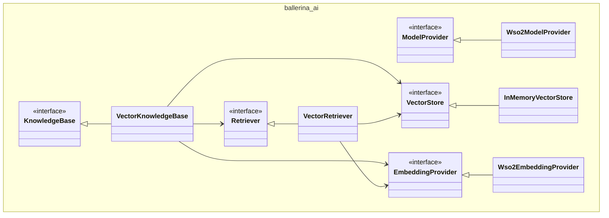

# Abstractions for Retrieval-Augmented Generation in Ballerina
- Authors
  - @MohamedSabthar, @VellummyilumVinoth
- Reviewed by
    - @shafreenAnfar, @MaryamZi, @xlight05, @SasinduDilshara
- Created date
    - 2025-06-19
- Issue
    - [1359](https://github.com/ballerina-platform/ballerina-spec/issues/1359)
- State
    - Submitted

## Summary
Retrieval-Augmented Generation (RAG) systems are becoming increasingly important in the development of generative AI applications. As the demand for GenAI solutions grows, it's essential to provide a well-defined abstraction for building RAG applications using Ballerina. This proposal aims to introduce such an abstraction, making it easier and more efficient to implement RAG workflows in Ballerina.

## Goals
- Provide abstractions to ingest data into knowledge bases
- Provide abstractions to retrieve data from knowledge bases

## Motivation
As generative AI continues to evolve, Retrieval-Augmented Generation (RAG) has emerged as a key pattern for building intelligent, context-aware applications. RAG enhances the quality and relevance of language model responses by grounding them in external knowledge sources. However, implementing RAG workflows from scratch can be complex and fragmented, often requiring developers to manually integrate vector stores, embedding models, retrieval logic, and prompt construction.

Ballerina, being a language designed for integration, is well-positioned to simplify and standardize RAG application development. By introducing structured abstractions for common RAG tasks such as ingesting data into knowledge bases, retrieving relevant context, and generating grounded responses, we can significantly reduce development time and lower the barrier to entry for developers building GenAI powered applications.

This initiative aims to empower developers with a cohesive and extensible framework for building robust RAG systems using Ballerina.

## Design
This section describes the core abstractions and components involved in implementing Retrieval-Augmented Generation (RAG) applications using Ballerina.

### 1. Document: The Knowledge Source
Every RAG system starts with a set of documents.

```ballerina
# Represents the common structure for all document types
public type Document record {|
    string 'type;
    DocumentMetaData metadata?;
    anydata content;
|};

public type DocumentMetaData record {|
    string mimeType?;
    string fileName?;
    decimal fileSize?;
    time:Utc createdAt?;
    time:Utc modifiedAt?;
    json...;
|};

# Represents documents containing plain text content
public type TextDocument record {|
    *Document;
    readonly "text" 'type = "text";
    string content;
|};
```

Each Document represents a piece of information (e.g., a paragraph, policy text, or FAQ entry, image URL). Optional metadata allows filtering and categorization (e.g., department: "HR").

### 2. Chunk: A Smaller Unit of Meaning
Once documents are loaded, they are broken down into smaller segments called chunks. Chunking makes it easier for retrieval systems to fetch and rank relevant pieces efficiently.

```ballerina
public type Chunk record {|
    *Document;
|};
```

```ballerina
public type TextChunk record {|
    *Chunk;
    # Fixed type for the text chunk
    readonly "text-chunk" 'type = "text-chunk";
    # The text content of the chunk
    string content;
|};
```

Each `Chunk` retains the metadata of the original `Document` but narrows down to a smaller portion of the content.


### 3. Embedding
Before we can search chunks efficiently, we convert them into numeric representations (`Embedding`) using an `EmbeddingProvider`.

```ballerina
public type Vector float[];

public type SparseVector record {|
    int[] indices;
    Vector values;
|};

public type HybridVector record {|
    Vector dense;
    SparseVector sparse;
|};

public type Embedding Vector|SparseVector|HybridVector;
```

The Embedding type supports three kinds of vector formats:
- Dense vectors (most common)
- Sparse vectors (useful for symbolic info)
- Hybrid vectors (combining both).

####  Embedding Provider
The embeddings are created by embedding providers.
Different providers or users can implement their own embedding provider by using the following Ballerina object type.
```ballerina
public type EmbeddingProvider distinct isolated client object {
    isolated remote function embed(Chunk chunk) returns Embedding|Error;
};
```

We will also provide a `Wso2EmbeddingProvider` as the default embedding provider. This allows users to get started without needing to supply their own API keys or custom implementations.
For more details about the default model provider, refer to [this issue](https://github.com/ballerina-platform/ballerina-library/issues/8029).

```ballerina
public type Wso2ProviderConfig record {|
    string serviceUrl;
    string accessToken;
|};

public distinct isolated client class Wso2EmbeddingProvider {
    *EmbeddingProvider;
    private final wso2:Client embeddingClient;

    public isolated function init(*Wso2ProviderConfig config) returns Error? {
        // omitted for brevity 
    }

    isolated remote function embed(Chunk chunk) returns Embedding|Error {
        // omitted for brevity 
    }
}
```

### 4. Vector Stores
A `VectorStore` is where the embedded chunks are stored and queried.

```ballerina
public type VectorStore distinct isolated object {
    public isolated function add(VectorEntry[] entries) returns Error?;
    public isolated function query(VectorStoreQuery query) returns VectorMatch[]|Error;
    public isolated function delete(string id) returns Error?;
};
```

Each `VectorEntry` links an embedding to its chunk:
```ballerina
public type VectorEntry record {|
   Embedding embedding;
   Chunk chunk;
|};
```

Querying returns a ranked list of VectorMatch items:
```ballerina
public type VectorMatch record {|
   *VectorEntry;
    float similarityScore;
|};
```


Metadata filtering is also supported during queries. The following types define how a query is constructed for the vector store.

```ballerina
public type VectorStoreQuery record {|
    Embedding embedding;
    MetadataFilters filters?;
|};

public type MetadataFilters record {|
    (MetadataFilters|MetadataFilter)[] filters;
    MetadataFilterCondition condition = AND;
|};

public type MetadataFilter record {|
    string key;
    MetadataFilterOperator operator = EQUAL;
    json value;
|};

public enum MetadataFilterOperator {
    EQUAL = "==",
    NOT_EQUAL = "!=",
    GREATER_THAN = ">",
    LESS_THAN = "<",
    GREATER_THAN_OR_EQUAL = ">=",
    LESS_THAN_OR_EQUAL = "<=",
    IN = "in",
    NOT_IN = "nin"
}

public enum MetadataFilterCondition {
    AND = "and",
    OR = "or"
}
```

Different providers or users can implement their own vector store integrations (e.g., Pinecone, Weaviate, etc.).
We provide a simple in-memory implementation for testing and local experimentation, which supports only dense vectors.

```ballerina
public distinct isolated class InMemoryVectorStore {
    *VectorStore;
    private final VectorEntry[] entries = [];
    private final int topK;
    private final SimilarityMetric similarityMetric;

    public isolated function init(int topK = 3, SimilarityMetric similarityMetric = COSINE) {
        self.topK = topK;
        self.similarityMetric = similarityMetric;
    }

    public isolated function add(VectorEntry[] entries) returns Error? {
        foreach VectorEntry entry in entries {
            if entry.embedding !is Vector {
                return error Error("InMemoryVectorStore supports dense vectors exclusively");
            }
        }
        readonly & VectorEntry[] clonedEntries = entries.cloneReadOnly();
        lock {
            self.entries.push(...clonedEntries);
        }
    }

    public isolated function query(VectorStoreQuery query) returns VectorMatch[]|Error {
        if query.embedding !is Vector {
            return error Error("InMemoryVectorStore supports dense vectors exclusively");
        }

        lock {
            VectorMatch[] sorted = from var entry in self.entries
                let float similarity = self.calculateSimilarity(<Vector>query.embedding.clone(), <Vector>entry.embedding)
                order by similarity descending
                limit self.topK
                select {chunk: entry.chunk, embedding: entry.embedding, similarityScore: similarity};
            return sorted.clone();
        }
    }

    private isolated function calculateSimilarity(Vector queryEmbedding, Vector entryEmbedding) returns float {
        match self.similarityMetric {
            COSINE => {
                return vector:cosineSimilarity(queryEmbedding, entryEmbedding);
            }
            EUCLIDEAN => {
                return vector:euclideanDistance(queryEmbedding, entryEmbedding);
            }
            DOT_PRODUCT => {
                return vector:dotProduct(queryEmbedding, entryEmbedding);
            }
        }
        return vector:cosineSimilarity(queryEmbedding, entryEmbedding);
    }

    public isolated function delete(string id) returns Error? {
        lock {
            int? indexToRemove = ();
            foreach int i in 0 ..< self.entries.length() {
                if self.entries[i].id == id {
                    indexToRemove = i;
                    break;
                }
            }

            if indexToRemove is () {
                return error Error(string `Vector entry with reference id '${id}' not found`);
            }
            _ = self.entries.remove(indexToRemove);
        }
    }
}
```

### 5. Retriever
To retrieve the most relevant chunks for a given question, we use a `Retriever`. The `Retriever` accepts a natural language query and optional metadata filters and then returns a list of matching chunks with relavant similarity score.

```ballerina
public type Retriever distinct isolated object {
    public isolated function retrieve(string query, MetadataFilters? filters = ()) returns QueryMatch[]|Error;
};

public type QueryMatch record {|
    Chunk chunk;
    float similarityScore;
|};
```

Users can implement their own `Retriever` to suit their requirements — for example, by incorporating custom ranking logic, re-ranking top matches with a more advanced scoring model, or applying domain-specific retrieval techniques.

We also provide a simple `Retriever` implementation named `VectorRetriever`  that
1. Embeds the query,
2. Runs a similarity against the underlying vector store,
3. Returns top-matching documents with similarity scores.

```ballerina
public distinct isolated class VectorRetriever {
    *Retriever;
    private final VectorStore vectorStore;
    private final EmbeddingProvider embeddingModel;

    public isolated function init(VectorStore vectorStore, EmbeddingProvider embeddingModel) {
        self.vectorStore = vectorStore;
        self.embeddingModel = embeddingModel;
    }

    public isolated function retrieve(string query, MetadataFilters? filters = ()) returns QueryMatch[]|Error {
        TextChunk queryChunk = {content: query, 'type: "text-chunk"};
        Embedding queryEmbedding = check self.embeddingModel->embed(queryChunk);
        VectorStoreQuery vectorStoreQuery = {
            embedding: queryEmbedding,
            filters: filters
        };
        VectorMatch[] matches = check self.vectorStore.query(vectorStoreQuery);
        return from VectorMatch 'match in matches
            select {chunk: 'match.chunk, similarityScore: 'match.similarityScore};
    }
}
```

### 6. Knowledge Base

A `KnowledgeBase` manages a collection of chunks and provides an interface for indexing and retrieval. Implementations can use any underlying storage or retrieval mechanism.

```ballerina
public type KnowledgeBase distinct isolated object {
    public isolated function ingest(Chunk[] chunks) returns Error?;
    public isolated function retrieve(string query, MetadataFilters? filters = ()) returns QueryMatch[]|Error;
};
```

The `VectorKnowledgeBase` defined below is a wrapper around a `VectorStore` and `EmbeddingProvider`.
It provides indexing and access to a `Retriever`.

```ballerina
public distinct isolated class VectorKnowledgeBase {
    *KnowledgeBase;
    private final VectorStore vectorStore;
    private final EmbeddingProvider embeddingModel;
    private final Retriever retriever;

    public isolated function init(VectorStore vectorStore, EmbeddingProvider embeddingModel) {
        self.vectorStore = vectorStore;
        self.embeddingModel = embeddingModel;
        self.retriever = new VectorRetriever(vectorStore, embeddingModel);
    }

    public isolated function ingest(Chunk[] chunks) returns Error? {
        VectorEntry[] entries = [];
        foreach Chunk chunk in chunks {
            Embedding embedding = check self.embeddingModel->embed(chunk);
            entries.push({embedding, chunk});
        }
        check self.vectorStore.add(entries);
    }

    public isolated function retrieve(string query, MetadataFilters? filters = ()) returns QueryMatch[]|Error {
        return self.retriever.retrieve(query, filters);
    }
}
```

### 7. Augment user query

After retrieving the relevant documents, matched chunks (`QueryMatch`), or context, we use them to construct a prompt for the language model. The package provides an `augmentUserQuery` function that generates the augmented user message. If a different prompt format is needed, users can implement and use their own custom logic.


```ballerina
# Augments the user's query with relevant context.
public isolated function augmentUserQuery(QueryMatch[]|Document[] context, string query) returns ChatUserMessage {
    Chunk[]|Document[] relevantContext = [];
    if context is QueryMatch[] {
        relevantContext = context.'map(queryMatch => queryMatch.chunk);
    } else if context is Document[] {
        relevantContext = context;
    }
    Prompt userPrompt = `Answer the question based on the following provided context: 
    <CONTEXT>${relevantContext}</CONTEXT>
    
    Question: ${query}`;
    return {role: USER, content: userPrompt};
}
```

```ballerina
# User chat message record.
public type ChatUserMessage record {|
    # Role of the message
    USER role;
    # Content of the message
    string|Prompt content;
    # An optional name for the participant
    # Provides the model information to differentiate between participants of the same role
    string name?;
|};
```

> **Note:** The `ChatUserMessage` record is already defined in the `ModelProvider` abstraction.


```ballerina
# Represents a prompt.
#
# + strings - Read-only array of string literals from the template
# + insertions - Array of values to be inserted into the template, can be any data or Document types
public type Prompt isolated object {
    *object:RawTemplate;

    public string[] & readonly strings;
    public (anydata|Document|Document[]|Chunk|Chunk[])[] insertions;
};
```

> **Note:** The `Prompt` object has already been introduced in the module to support natural programming constructs. We are reusing it here to simplify prompt construction for users and to enable multimodal input support.

### 8. Changes in ModelProvider

The `ModelProvider` currently defines its `chat()` method to accept an array of `ChatMessage` values as input.
The relevant type definitions are:

```ballerina
# Chat message record.
public type ChatMessage ChatUserMessage|ChatSystemMessage|ChatAssistantMessage|ChatFunctionMessage;

# User chat message record.
public type ChatUserMessage record {|
    USER role;
    string content;
    string name?;
|};

# System chat message record.
public type ChatSystemMessage record {|
    SYSTEM role;
    string content;
    string name?;
|};

# Assistant chat message record.
public type ChatAssistantMessage record {|
    // ...omited for brevity
|};

# Function message record.
public type ChatFunctionMessage record {|
     // ...omited for brevity
|};
```

To enable multimodal support in ModelProvider—for example, allowing models to handle different types of documents such as `TextDocument`, `TextChunk` `AudioDocument`, `ImageDocument`, etc. we are updating the `content` field in `ChatUserMessage` and `ChatSystemMessage` to use the `Prompt` type:

```ballerina
public type ChatUserMessage record {|
    string|Prompt content;
    // ...omitted for brevity
|};

public type ChatSystemMessage record {|
    string|Prompt content;
    // ...omitted for brevity
|};
```

If the content is a `Prompt` and its `insertions` field includes any `Document` or `Chunk` values, model providers that support multimodal input should implement the logic required to convert and forward this data to the LLM.

Additionally, the `chat()` method is updated to accept either a single `ChatUserMessage` or a list of `ChatMessage` values. The updated API is:

```ballerina
public type ModelProvider distinct isolated client object {
    isolated remote function chat(ChatMessage[]|ChatUserMessage messages, ChatCompletionFunctions[] tools = [], string? stop = ())
        returns ChatAssistantMessage|LlmError;
};
```

### RAG Ingestion Example

```ballerina
import ballerina/ai;
import ballerina/io;
import ballerinax/ai.pinecone;

configurable string pineconeServiceUrl = ?;
configurable string pineconeApiKey = ?;
configurable string wso2EmbeddingServiceUrl = ?;
configurable string wso2AccessToken = ?;

public function main() returns error? {
    ai:VectorStore vectorStore = check new pinecone:VectorStore(serviceUrl = pineconeServiceUrl, apiKey = pineconeApiKey);
    ai:EmbeddingProvider embeddingModel = check new ai:Wso2EmbeddingProvider(wso2EmbeddingServiceUrl, wso2AccessToken);
    ai:VectorKnowledgeBase knowlegeBase = new ai:VectorKnowledgeBase(vectorStore, embeddingModel);

    io:println("Pre-processing data...");
    string policy = check io:fileReadString("./resources/pizza_shop_policy_doc.md");
    ai:TextDocument policyDoc = {
        content: policy,
        metadata: {
            "source": "pizza_shop_policy_doc.md",
            "type": "policy"
        }
    };

    // A recursive chunker will be introduced as part of future improvements
    ai:Chunk[] policyChunks = check ai:chunkDocumentRecursively(policyDoc); 
    io:println("Pre-processing done.");

    io:println("Ingesting data...");
    check knowlegeBase.ingest(policyChunks);
    io:println("Ingestion done.");
}
```

### RAG Query Example

```ballerina
import ballerina/ai;
import ballerina/http;
import ballerina/log;
import ballerinax/ai.pinecone;

configurable string pineconeServiceUrl = ?;
configurable string pineconeApiKey = ?;
configurable string wso2ServiceUrl = ?;
configurable string wso2AccessToken = ?;

isolated service /rag on new http:Listener(9090) {
    private final ai:KnowledgeBase knowledgeBase;
    private final ai:ModelProvider model;

    isolated function init() returns error? {
        ai:VectorStore vectorStore = check new pinecone:VectorStore(pineconeServiceUrl, pineconeApiKey);
        ai:EmbeddingProvider embeddingModel = check new ai:Wso2EmbeddingProvider(wso2ServiceUrl, wso2AccessToken);
        self.knowledgeBase = new ai:VectorKnowledgeBase(vectorStore, embeddingModel);
        self.model = check new ai:Wso2ModelProvider(wso2ServiceUrl, wso2AccessToken);
    }

    isolated resource function post query(QueryRequest request) returns QueryResponse|http:InternalServerError {
        log:printInfo("Received query: " + request.query);
        do {
            ai:QueryMatch[] context = check self.knowledgeBase.retrieve(request.query);
          
            ai:ChatUserMessage message = ai:augmentUserQuery(context, request.query);

            ai:ChatAssistantMessage response = check self.model->chat(message, []);
            string answer = response.content ?: "I couldn't find an answer to your question.";
            return {response: answer};
        } on fail error e {
            log:printError("Failed to process query", 'error = e);
            return {body: "Unable to obtain a valid answer at this time."};
        }
    }
}
```

### Dependency Diagram
The following diagram illustrates the dependencies between the abstractions and components introduced above.

