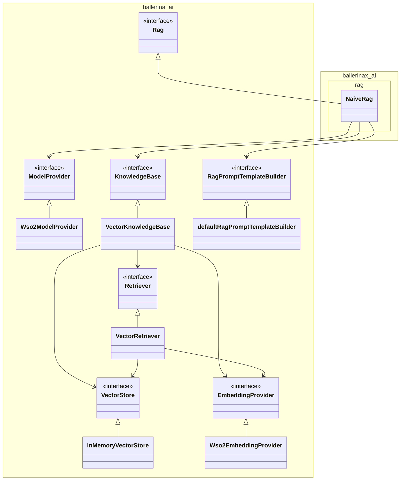

# Abstractions for Retrieval-Augmented Generation in Ballerina
- Authors
  - @MohamedSabthar, @VellummyilumVinoth
- Reviewed by
    - @shafreenAnfar, @MaryamZi, @xlight05, @SasinduDilshara
- Created date
    - 2025-06-19
- Issue
    - [1359](https://github.com/ballerina-platform/ballerina-spec/issues/1359)
- State
    - Submitted

## Summary
Retrieval-Augmented Generation (RAG) systems are becoming increasingly important in the development of generative AI applications. As the demand for GenAI solutions grows, it's essential to provide a well-defined abstraction for building RAG applications using Ballerina. This proposal aims to introduce such an abstraction, making it easier and more efficient to implement RAG workflows in Ballerina.

## Goals
- Provide abstractions to ingest data into knowledge bases
- Provide abstractions to retrieve data from knowledge bases

## Motivation
As generative AI continues to evolve, Retrieval-Augmented Generation (RAG) has emerged as a key pattern for building intelligent, context-aware applications. RAG enhances the quality and relevance of language model responses by grounding them in external knowledge sources. However, implementing RAG workflows from scratch can be complex and fragmented, often requiring developers to manually integrate vector stores, embedding models, retrieval logic, and prompt construction.

Ballerina, being a language designed for integration, is well-positioned to simplify and standardize RAG application development. By introducing structured abstractions for common RAG tasks such as ingesting data into knowledge bases, retrieving relevant context, and generating grounded responses, we can significantly reduce development time and lower the barrier to entry for developers building GenAI powered applications.

This initiative aims to empower developers with a cohesive and extensible framework for building robust RAG systems using Ballerina.

## Design
This section describes the core abstractions and components involved in implementing Retrieval-Augmented Generation (RAG) applications using Ballerina.

### 1. Document: The Knowledge Source
Every RAG system starts with a set of documents.

```ballerina
# Represents the common structure for all document types
public type Document record {|
    string 'type;
    DocumentMetaData metadata?;
    anydata content;
|};

public type DocumentMetaData record {|
    string mimeType?;
    string fileName?;
    decimal fileSize?;
    time:Utc createdAt?;
    time:Utc modifiedAt?;
    json...;
|};

# Represents documents containing plain text content
public type TextDocument record {|
    *Document;
    readonly TEXT 'type = TEXT;
    string content;
|};
```

Each Document represents a piece of information (e.g., a paragraph, policy text, or FAQ entry, image URL). Optional metadata allows filtering and categorization (e.g., department: "HR").

### 2. Embeddings
Before we can search documents efficiently, we convert them into numeric representations (`Embedding`) using an `EmbeddingProvider`.

```ballerina
public type Vector float[];

public type SparseVector record {|
    int[] indices;
    Vector values;
|};

public type HybridVector record {|
    Vector dense;
    SparseVector sparse;
|};

public type Embedding Vector|SparseVector|HybridVector;
```

The Embedding type supports three kinds of vector formats:
- Dense vectors (most common)
- Sparse vectors (useful for symbolic info)
- Hybrid vectors (combining both).

####  Embedding Provider
The embeddings are created by embedding providers.

```ballerina
public type EmbeddingProvider distinct isolated client object {
    isolated remote function embed(Document document) returns Embedding|Error;
};
```

Different providers or users can implement their own embedding provider by using the following Ballerina object type.

We will also provide a `Wso2EmbeddingProvider` as the default embedding provider. This allows users to get started without needing to supply their own API keys or custom implementations.
For more details about the default model provider, refer to [this issue](https://github.com/ballerina-platform/ballerina-library/issues/8029).

```ballerina
public type Wso2ProviderConfig record {|
    string serviceUrl;
    string accessToken;
|};

public distinct isolated client class Wso2EmbeddingProvider {
    *EmbeddingProvider;
    private final wso2:Client embeddingClient;

    public isolated function init(*Wso2ProviderConfig config) returns Error? {
        // omitted for brevity 
    }

    isolated remote function embed(Document document) returns Embedding|Error {
        // omitted for brevity 
    }
}
```

### 3. Vector Stores
A `VectorStore` is where the embedded documents are stored and queried.

```ballerina
public type VectorStore distinct isolated object {
    public isolated function add(VectorEntry[] entries) returns Error?;
    public isolated function query(VectorStoreQuery query) returns VectorMatch[]|Error;
    public isolated function delete(string id) returns Error?;
};
```

Each `VectorEntry` links an embedding to its document:
```ballerina
public type VectorEntry record {|
   Embedding embedding;
   Document document;
|};
```

Querying returns a ranked list of VectorMatch items:
```ballerina
public type VectorMatch record {|
   *VectorEntry;
   float score; // represents the similarity score
|};
```


Metadata filtering is also supported during queries. The following types define how a query is constructed for the vector store.

```ballerina
public type VectorStoreQuery record {|
    Embedding embedding;
    MetadataFilters filters?;
|};

public type MetadataFilters record {|
    (MetadataFilters|MetadataFilter)[] filters;
    MetadataFilterCondition condition = AND;
|};

public type MetadataFilter record {|
    string key;
    MetadataFilterOperator operator = EQUAL;
    json value;
|};

public enum MetadataFilterOperator {
    EQUAL = "==",
    NOT_EQUAL = "!=",
    GREATER_THAN = ">",
    LESS_THAN = "<",
    GREATER_THAN_OR_EQUAL = ">=",
    LESS_THAN_OR_EQUAL = "<=",
    IN = "in",
    NOT_IN = "nin"
}

public enum MetadataFilterCondition {
    AND = "and",
    OR = "or"
}
```

Different providers or users can implement their own vector store integrations (e.g., Pinecone, Weaviate, etc.).
We provide a simple in-memory implementation for testing and local experimentation, which supports only dense vectors.

```ballerina
public distinct isolated class InMemoryVectorStore {
    *VectorStore;
    private final VectorEntry[] entries = [];

    public isolated function add(VectorEntry[] entries) returns Error? {
        foreach VectorEntry entry in entries {
            if entry.embedding !is Vector {
                return error Error("InMemoryVectorStore implementation only supports dense vectors");
            }
        }
        readonly & VectorEntry[] clonedEntries = entries.cloneReadOnly();
        lock {
            self.entries.push(...clonedEntries);
        }
    }

    public isolated function query(VectorStoreQuery query) returns VectorMatch[]|Error {
        if query.embedding !is Vector {
            return error Error("InMemoryVectorStore supports dense vectors exclusively");
        }

        lock {
            VectorMatch[] sorted = from var entry in self.entries
                let float similarity = self.cosineSimilarity(<Vector>query.embedding.clone(), <Vector>entry.embedding)
                order by similarity descending
                limit self.topK
                select {document: entry.document, embedding: entry.embedding, similarityScore: similarity};
            return sorted.clone();
        }
    }

    isolated function cosineSimilarity(Vector a, Vector b) returns float {
        // omitted for brevity
    }

    public isolated function delete(string id) returns Error? {
        // omitted for brevity
    }
}
```

### 4. Retriever
To retrieve the most relevant documents for a given question, we use a `Retriever`. The `Retriever` accepts a natural language query and optional metadata filters and then returns a list of matching documents.

```ballerina
public type Retriever distinct isolated object {
    public isolated function retrieve(string query, MetadataFilters? filters = ()) returns DocumentMatch[]|Error;
};
```

Users can implement their own `Retriever` to suit their requirements — for example, by incorporating custom ranking logic, re-ranking top matches with a more advanced scoring model, or applying domain-specific retrieval techniques.


We also provide a simple `Retriever` implementation named `VectorRetriever`  that
1. Embeds the query,
2. Runs a similarity against the underlying vector store,
3. Returns top-matching documents with similarity scores.

```ballerina
public distinct isolated class VectorRetriever {
    *Retriever;
    private final VectorStore vectorStore;
    private final EmbeddingProvider embeddingModel;

    public isolated function init(VectorStore vectorStore,
            EmbeddingProvider embeddingModel) {
        self.vectorStore = vectorStore;
        self.embeddingModel = embeddingModel;
    }

    public isolated function retrieve(string query, MetadataFilters? filters = {})
    returns DocumentMatch[]|Error {
        TextDocument queryDocument = {content: query, 'type: TEXT};
        Embedding queryVec = check self.embeddingModel->embed(queryDocument);
        VectorStoreQuery vectorStoreQuery = {
            embeddingVector: queryVec,
            filters: filters
        };
        VectorMatch[] matches = check self.vectorStore.query(vectorStoreQuery);
        return from VectorMatch 'match in matches
            select {document: 'match.document, score: 'match.score};
    }
}
```

### 5. Knowledge Base

A `KnowledgeBase` manages a collection of documents and provides an interface for indexing and retrieval. Implementations can use any underlying storage or retrieval mechanism.

```ballerina
public type KnowledgeBase distinct isolated object {
    public isolated function index(Document[] documents) returns Error?;
    public isolated function retrieve(string query, MetadataFilters? filters = ()) returns DocumentMatch[]|Error;
};
```

The `VectorKnowledgeBase` defined below is a wrapper around a `VectorStore` and `EmbeddingProvider`.
It provides indexing and access to a `Retriever`.

```ballerina
public distinct isolated class VectorKnowledgeBase {
    *KnowledgeBase;
    private final VectorStore vectorStore;
    private final EmbeddingProvider embeddingModel;
    private final Retriever retriever;

    public isolated function init(VectorStore vectorStore, EmbeddingProvider embeddingModel) {
        self.embeddingModel = embeddingModel;
        self.vectorStore = vectorStore;
        self.retriever = new VectorRetriever(vectorStore, embeddingModel);
    }

    public isolated function index(Document[] documents) returns Error? {
        VectorEntry[] entries = [];
        foreach var document in documents {
            Embedding embedding = check self.embeddingModel->embed(document.content);
            entries.push({embedding, document});
        }
        check self.vectorStore.add(entries);
    }

    public isolated function retrieve(string query, MetadataFilters? filters = ()) returns DocumentMatch[]|Error {
        return self.retriever.retrieve(query, filters);
    }
}
```

### 6. RAG Prompt Template Builder

After retrieving the relevant documents or context, we use them to construct a prompt for the language model. The RagPromptTemplateBuilder is responsible for injecting this context and generating the final prompt.

```ballerina
public type RagPromptTemplateBuilder isolated function (Document[] context, string query) returns RagPrompt;

# Represents a prompt constructed by `RagPromptTemplateBuilder`.
public type RagPrompt record {|
    string|Prompt systemPrompt?;
    string|Prompt userPrompt;
|};

# Represents a prompt.
#
# + strings - Read-only array of string literals from the template
# + insertions - Array of values to be inserted into the template, can be any data or Document types
public type Prompt isolated object {
    *object:RawTemplate;

    public string[] & readonly strings;
    public (anydata|Document)[] insertions;
};
```

> **Note:** The `Prompt` object mentioned above has already been introduced in the module to support natural programming constructs.  
> We will be reusing it here to allow users to write prompts more easily.


By default we'll provide the following default implementation:

```ballerina
public isolated function defaultRagPromptTemplateBuilder(Document[] context, string query) returns RagPrompt {
    Prompt systemPrompt = `Answer the question based on the following provided context: 
    <CONTEXT>${context}</CONTEXT>`;
    string userPrompt = "Question:\n" + query;
    return {systemPrompt, userPrompt};
}
```

### 7. Rag: The Orchestrator

The `Rag` object is desinged to acts as the central orchestrator that brings together all the core components of a Retrieval-Augmented Generation system. It provides a streamlined and unified interface for indexing knowledge and executing queries.

An implementation of the `Rag` could simplifies the RAG workflow by:
- Ingesting and indexing documents
- Retrieving relevant contextual information
- Constructing prompts using the retrieved context
- Invoking the LLM to generate a final response

The `Rag` object abstracts away the internal complexity and exposes two primary functions that developers can use to interact with the system:

```ballerina
public type Rag distinct isolated object {
    public isolated function query(string query, MetadataFilters? filters = ()) returns string|Error;
    public isolated function ingest(Document[] documents) returns Error?;
};
```

### 8. RAG implementations


The plan is to implement and maintain various RAG patterns under a separate package named `ballerinax/ai.rag`.
By default, the initial implementation will include a naive RAG, pattern as shown below.

```ballerina
import ballerina/ai;
import ballerinax/ai.openai;
import ballerinax/ai.pinecone;

// The `KnowledgeBaseConfig` will be updated as new KnowledgeBase types are introduced.
// For example, `GraphKnowledgeBaseConfig` will be added once we decide to support Graph-based knowledge bases.
public type KnowledgeBaseConfig VectorKnowledgeBaseConfig|...;

public type VectorKnowledgeBaseConfig record {|
    VectorStoreConfig vectorStoreConfig;
    EmbeddingProviderConfig embeddingProviderConfig;
|};

public type VectorStoreConfig PineConeVectorStoreConfig|InMemoryVectorStoreConfig;

public type PineConeVectorStoreConfig record {|
    string serviceUrl;
    string apiKey;
    ai:VectorStoreQueryMode queryMode = ai:DENSE;
    pinecone:PineconeConfigs conf = {};
    "pinecone" provider = "pinecone";
    ai:ConnectionConfig connectionConfig = {}; // advanced http configurations
|};

public type InMemoryVectorStoreConfig record {|
    int topK = 5;
    "inMemory" provider = "inMemory";
|};

public type EmbeddingProviderConfig Wso2EmbeddingProviderConfig|OpenAiEmbeddingProviderConfig|...;

public type Wso2EmbeddingProviderConfig record {|
    *ai:Wso2ProviderConfig;
    "wso2" provider = "wso2";
    ai:ConnectionConfig connectionConfig = {};
|};

public type OpenAiEmbeddingProviderConfig record {|
    string serviceUrl;
    string apiKey;
    "openai" provider = "openai";
    openai:OPEN_AI_EMBEDDING_MODEL_NAMES modelType;
    ai:ConnectionConfig connectionConfig = {};
|};

public type ModelProviderConfig Wso2ModelProviderConfig|OpenAiModelProviderConfig|....;

public type Wso2ModelProviderConfig record {|
    *ai:Wso2ProviderConfig;
    "wso2" provider = "wso2";
    ai:ConnectionConfig connectionConfig = {};
|};

public type OpenAiModelProviderConfig record {|
    string apiKey;
    openai:OPEN_AI_MODEL_NAMES modelType;
    string serviceUrl = openai:DEFAULT_OPENAI_SERVICE_URL;
    int maxTokens = openai:DEFAULT_MAX_TOKEN_COUNT;
    decimal temperature = openai:DEFAULT_TEMPERATURE;
    ai:ConnectionConfig connectionConfig = {};
    "openai" provider = "openai";
|};

public distinct isolated class NaiveRag {
    *ai:Rag;
    private final ai:ModelProvider model;
    private final ai:KnowledgeBase knowledgeBase;
    private final ai:RagPromptTemplateBuilder promptTemplateBuilder;

    # Creates a new `Rag` instance.
    #
    # + modelProviderConfig - The configuration of language model provider used by the RAG pipeline. If `nil`, `Wso2ModelProvider` is used as the default
    # + knowledgeBase - configuration to create knowledge base.
    # If `nil`, a default `VectorKnowledgeBase` is created, backed by `InMemoryVectorStore` and `Wso2EmbeddingProvider`
    # + promptTemplate - The function pointer of a RAG prompt template builder used to construct context-aware prompts.
    # Defaults to `defaultRagPromptTemplateBuilder` if not provided
    # + return - `nil` on success, or an `Error` if initialization fails
    public isolated function init(ModelProviderConfig? modelProviderConfig = (),
            KnowledgeBaseConfig? knowledgeBaseConfig = (),
            ai:RagPromptTemplateBuilder promptTemplate = ai:defaultRagPromptTemplateBuilder) returns ai:Error? {
        self.model = modelProviderConfig is () ? check ai:getDefaultModelProvider() : check createModelProvider(modelProviderConfig);
        self.knowledgeBase = knowledgeBaseConfig is () ? check ai:getDefaultKnowledgeBase() : check createKnowledgeBase(knowledgeBaseConfig);
        self.promptTemplateBuilder = promptTemplate;
    }

    public isolated function query(string query, ai:MetadataFilters? filters = ()) returns string|ai:Error {
        ai:DocumentMatch[] context = check self.knowledgeBase.retrieve(query, filters);
        ai:RagPrompt prompts = check self.executePromptBuilder(context.'map(ctx => ctx.document), query);
        ai:ChatMessage[] messages = self.mapPromptToChatMessages(prompts);
        ai:ChatAssistantMessage response = check self.model->chat(messages, []);
        return response.content ?: error ai:Error("Unable to obtain valid answer");
    }

    private isolated function executePromptBuilder(ai:Document[] documents, string query) returns ai:RagPrompt|ai:Error {
        // ...omitted for brevity
    }

    public isolated function ingest(ai:Document[] documents) returns ai:Error? {
        return self.knowledgeBase.index(documents);
    }

    private isolated function mapPromptToChatMessages(ai:RagPrompt prompt) returns ai:ChatMessage[] {
        // ...omitted for brevity
    }
}

public isolated function createModelProvider(ModelProviderConfig modelProviderConfig) returns ai:ModelProvider|ai:Error {
    if modelProviderConfig is Wso2ModelProviderConfig {
        return new ai:Wso2ModelProvider(
            serviceUrl = modelProviderConfig.serviceUrl,
            accessToken = modelProviderConfig.accessToken,
            connectionConfig = modelProviderConfig.connectionConfig
        );
    }
    // handle other providers
    return new openai:ModelProvider(
        apiKey = modelProviderConfig.apiKey,
        modelType = modelProviderConfig.modelType,
        serviceUrl = modelProviderConfig.serviceUrl,
        maxTokens = modelProviderConfig.maxTokens,
        temperature = modelProviderConfig.temperature,
        connectionConfig = modelProviderConfig.connectionConfig
    );
}

public isolated function createKnowledgeBase(KnowledgeBaseConfig knowledgeBaseConfig) returns ai:KnowledgeBase|ai:Error {
    ai:VectorStore vectorStore = check createVectorStore(knowledgeBaseConfig.vectorStoreConfig);
    ai:EmbeddingProvider embeddingProvider = check createEmbeddingProvider(knowledgeBaseConfig.embeddingProviderConfig);
    return new ai:VectorKnowledgeBase(vectorStore, embeddingProvider);
    // handle other cases when we introduce different KnowledgeBase kinds (ex. GraphKnowledgeBase)
}

public isolated function createVectorStore(VectorStoreConfig vectorStoreConfig) returns ai:VectorStore|ai:Error {
    if vectorStoreConfig is PineConeVectorStoreConfig {
        return new pinecone:VectorStore(
            serviceUrl = vectorStoreConfig.serviceUrl,
            apiKey = vectorStoreConfig.apiKey,
            queryMode = vectorStoreConfig.queryMode,
            conf = vectorStoreConfig.conf
        );
    } 
    // handle other cases
    return new ai:InMemoryVectorStore(topK = vectorStoreConfig.topK);
}

public isolated function createEmbeddingProvider(EmbeddingProviderConfig embeddingProviderConfig) 
returns ai:EmbeddingProvider|ai:Error {
    if embeddingProviderConfig is Wso2EmbeddingProviderConfig {
        return new ai:Wso2EmbeddingProvider(
            serviceUrl = embeddingProviderConfig.serviceUrl,
            accessToken = embeddingProviderConfig.accessToken,
            connectionConfig = embeddingProviderConfig.connectionConfig
        );
    }
    return new openai:EmbeddingProvider(
        serviceUrl = embeddingProviderConfig.serviceUrl,
        apiKey = embeddingProviderConfig.apiKey,
        modelType = embeddingProviderConfig.modelType,
        connectionConfig = embeddingProviderConfig.connectionConfig
    );
}
```

#### Default Initialization:
The Rag constructor supports optional injection of custom implementations. If no arguments are provided, the class initializes with the following defaults:
`Wso2ModelProvider` is an implementation of the existing `ai:ModelProvide`r type. It allows users to get started quickly without the need to provide their own API keys or custom model provider implementations. For more details about the `Wso2ModelProvider`, refer to [this issue](https://github.com/ballerina-platform/ballerina-library/issues/8029).
- `VectorKnowledgeBase` → VectorKnowledgeBase backed by `InMemoryVectorStore` and `Wso2EmbeddingProvider`
- `RagPromptTemplate` → `DefaultRagPromptBuilder`

```ballerina
public isolated function getDefaultModelProvider() returns Wso2ModelProvider|Error {
    Wso2ModelProviderConfig? config = wso2ModelProviderConfig;
    if config is () {
        return error Error("The `wso2ProviderConfig` is not configured correctly."
        + " Ensure that the WSO2 model provider configuration is defined in your TOML file.");
    }
    return new Wso2ModelProvider(config);
}

public isolated function getDefaultKnowledgeBase() returns VectorKnowledgeBase|Error {
    Wso2ModelProviderConfig? config = wso2ModelProviderConfig;
    if config is () {
        return error Error("The `wso2ProviderConfig` is not configured correctly."
        + " Ensure that the WSO2 model provider configuration is defined in your TOML file.");
    }
    EmbeddingProvider|Error wso2EmbeddingProvider = new Wso2EmbeddingProvider(config);
    if wso2EmbeddingProvider is Error {
        return error Error("error creating default vector knowledge base");
    }
    return new VectorKnowledgeBase(new InMemoryVectorStore(), wso2EmbeddingProvider);
}
```

### 9. Changes in ModelProvider

The ModelProvider currently defines its `chat()` method to accept an array of `ChatMessage` as input. The type definitions are as follows:

```ballerina
# Chat message record.
public type ChatMessage ChatUserMessage|ChatSystemMessage|ChatAssistantMessage|ChatFunctionMessage;

# User chat message record.
public type ChatUserMessage record {|
    USER role;
    string content;
    string name?;
|};

# System chat message record.
public type ChatSystemMessage record {|
    SYSTEM role;
    string content;
    string name?;
|};

# Assistant chat message record.
public type ChatAssistantMessage record {|
    // ...omited for brevity
|};

# Function message record.
public type ChatFunctionMessage record {|
     // ...omited for brevity
|};
```

To enable multimodal support in ModelProvider—for example, allowing models to handle different types of documents such as `TextDocument`, `AudioDocument`, `ImageDocument`, etc.—we are updating the `content` field in `ChatUserMessage` and `ChatSystemMessage` to use the `PromptParts` type:

```
public type PromptParts record {|
    string[] & readonly strings;
    (anydata|Document)[] insertions;
|};

public type ChatUserMessage record {|
    string|PromptParts content;
    // ...omitted for brevity
|};

public type ChatSystemMessage record {|
    string|PromptParts content;
    // ...omitted for brevity
|};
```

The `PromptParts` type is designed to represent the structured data extracted from a `Prompt` raw template. If the `insertions` array contains any `Document` values, model providers that support multimodal input will implement the necessary logic to convert and forward this data to the LLM.

### NaiveRag Example Usage with Default Configuration

```ballerina
import ballerina/ai;
import ballerina/io;
import ballerinax/ai.rag;

public function main() returns error? {
    rag:Naive rag = check new ();

    string policy = check io:fileReadString("./resources/pizza_shop_policy_doc.md");
    ai:Document[] policyDocs = ai:splitDocumentByLine(policy);
    check rag.ingest(policyDocs);

    string answer = check rag.query("How long is the unpaid lunch break?");
    io:println(answer);
}

```

### NaiveRag Example Usage with Custom Configuration
```ballerina
import ballerina/ai;
import ballerina/io;
import ballerinax/ai.rag;

configurable rag:ModelProviderConfig modelProviderConfig = ?;
configurable rag:KnowledgeBaseConfig knowledgeBaseConfig = ?;

public function main() returns error? {
    rag:Naive rag = check new (modelProviderConfig, knowledgeBaseConfig);

    string policy = check io:fileReadString("./resources/pizza_shop_policy_doc.md");
    ai:Document[] policyDocs = ai:splitDocumentByLine(policy);
    check rag.ingest(policyDocs);

    string answer = check rag.query("How long is the unpaid lunch break?");
    io:println(answer);
}
```

### RAG Ingestion Example Using Fundamental Building Blocks

```ballerina
import ballerina/ai;
import ballerina/io;
import ballerinax/ai.pinecone;

configurable string pineconeServiceUrl = ?;
configurable string pineconeApiKey = ?;
configurable string wso2EmbeddingServiceUrl = ?;
configurable string wso2AccessToken = ?;

public function main() returns error? {
    ai:VectorStore vectorStore = check new pinecone:VectorStore(serviceUrl = pineconeServiceUrl, apiKey = pineconeApiKey);
    ai:EmbeddingProvider embeddingModel = check new ai:Wso2EmbeddingProvider(wso2EmbeddingServiceUrl, wso2AccessToken);
    ai:VectorKnowledgeBase knowlegeBase = new ai:VectorKnowledgeBase(vectorStore, embeddingModel);

    io:println("Pre-processing data...");
    string policy = check io:fileReadString("./resources/pizza_shop_policy_doc.md");
    ai:Document[] policyDocs = ai:splitDocumentByLine(policy);
    io:println("Pre-processing done.");

    io:println("Ingesting data...");
    check knowlegeBase.index(policyDocs);
    io:println("Ingestion done.");
}
```

### RAG Query Example Using Fundamental Building Blocks

```ballerina
import ballerina/ai;
import ballerina/http;
import ballerina/log;
import ballerinax/ai.pinecone;

configurable string pineconeServiceUrl = ?;
configurable string pineconeApiKey = ?;
configurable string wso2ServiceUrl = ?;
configurable string wso2AccessToken = ?;

isolated service /rag on new http:Listener(9090) {
    private final ai:KnowledgeBase knowledgeBase;
    private final ai:ModelProvider llm;

    isolated function init() returns error? {
        ai:VectorStore vectorStore = check new pinecone:VectorStore(pineconeServiceUrl, pineconeApiKey);
        ai:EmbeddingProvider embeddingModel = check new ai:Wso2EmbeddingProvider(wso2ServiceUrl, wso2AccessToken);
        self.knowledgeBase = new ai:VectorKnowledgeBase(vectorStore, embeddingModel);
        self.llm = check new ai:Wso2ModelProvider(wso2ServiceUrl, wso2AccessToken);
    }

    isolated resource function post query(QueryRequest request) returns QueryResponse|http:InternalServerError {
        log:printInfo("Received query: " + request.query);
        do {
            ai:DocumentMatch[] documentMatch = check self.knowledgeBase.retrieve(request.query);
            ai:Document[] context = documentMatch.'map(ctx => ctx.document);

            ai:RagPrompt prompts = ai:defaultRagPromptTemplateBuilder(context, request.query);
            ai:ChatMessage[] messages = mapPromptToChatMessages(prompts);

            ai:ChatAssistantMessage response = check self.llm->chat(messages, []);

            string answer = response.content ?: "I couldn't find an answer to your question.";
            return {response: answer};
        } on fail error e {
            log:printError("Failed to process query", 'error = e);
            return {body: "Unable to obtain a valid answer at this time."};
        }
    }
}
```

### Dependency Diagram
The following diagram illustrates the dependencies between the abstractions and components introduced above.

