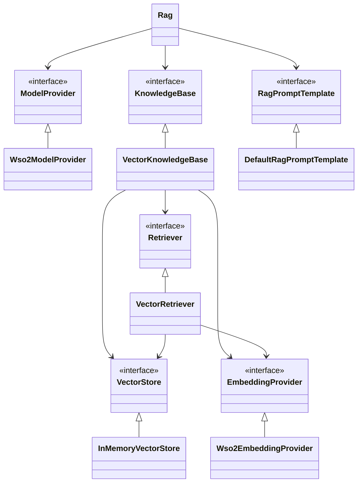

# Abstractions for Retrieval-Augmented Generation in Ballerina
- Authors
  - @MohamedSabthar, @VellummyilumVinoth
- Reviewed by
    - @shafreenAnfar, @MaryamZi, @xlight05, @SasinduDilshara
- Created date
    - 2025-06-19
- Issue
    - [1359](https://github.com/ballerina-platform/ballerina-spec/issues/1359)
- State
    - Submitted

## Summary
Retrieval-Augmented Generation (RAG) systems are becoming increasingly important in the development of generative AI applications. As the demand for GenAI solutions grows, it's essential to provide a well-defined abstraction for building RAG applications using Ballerina. This proposal aims to introduce such an abstraction, making it easier and more efficient to implement RAG workflows in Ballerina.

## Goals
- Provide abstractions to ingest data into knowledge bases
- Provide abstractions to retrieve data from knowledge bases

## Motivation
As generative AI continues to evolve, Retrieval-Augmented Generation (RAG) has emerged as a key pattern for building intelligent, context-aware applications. RAG enhances the quality and relevance of language model responses by grounding them in external knowledge sources. However, implementing RAG workflows from scratch can be complex and fragmented, often requiring developers to manually integrate vector stores, embedding models, retrieval logic, and prompt construction.

Ballerina, being a language designed for integration, is well-positioned to simplify and standardize RAG application development. By introducing structured abstractions for common RAG tasks such as ingesting data into knowledge bases, retrieving relevant context, and generating grounded responses we can significantly reduce development time and lower the barrier to entry for developers building GenAI powered applications.

This initiative aims to empower developers with a cohesive and extensible framework for building robust RAG systems using Ballerina.

## Design
This section describes the core abstractions and components involved in implementing Retrieval-Augmented Generation (RAG) applications using Ballerina.

### 1. Document: The Knowledge Source
Every RAG system starts with a set of documents.

```ballerina
public type Document record {|
    string content;
    map<anydata> metadata?;
|};
```

Each Document represents a piece of information (e.g., a paragraph, policy text, or FAQ entry, image URL). Optional metadata allows filtering and categorization (e.g., department: "HR").

### 2. Embeddings
Before we can search documents efficiently, we convert them into numeric representations (`Embedding`) using an `EmbeddingProvider`.

```ballerina
public type Vector float[];

public type SparseVector record {|
    int[] indices;
    Vector values;
|};

public type HybridVector record {|
    Vector dense;
    SparseVector sparse;
|};

public type Embedding Vector|SparseVector|HybridVector;
```

The Embedding type supports three kinds of vector formats:
- Dense vectors (most common),
- Sparse vectors (useful for symbolic info)
- Hybrid vectors (combining both).

####  Embedding Provider
The embeddings are created by embedding providers.

```ballerina
public type EmbeddingProvider distinct isolated client object {
    isolated remote function embed(Document document) returns Embedding|Error;
};
```

Different providers or users can implement their own embedding provider by using the following Ballerina object type.

We will also provide a `Wso2EmbeddingProvider` as the default embedding provider. This allows users to get started without needing to supply their own API keys or custom implementations.
For more details about the default model provider, refer to [this issue](https://github.com/ballerina-platform/ballerina-library/issues/8029).

```ballerina
public type Wso2ProviderConfig record {|
    string serviceUrl;
    string accessToken;
|};

public distinct isolated client class Wso2EmbeddingProvider {
    *EmbeddingProvider;
    private final wso2:Client embeddingClient;

    public isolated function init(*Wso2ProviderConfig config) returns Error? {
        // omitted for brevity 
    }

    isolated remote function embed(Document document) returns Embedding|Error {
        // omitted for brevity 
    }
}
```

### 3. Vector Stores
A `VectorStore` is where the embedded documents are stored and queried.

```ballerina
public type VectorStore distinct isolated object {
    public isolated function add(VectorEntry[] entries) returns Error?;
    public isolated function query(VectorStoreQuery query) returns VectorMatch[]|Error;
    public isolated function delete(string id) returns Error?;
};
```

Each `VectorEntry` links an embedding to its document:
```ballerina
public type VectorEntry record {|
   Embedding embedding;
   Document document;
|};
```

Querying returns a ranked list of VectorMatch items:
```ballerina
public type VectorMatch record {|
   *VectorEntry;
   float score; // represents the similariy score
|};
```


Metadata filtering is also supported during queries. The following types define how a query is constructed for the vector store.

```ballerina
public type VectorStoreQuery record {|
    Embedding embedding;
    MetadataFilters filters?;
|};

public type MetadataFilters record {|
    (MetadataFilters|MetadataFilter)[] filters;
    MetadataFilterCondition condition = AND;
|};

public type MetadataFilter record {|
    string key;
    MetadataFilterOperator operator = EQUAL;
    json value;
|};

public enum MetadataFilterOperator {
    EQUAL = "==",
    NOT_EQUAL = "!=",
    GREATER_THAN = ">",
    LESS_THAN = "<",
    GREATER_THAN_OR_EQUAL = ">=",
    LESS_THAN_OR_EQUAL = "<=",
    IN = "in",
    NOT_IN = "nin"
}

public enum MetadataFilterCondition {
    AND = "and",
    OR = "or"
}
```

Different providers or users can implement their own vector store integrations (e.g., Pinecone, Weaviate, etc.).
We provide a simple in-memory implementation for testing and local experimentation, which supports only dense vectors.

```ballerina
public distinct isolated class InMemoryVectorStore {
    *VectorStore;
    private final VectorEntry[] entries = [];

    public isolated function add(VectorEntry[] entries) returns Error? {
        foreach VectorEntry entry in entries {
            if entry.embedding !is Vector {
                return error Error("InMemoryVectorStore implementation only supports dense vectors");
            }
        }
        readonly & VectorEntry[] clonedEntries = entries.cloneReadOnly();
        lock {
            self.entries.push(...clonedEntries);
        }
    }

    public isolated function query(VectorStoreQuery query) returns VectorMatch[]|Error {
        if query.embedding !is Vector {
            return error Error("InMemoryVectorStore supports dense vectors exclusively");
        }

        lock {
            VectorMatch[] sorted = from var entry in self.entries
                let float similarity = self.cosineSimilarity(<Vector>query.embedding.clone(), <Vector>entry.embedding)
                order by similarity descending
                limit self.topK
                select {document: entry.document, embedding: entry.embedding, similarityScore: similarity};
            return sorted.clone();
        }
    }

    isolated function cosineSimilarity(Vector a, Vector b) returns float {
        // ommited for brevity
    }

    public isolated function delete(string id) returns Error? {
        // ommited for brevity
    }
}
```

### 4. Retriever
To retrieve the most relevant documents for a given question, we use a `Retriever`. The `Retriever` accepts a natural language query and optional metadata filters, then returns a list of matching documents.

```ballerina
public type Retriever distinct isolated object {
    public isolated function retrieve(string query, MetadataFilters? filters = ()) returns DocumentMatch[]|Error;
};
```

Users can implement their own `Retriever` to suit their requirements — for example, by incorporating custom ranking logic, re-ranking top matches with a more advanced scoring model, or applying domain-specific retrieval techniques.


We also provide a simple `Retriever` implementation named `VectorRetriever`  that
1. Embeds the query,
2. Runs a similarity against the underlying vector store,
3. Returns top-matching documents with similarity scores.

```ballerina
public distinct isolated class VectorRetriever {
    *Retriever;
    private final VectorStore vectorStore;
    private final EmbeddingProvider embeddingModel;

    public isolated function init(VectorStore vectorStore,
            EmbeddingProvider embeddingModel) {
        self.vectorStore = vectorStore;
        self.embeddingModel = embeddingModel;
    }

    public isolated function retrieve(string query, MetadataFilters? filters = {})
    returns DocumentMatch[]|Error {
        Embedding queryVec = check self.embeddingModel->embed({content: query});
        VectorStoreQuery vectorStoreQuery = {
            embeddingVector: queryVec,
            filters: filters
        };
        VectorMatch[] matches = check self.vectorStore.query(vectorStoreQuery);
        return from VectorMatch 'match in matches
            select {document: 'match.document, score: 'match.score};
    }
}
```

### 5. Knowledge Base

A `KnowledgeBase` manages a collection of documents and provides an interface for indexing and retrieval. Implementations can use any underlying storage or retrieval mechanism.

```ballerina
public type KnowledgeBase distinct isolated object {
    public isolated function index(Document[] documents) returns Error?;
    public isolated function retrieve(string query, MetadataFilters? filters = ()) returns DocumentMatch[]|Error;
};
```

The `VectorKnowledgeBase` defined below is a wrapper around a `VectorStore` and `EmbeddingProvider`.
It provides indexing and access to a `Retriever`.

```ballerina
public distinct isolated class VectorKnowledgeBase {
    *KnowledgeBase;
    private final VectorStore vectorStore;
    private final EmbeddingProvider embeddingModel;
    private final Retriever retriever;

    public isolated function init(VectorStore vectorStore, EmbeddingProvider embeddingModel) {
        self.embeddingModel = embeddingModel;
        self.vectorStore = vectorStore;
        self.retriever = new VectorRetriever(vectorStore, embeddingModel);
    }

    public isolated function index(Document[] documents) returns Error? {
        VectorEntry[] entries = [];
        foreach var document in documents {
            Embedding embedding = check self.embeddingModel->embed(document.content);
            entries.push({embedding, document});
        }
        check self.vectorStore.add(entries);
    }

    public isolated function retrieve(string query, MetadataFilters? filters = ()) returns DocumentMatch[]|Error {
        return self.retriever.retrieve(query, filters);
    }
}
```

### 6. RAG Prompt Template

After retrieving the relevant documents or context, we use them to construct a prompt for the language model. The RagPromptTemplate is responsible for injecting this context and generating the final prompt.

```ballerina
public type RagPromptTemplate distinct isolated object {
   public isolated function format(Document[] context, string query) returns Prompt;
};

public type Prompt {|
   string systemPrompt?;
   string userPrompt;
|};
```

By default we'll provide the following default implmentation:

```ballerina
public distinct isolated class DefaultRagPromptTemplate {
    *RagPromptTemplate;

    public isolated function format(Document[] context, string query) returns Prompt {
        // following is a sample implementation
        string systemPrompt = string `Answer the question based on the following provided context: `
            + string `<CONTEXT>${string:'join("\n", ...context.'map(doc => doc.content))}</CONTEXT>"""`;
        string userPrompt = "Question:\n" + query;
        return {systemPrompt, userPrompt};
    }
}
```

### 7. Rag: The Orchestrator

The Rag class acts as the high-level orchestrator that brings together all core components of a Retrieval-Augmented Generation (RAG) system. It provides a simple and unified interface for indexing knowledge and querying against it.
The Rag class simplifies the RAG workflow by:
- Handling document ingestion,
- Retrieving relevant context,
- Building a prompt using that context,
- Calling the LLM to generate a response.

It abstracts away the internal complexity and allows developers to interact with the system through two main functions: ingest() and query().

```ballerina

public distinct isolated class Rag {
    private final ModelProvider model;
    private final KnowledgeBase knowledgeBase;
    private final RagPromptTemplate promptTemplate;

    public isolated function init(ModelProvider? model = (),
            KnowledgeBase? knowledgeBase = (),
            RagPromptTemplate promptTemplate = new DefaultRagPromptTemplate()) returns Error? {
        self.model = model ?: check getDefaultModel();
        self.knowledgeBase = knowledgeBase ?: check getDefualtKnowlegeBase();
        self.promptTemplate = promptTemplate;
    }

    public isolated function query(string query, MetadataFilters? filters = ()) returns string|Error {
        DocumentMatch[] context = check self.knowledgeBase.retrieve(query, filters);
        // later when we allow re-rankers we can use the score in the document match
        Prompt prompt = self.promptBuilder.format(context.'map(ctx => ctx.document), query);
        ChatMessage[] messages = self.mapPromptToChatMessages(prompt);
        ChatAssistantMessage response = check self.model->chat(messages, []);
        return response.content ?: error Error("Unable to obtain valid answer");
    }

    public isolated function ingest(Document[] documents) returns Error? {
        return self.knowledgeBase.index(documents);
    }

    private isolated function mapPromptToChatMessages(Prompt prompt) returns ChatMessage[] {
        string? systemPrompt = prompt?.systemPrompt;
        string? userPrompt = prompt?.userPrompt;
        ChatMessage[] messages = [];
        if systemPrompt is string {
            messages.push({role: SYSTEM, content: systemPrompt});
        }
        if userPrompt is string {
            messages.push({role: USER, content: userPrompt});
        }
        return messages;
    }
};
```

#### Default Initialization:
The Rag constructor supports optional injection of custom implementations. If no arguments are provided, the class initializes with the following defaults:
`Wso2ModelProvider` is an implementation of the existing `ai:ModelProvide`r type. It allows users to get started quickly without the need to provide their own API keys or custom model provider implementations. For more details about the `Wso2ModelProvider`, refer to [this issue](https://github.com/ballerina-platform/ballerina-library/issues/8029).
- `VectorKnowledgeBase` → VectorKnowledgeBase backed by `InMemoryVectorStore` and `Wso2EmbeddingProvider`
- `RagPromptTemplate` → `DefaultRagPromptBuilder`

```ballerina
isolated function getDefaultModelProvider() returns Wso2ModelProvider|Error {
    Wso2ModelProviderConfig? config = wso2ModelProviderConfig;
    if config is () {
        return error Error("The `wso2ProviderConfig` is not configured correctly."
        + " Ensure that the WSO2 model provider configuration is defined in your TOML file.");
    }
    return new Wso2ModelProvider(config);
}

isolated function getDefaultKnowledgeBase() returns VectorKnowledgeBase|Error {
    Wso2ModelProviderConfig? config = wso2ModelProviderConfig;
    if config is () {
        return error Error("The `wso2ProviderConfig` is not configured correctly."
        + " Ensure that the WSO2 model provider configuration is defined in your TOML file.");
    }
    EmbeddingProvider|Error wso2EmbeddingProvider = new Wso2EmbeddingProvider(config);
    if wso2EmbeddingProvider is Error {
        return error Error("error creatating default vector konwledge base");
    }
    return new VectorKnowledgeBase(new InMemoryVectorStore(), wso2EmbeddingProvider);
}
```

### Example Usage with Default Configuration

```ballerina
import ballerina/ai;
import ballerina/io;

public function main() returns error? {
    ai:Rag rag = check new ai:Rag();

    string poilicy = check io:fileReadString("pizza_shop_policy_doc.md");
    ai:Document[] poilicyDocs = ai:splitDocumentByLine(poilicy);
    check rag.ingest(poilicyDocs);

    string answer = check rag.query("How long is the unpaid lunch break?");
    io:println(answer);
}
```

### Example Usage with Custom Implementation
```ballerina
import ballerina/ai;
import ballerinax/ai.openai;
import ballerinax/ai.pinecone;

public function main() returns error? {
    ai:ModelProvider model = check new openai:ModelProvider(openAiApiKey, openai:GPT_4O);
    ai:VectoStore store = check new pinecone:VectoreStore(pineconeServiceUrl, pineconeKey);
    ai:EmbeddingProvider embeddingModel = check new openai:EmbeddingProvider(openAiApiKey, openai:TEXT_EMBEDDING_ADA_002);
    ai:VectorKnowlegeBase knowledgeBase = new (store, embeddingModel);
    ai:Rag rag = new (model, knowledgeBase);

    string poilicy = check io:fileReadString("pizza_shop_policy_doc.md");
    ai:Document[] poilicyDocs = ai:splitDocumentByLine(poilicy);
    check rag.ingest(poilicyDocs);


    string answer = check rag.query("predective maintenance and analytics");
    //...
}
```

### Dependency Diagram
The following diagram illustrates the dependencies between the abstractions and components introduced above.

