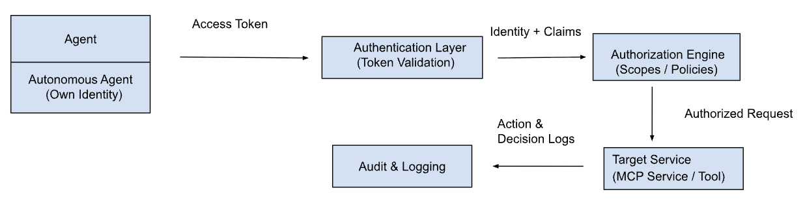
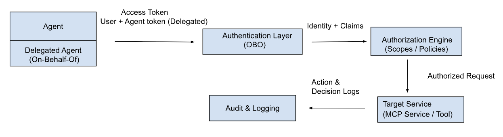
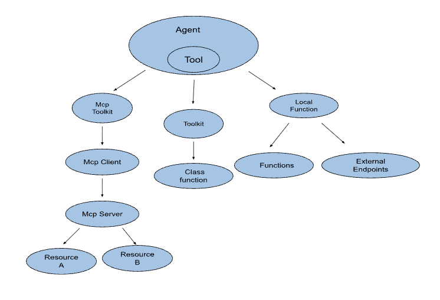
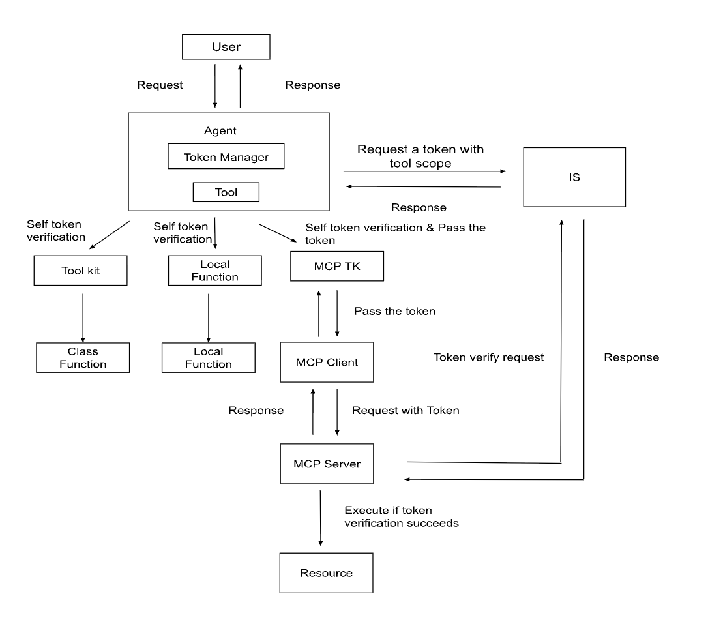
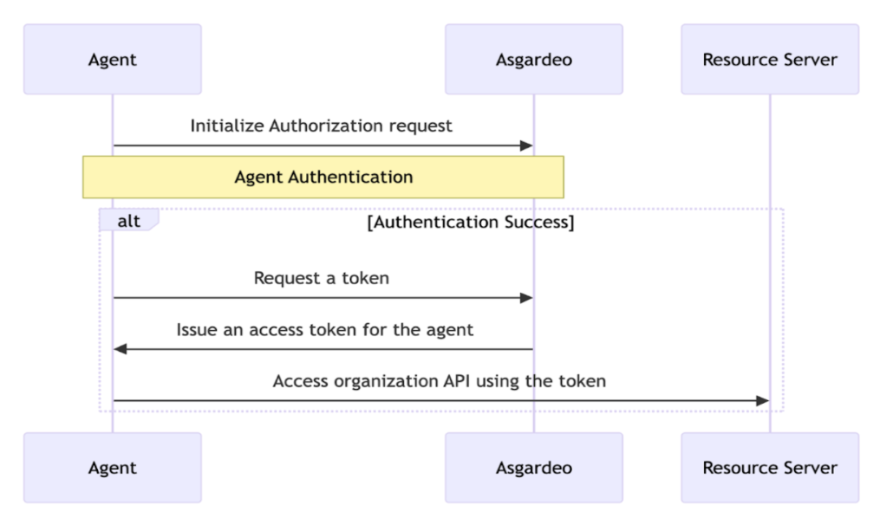
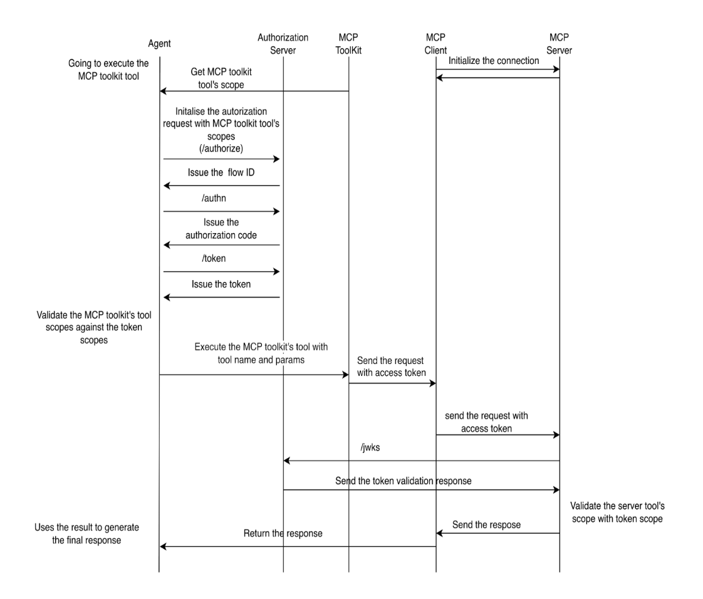

# Agent Identity in Ballerina
- Authors
    - @kalaiyarasiganeshalingam
- Reviewed by
    - @shafreenAnfar, @MohamedSabthar
- Created date
    - 2026-02-05
- Issue
    - [1425](https://github.com/ballerina-platform/ballerina-spec/issues/1425)
- State
    - Submitted

## Summary

This document proposes introducing WSO2 Agent Identity as a first-class concept in Ballerina AI Agents. By assigning each agent a distinct digital identity, agents can be authenticated, authorized, governed, and audited independently of applications or users. This enables secure autonomous operation, aligns agent behavior with enterprise security and compliance requirements, and allows organizations to apply consistent identity and access management practices to AI agents in the same way they do for applications, services, and human users.

## Goals

The primary goal of this proposal is to enable secure, governed, and auditable autonomous execution of Ballerina AI Agents through a first-class Agent Identity model. Specifically, this design aims to:
- Establish unique, first-class identities for AI agents, distinct from applications, services, or human users.
- Enable agent-specific authentication and authorization when accessing protected resources.
- Support fine-grained, least-privilege access control aligned with Zero Trust security principles.

## Motivation

As AI agents evolve from assistive tools to autonomous actors, the lack of a robust identity model poses a significant risk. Today, Ballerina AI Agents rely on shared or application-level credentials, making it difficult to distinguish agent actions from those of applications or human users. This blurs security boundaries and limits effective governance.

Shared credentials often lead to over-privileged access and increase the impact of security incidents. They also prevent organizations from enforcing agent-specific policies or clearly tracking agent behavior. As a result, logs cannot reliably attribute actions to individual agents, complicating audits, investigations, and compliance efforts.

Without strong identity, authentication, and authorization guarantees, enabling autonomous agent execution is inherently unsafe. Introducing Agent Identity addresses these challenges by providing clear accountability, controlled access, and improved visibility into agent actions, thereby laying the foundation for secure, reliable, enterprise-grade AI agents in Ballerina.

## Key Concepts

### Understanding Agent Identity vs Application Identity

Traditional systems treat access as originating from either a human user or an application. AI agents do not fit cleanly into either category. Unlike applications, agents can reason, make decisions, and invoke tools dynamically. Unlike users, they can operate continuously without an active session.
Agent Identity introduces a distinct identity model that allows AI agents to be treated as first-class security principals, separate from users and applications. It supports two primary execution models:
- Autonomous Agents: These agents operate independently and use their own identity and permissions. They authenticate using their own credentials and are authorized based on agent-specific scopes.
- Delegated Agents:These agents act on behalf of a human user and use delegated authorization flows. Their actions are constrained by the user’s permissions, and a human remains in the loop.

#### High-Level Architecture for Agent Identity

##### Autonomous Agent


##### Delegated Agent


#### Core Components

##### Agent Identity Provider (AIP): Issue an identity token to an AI agent

When an AI agent starts or requires access to protected resources, it requests an identity token from the Agent Identity Provider. The AIP validates the agent’s registration and issues a short-lived, scoped token representing the agent’s identity.
- Manages agent identities
- Issues credentials
- Handles lifecycle operations

##### Authentication Layer: Verify agent identity on every request (Zero Trust).

Each request from an agent must include its identity token. The authentication layer validates the cryptographic signature, issuer, and expiration. Requests without valid credentials are rejected.
- Validates agent credentials
- Supports short-lived tokens

##### Authorization Engine:  Enforce least-privilege access.

After authentication, the authorization engine evaluates whether the agent is allowed to perform the requested action. Policies are resolved from the policy store and evaluated using contextual attributes such as resource, action, environment, and delegation scope.
- Policy-based access control
- Context-aware authorization
- Enforces least privilege

##### Target Service Invocation & Auditing Flow: Ensure traceability and compliance

All successful and failed operations are recorded by the audit layer, ensuring that every action is attributable to a specific agent identity.
- Stores agent access policies
- Supports conditional rules
- Logs agent actions
- Supports compliance reporting

### Why Agent-Specific Identity?
Using shared or application-level credentials for AI agents introduces several risks and limitations:
- Loss of Accountability: When agents share credentials with applications or other agents, it becomes impossible to determine which agent performed a specific action. This makes audits, investigations, and compliance reporting unreliable. Agent Identity ensures that:
  - Each action can be traced to a specific agent
  - Agent behavior can be monitored independently
  - Responsibility is clearly defined
- Over-Privileged Access: Shared credentials typically require broad permissions to support multiple use cases. This violates least-privilege principles and increases the impact of security incidents. With Agent Identity:
  - Each agent receives only the permissions it needs
  - Access can be restricted to specific services or tools
  - The blast radius of a compromised agent is minimized
- Unsafe Autonomous Execution: Autonomous agents can execute actions without continuous human oversight. Without strong identity, authentication, and authorization guarantees, such autonomy is unsafe. Agent Identity provides the necessary controls to:
  - Authenticate agents explicitly
  - Authorize each action based on scopes
  - Enforce Zero Trust principles for every request

### Ballerina Agent Execution Flow

A BI agent executes actions via tools that abstract different execution mechanisms. As shown in the diagram, a single agent can invoke multiple types of executable functions depending on how the tool is defined.



### Autonomous Agent Identity in Ballerina

The Ballerina Agent Identity model can be used across all agent interaction patterns supported by Ballerina, including MCP integration, local tools, external endpoint integrations, chat agents, and agent toolkits. When enabled, it provides a consistent mechanism for identifying agents and enforcing authorization, regardless of how the agent interacts with a system.

The diagram below shows how Agent Identity works.



Ballerina agents can be represented as first-class identities in identity management systems such as WSO2 Identity Server or Asgardeo using the Agent ID capability. This enables agents to be uniquely identified and authorized when interacting with external systems, tools, or services.

To enable this capability, an agent must first be registered in the identity provider. During this provisioning process, the identity provider creates a unique identity for the agent and generates the credentials required for authentication.

Using these credentials, the Ballerina agent can authenticate with the identity provider and obtain OAuth 2.0 access tokens. These tokens are then used when invoking protected APIs, tools, or services, thereby enforcing authorization policies defined by the identity provider.

On the Ballerina agent side, the following configuration parameters are typically required:
  - Agent ID – A unique identifier representing the agent when interacting with the identity provider.
  - Agent Secret – A confidential credential used by the agent to authenticate with the identity provider.
  - OAuth Client ID – The identifier of the OAuth application associated with the agent, used when requesting access tokens.
  - Authorization Endpoint (Base Auth URL) – The base URL of the identity provider’s authorization server used to initiate the OAuth authorization flow.
  - Redirect URI – The callback URI where the identity provider redirects the authorization response after successful authentication.

In Ballerina, agent credentials are configured as part of the agent configuration, while the OAuth client configuration is defined within the tool configuration, such as in the Agent Tool annotation or during MCP toolkit initialization. Additionally, the tool validation configuration must be specified in the Agent Tool annotation for non-MCP tools, or during MCP server initialization for MCP tools. Further details are provided in the Design section.

Once configured, the agent can obtain access tokens and use them when invoking MCP tools, external endpoints, or other protected services.



The flow diagram below shows how Agent Identity works when an MCP tool is registered with the Agent.



### Token Management

To enforce least-privilege access, the agent does not use a single, broad token for all tools. Instead, the agent obtains tool-scoped access tokens and manages them using a Token Manager.
#### Token Acquisition per Tool
- When the agent needs to execute a tool, it requests an access token only with the scopes required by that specific tool.
- This ensures the agent has no additional permissions beyond what the tool needs.
- The obtained token is stored in the Token Manager, indexed by the tool and its required scopes.

#### Token Reuse and Expiry Handling
- If the same tool is executed again, the agent first checks the Token Manager.
- If a valid (non-expired) token for that tool already exists, the agent reuses the existing token.
- If the token has expired:
  - The agent requests a new token with the same tool scopes.
  - The Token Manager updates the stored token.
  - This avoids unnecessary token requests while preserving security.

## Design

### AI Module(ballerina/ai)

#### Agent Configuration

The existing AgentConfiguration is extended with an optional parameter to include agent credential configuration, which enables agent identity at runtime.

```bal
# Provides a set of configurations for the agent.
@display {label: "Agent Configuration"}
public type AgentConfiguration record {|

   #Existing configuration

   # Optional authentication details of the agent.
   @display {label: "Agent Credential"}
   AgentCredential agentCredential?;
|};
```

#### Agent Credential

A new configuration is introduced to add the agent’s credentials.

```
# Represents the authentication credentials of an autonomous agent.
@display {label: "Agent Credential"}
public type AgentCredential record {|

   # The unique identifier assigned to the agent.
   @display {label: "Agent ID"}
   string agentId;

   # The secret associated with the agent.
   @display {label: "Agent Secret"}
   string agentSecret;
|};
```

#### Tool Annotation Config

The existing ToolAnnotationConfig is extended with an optional parameter to configure tool-level agent identity settings.

```
# Defines the configuration of the Tool annotation.
public type ToolAnnotationConfig record {|
   
   # Existing configurations

   # Optional authorization configuration required to invoke this tool.
   @display {label: "Authorization Configuration"}
   AgentIdAuthConfig agentIdConfig?;
|};
```

#### MCP ToolKit

The existing HTTP authentication configuration is extended to support agent identity configuration within the MCP Toolkit.

```
#Configuration options for the Streamable HTTP client transport.
public type StreamableHttpClientTransportConfig record {|

    #Existing configurations

   # Configurations related to client authentication
   http:ClientAuthConfig|AgentIdAuthConfig? auth = ();
|};
```

#### Agent Identity Auth Config

Introduces AgentIdAuthConfig to configure the tool-level agent identity configs.

```
# Represents the OAuth 2.0 client configuration required to interact
# with an external Authorization Server and validate issued access tokens.
@display {label: "OAuth Client Configuration"}
public type AgentIdAuthConfig record {|


   # The base URL of the Authorization Server used to resolve
   # OAuth 2.0 endpoints such as authorization, token, and introspection.
   @display {label: "Authorization Server Base URL"}
   string baseAuthUrl?;


   # The OAuth 2.0 client identifier issued to this client application.
   @display {label: "Client ID"}
   string clientId?;


   # The redirect URI registered for the OAuth client and used
   # in the Authorization Code flow.
   @display {label: "Redirect URI"}
   string redirectUri?;


   # Scopes required to invoke this tool
   @display {label: "Required Scopes"}
   string|string[] scopes?;


   # Indicates whether PKCE (Proof Key for Code Exchange) is enabled
   # for the Authorization Code flow.
   @display {label: "Enable PKCE"}
   boolean isPkceEnabled = false;
|};
```

### Token Management

The Ballerina cache module is used for token management by caching access tokens per tool to avoid unnecessary token requests.
A cache instance is initialized with a capacity equal to the number of tools:

cache:Cache cache = new(capacity = toolSize);

Key: Tool name
Value: Token metadata object
```
{
  "accessToken": "<token>",
  "scopes": "openid",
  "expTime": 3600
}
```

### MCP Module(ballerina/mcp)

#### Server

The MCP Server enforces authentication and authorization for incoming requests using OAuth2 token introspection or JWKS. The `mcp:ServiceConfig` already uses `http:HttpServiceConfig`. Since this configuration supports `http:ListenerAuthConfig`, we will use it to handle the security requirements.

#### Tool

Introduces an optional scopes parameter in the McpToolConfig. The scopes field defines the OAuth scopes required to invoke a specific tool.

```
# Represents a tool configuration that can be used to define tools available in the MCP service.
public type McpToolConfig record {|
   # ...
   # Existing agent configuration fields
   # …

   # Scopes required to invoke this tool
   @display {label: "Required Scopes"}
   string|string[] scopes?;
|};
```

Use existing tool annotation for MCP
```
# Annotation to mark a function as an MCP tool configuration.
public annotation McpToolConfig Tool on object function;
```

### Audit & Logging (Log agent actions)

Operational logs will be handled using the Ballerina log module.

```
[ballerina.log]
level = "INFO"
format = "logfmt"

[[ballerina.log.destinations]]
path = "./logs/app.log"

# Configure root logger with TIME_BASED rotation
# Logs will rotate based on file age
[ballerina.log.destinations.rotation]
policy = "TIME_BASED"
maxAge = 86400
maxBackupFiles = 5
```

#### Log Definitions for Agent Identity

##### INFO
Use INFO for expected, successful, and traceable agent operations.
```
log:printInfo(
  "Agent tool executed successfully",
  agentId = "agent-123",
  toolName = "createUser"
);
```

##### WARN
Use WARN for unexpected but recoverable situations that do not immediately break execution.
```
log:printWarn(
  "Agent authorization denied",
  agentId = "agent-123",
  toolName = "deleteUser",
  requiredScopes = "user:delete",
  authResult = "denied",
  reason = "missing_scope"
);
```

##### ERROR
Use ERROR for critical failures where the agent cannot proceed.
```
log:printError(
  "Agent identity enforcement failed",
  agentId = "agent-123",
  toolName = "createUser",
  error = "token_validation_failed"
);
```

## Example 

### MCP

#### MCP Service

```aidl
import ballerina/http;
import ballerina/log;
import ballerina/mcp;
import ballerina/random;
import ballerina/time;


type Weather record {|
   string location;
   decimal temperature;
   int humidity;
   int pressure;
   string condition;
   string timestamp;
|};


type ForecastItem record {|
   string date;
   int high;
   int low;
   string condition;
   int precipitationChance;
   int windSpeed;
|};


type WeatherForecast record {|
   string location;
   ForecastItem[] forecast;
|};


listener mcp:Listener mcpListener = new (9090,
   secureSocket = {
       'key: {
           certFile: "/Users/wso2/Documents/AI/public.crt",
           keyFile: "/Users/wso2/Documents/AI/private.key"
       }
   }
);


@mcp:ServiceConfig {
   info: {
       name: "Secured Weather Server",
       version: "1.0.0"
   },
   httpConfig: {
       auth: [
           {
               jwtValidatorConfig: {
                   username: "2232d7",
                   signatureConfig: {
                       jwksConfig: {
                           url: "https://localhost:9443/oauth2/jwks"
                       }
                   }
               },
               scopes: [ "write_forecast", "read_weather"]
           }
       ]
   }
}
service mcp:Service /mcp on mcpListener {

   @mcp:Tool {
       scopes: ["write_weather", "read_forecast",]
   }
   remote function getCurrentWeather(string city) returns Weather|http:Unauthorized|http:Forbidden|error {
       Weather mockWeather = check getMockWeather(city);
       log:printInfo(string `Weather data retrieved for ${
                       city}: ${mockWeather.condition}, ${mockWeather.temperature}°C`);
       return mockWeather;
   };

   @mcp:Tool
   remote function getWeatherForecast(string location, int days) returns WeatherForecast|error {
       WeatherForecast mockForecast = {
           forecast: check getMockForecastItems(days),
           location
       };
       log:printInfo(string `Forecast generated for ${location}: ${days} days with random data`);
       return mockForecast;
   }
}

function getMockWeather(string city) returns Weather|error => {
   condition: "Sunny",
   humidity: check random:createIntInRange(30, 70),
   location: city,
   pressure: check random:createIntInRange(1000, 1025),
   temperature: <decimal>check random:createIntInRange(15, 30),
   timestamp: time:utcToString(time:utcNow())
};

function getMockForecastItems(int days) returns ForecastItem[]|error {
   string[] conditions = ["Sunny", "Cloudy", "Rainy", "Windy", "Stormy", "Snowy"];
   return from int i in 1 ... days
       select {
           condition: conditions[check random:createIntInRange(0, conditions.length() - 1)],
           date: time:utcToString(time:utcAddSeconds(time:utcNow(), i * 86400)),
           high: check random:createIntInRange(20, 30),
           low: check random:createIntInRange(10, 20),
           precipitationChance: check random:createIntInRange(10, 50),
           windSpeed: check random:createIntInRange(5, 20)
       };
}
```
#### Agent with MCP tools

```aidl
import ballerina/ai;
import ballerina/io;
import ballerina/log;
import ballerina/mcp;
import ballerina/http;

isolated class CustomMcpToolKit {
   *ai:McpBaseToolKit;
   private final mcp:StreamableHttpClient mcpClient;
   private ai:ToolConfig[] tools = [];
   private final map<ai:FunctionTool> permittedTools;
   private http:ClientAuthConfig|mcp:AgentIdAuthConfig? auth;

   public isolated function init(string serverUrl = "https://localhost:9090/mcp",
           mcp:Implementation info = {name: "MCP", version: "1.0.0"},
           *mcp:StreamableHttpClientTransportConfig config) returns ai:Error? {
       self.auth = config.auth.cloneReadOnly();
       self.permittedTools = {
           "getCurrentWeather": self.getCurrentWeather,
           "getWeatherForecast": self.getWeatherForecast
       };
       do {
           self.mcpClient = check new mcp:StreamableHttpClient(serverUrl, config);
           self.tools = check ai:getPermittedMcpToolConfigs(self.mcpClient, info, self.permittedTools, agentIdConfig= self.auth).cloneReadOnly();


       } on fail error e {
           log:printError("Error initializing MCP toolkit", e);
           return error ai:Error("Failed to initialize MCP toolkit", e);
       }
   }

   public isolated function getTools() returns ai:ToolConfig[] {
       lock {
          return self.tools.cloneReadOnly();
       }
      
   }


   @ai:AgentTool{
       agentIdConfig: {
           scopes: ["get_current_weather", "read_current_weather"]
       }
   }
   public isolated function getCurrentWeather(ai:Context ctx, mcp:CallToolParams params) returns mcp:CallToolResult|error {
       return self.mcpClient->callTool(params, headers = {"Authorization": string `Bearer ${check ctx.getAccessToken(params.name)}`});
   }


   @ai:AgentTool {
       agentIdConfig: {
           scopes: ["get_weather_forecast", "read_weather_forecast"]
       }
   }
   public isolated function getWeatherForecast(ai:Context ctx, mcp:CallToolParams params) returns mcp:CallToolResult|error {
       return self.mcpClient->callTool(params, headers = {"Authorization": string `Bearer ${check ctx.getAccessToken(params.name)}`});
   }
}


final CustomMcpToolKit weatherMcpConn = check new ("https://localhost:9090/mcp",
   secureSocket = {cert: "/Users/wso2/Documents/AI/public.crt"}
   ,
   auth = {
       baseAuthUrl: "https://api.asgardeo.io/t/testchorea/oauth2",
       clientId: "l8vFSM",
       redirectUri: "https://localhost:8000/callback",
       isPkceEnabled: true
   }
);


final ai:Agent weatherAgent = check new (
   systemPrompt = {
       role: "Weather-aware AI Assistant",
       instructions: string `You are a smart AI assistant that can assist
           a user based on accurate and timely weather information.`
   },
   tools = [weatherMcpConn],
   model = check ai:getDefaultModelProvider(),
   agentCredential = {
       agentId: "22322bf6-395",
       agentSecret: "!X9zK*"
   }
);

public function main() returns error? {

   while true {
       string userInput = io:readln("User (or 'exit' to quit): ");
       if userInput == "exit" {
           break;
       }
       // Pass the user input to the agent and get a response.
       string response = check weatherAgent.run(userInput);
       io:println("Agent: ", response);
   }
}
```

### Non-MCP

```
import ballerina/ai;
import ballerina/io;
import ballerina/time;
import ballerina/uuid;

type Task record {|
   string description;
   time:Date dueBy?;
   time:Date createdAt = time:utcToCivil(time:utcNow());
   time:Date completedAt?;
   boolean completed = false;
|};

// A tool kit to manage a set of tasks.
public isolated class TaskManagerToolkit {
   *ai:BaseToolKit;
  
   private final map<Task> tasks = {};

   public isolated function getTools() returns ai:ToolConfig[] =>
       ai:getToolConfigs([self.addTask, self.listTasks]);

   @ai:AgentTool
   {
       agentIdConfig: {
           baseAuthUrl: "https://api.asgardeo.io/t/testchorea/oauth2",
           clientId: "TrYa",
           redirectUri: "http://localhost:8000/callback",
           scopes: ["add"]
       }
   }
   isolated function addTask(string description, time:Date? dueBy = ()) {
       lock {
           self.tasks[uuid:createRandomUuid()] = {
               description: description,
               dueBy: dueBy.clone()
           };
       }
   }

   @ai:AgentTool
   {
       agentIdConfig: {
           baseAuthUrl: "https://api.asgardeo.io/t/testchorea/oauth2",
           clientId: "TrMYa",
           redirectUri: "http://localhost:8000/callback",
           scopes: ["list"]
       }
   }
   isolated function listTasks() returns map<Task> {
       lock {
           return self.tasks.clone();
       }
   }
}

@ai:AgentTool
isolated function getCurrentDate() returns time:Date {
   time:Civil {year, month, day} = time:utcToCivil(time:utcNow());
   return {year, month, day};
}

// Define an AI agent with a system prompt and a set of tools.
// The agent will use these tools to help manage a task list,
// following the system prompt instructions.
final ai:Agent taskAssistantAgent = check new ({
   systemPrompt: {
       role: "Task Assistant",
       instructions: string `You are a helpful assistant for
           managing a to-do list. You can manage tasks and
           help a user plan their schedule.`
   },
   // Include the tool kit in tools the agent can use.
   tools: [new TaskManagerToolkit(), getCurrentDate],
   model: check ai:getDefaultModelProvider(),
   maxIter: 10,
   agentCredential:{
      agentId: "4f4e8",
      agentSecret: "cW!"
   }
});

public function main() returns error? {
   while true {
       string userInput = io:readln("User (or 'exit' to quit): ");
       if userInput == "exit" {
           break;
       }
       // Pass the user input to the agent and get a response.
       string response = check taskAssistantAgent.run(userInput);
       io:println("Agent: ", response);
   }
}
```